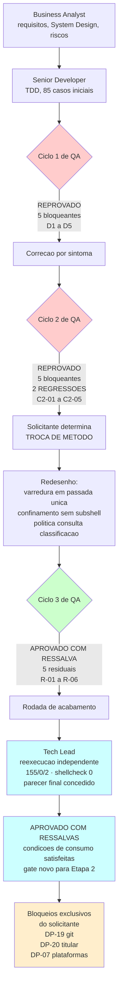

# Registro Retroativo de Validação QA — Camada de Dominio

## AVISO — Natureza Retroativa e Proveniencia

**Este documento foi consolidado retroativamente pelo Tech Lead em 2026-08-18, A PARTIR DO CONTEUDO DOS PARECERES DE QA PRESERVADO NO ARQUIVO DE ENTREGA DO SENIOR DEVELOPER. NAO E UM PARECER ORIGINAL EMITIDO PELO QA EXPERT.**

O desvio de protocolo ocorreu por instrucao explicita do Tech Lead durante a execucao, para reduzir custo de contexto nos ciclos de QA. A homologacao retroativa foi necessaria porque o conteudo do QA — tres ciclos independentes, cinco bloqueantes no primeiro, cinco no segundo com duas regressoes, uma troca de metodo determinada pelo solicitante, e uma rodada de acabamento fechando cinco ressalvas residuais — merecia sobreviver fora da memoria do Senior Developer. **A honestidade de proveniencia e o ponto central deste artefato.**

Referencia de decisao: **`TL-08`**.

---

## Identificacao

| Campo | Valor |
|---|---|
| Projeto | `dropbox_api` — aplicacao CLI em shell script para integracao com Dropbox API v2 |
| Escopo validado | Camada de dominio: `lib/hash.sh`, `lib/errors.sh`, `lib/path.sh`, mais o arcabouco de testes `tests/` |
| Agent validador | QA Expert (nao identificado por nome no protocolo do projeto) |
| Agent consolidador | Tech Lead |
| Data da consolidacao | 2026-08-18 |
| Data original dos pareceres | Ciclo 1, 2, 3 e rodada de acabamento durante a Etapa 1 (agosto 2026) |
| Parecer final | **APROVADO COM RESSALVA** |
| Referencia ao registro de entrega | `docs/registros/2026-08-17_entrega-camada-dominio.md` (secoes de ciclos de QA) |

---

## Resumo dos Ciclos de Validacao

| Ciclo | Veredito | Bloqueantes | Media/Baixa | Observacao |
|---|---|---|---|---|
| Ciclo 1 | **Reprovado** | 5 (`D1` a `D5`) | — | Defeitos na redacao de segredo, confinamento de caminho, conversao de blocos e deteccao de fim de fluxo |
| Ciclo 2 | **Reprovado** | 5 (`C2-01` a `C2-05`), dos quais **3 de severidade ALTA** | — | **Dois deles regressoes das proprias correcoes do ciclo 1** (`C2-01` e `C2-02`); solicitante determinou troca de metodo em ambos |
| Ciclo 3 | **Aprovado com ressalva** | — | 5 achados residuais | Validacao por mutacao propria; oito vetores de ataque ao confinamento |
| Rodada de acabamento — detalhamento | — | — | `R-01` a `R-06` | `R-01` a `R-05` sao os cinco achados residuais; **`R-06` nao e um sexto defeito**, e sim a fixacao por teste da invariante que torna nula a mutacao de ordem discutida em `C2-04` |
| Rodada de acabamento | **Parecer final: APROVADO COM RESSALVA** | — | — | Cinco ressalvas residuais fechadas; nenhuma bloqueante |

**Conclusao:** Sem escalonamento por excesso de reprovacoes. Limite de 3 reprovacoes nao atingido (2 ocorreram). Solicitante interveio por decisao voluntaria no ciclo 2, nao como resultado de escalonamento formal.

---

## Ciclo 1 de QA — Reprovacao e Correcoes

O QA reprovou o ciclo 1 com **5 defeitos bloqueantes**. Todos foram corrigidos e validados no ciclo seguinte.

### D1 — Corrupcao de caminho com quebra de linha final (ALTA)

**O que estava errado:** `lib/path` capturava resultado de funcoes internas por substituicao de comando (`$(...)`), que remove quebras de linha finais. Um caminho `arq\n` devolvia `arq` com status `0`, fazendo a aplicacao ler ou sobrescrever o arquivo errado.

**Correcao aplicada:** Funcoes internas passaram a gravar resultado em `DBX_PATH_RESULTADO` em vez de imprimir. Nenhuma captura por substituicao de comando ocorre mais no caminho interno.

**Casos de teste:** `quebra_de_linha_terminal_sobrevive_na_normalizacao_remota`, `quebra_de_linha_terminal_sobrevive_no_confinamento_remoto`, `multiplas_quebras_terminais_sao_preservadas`, `quebra_terminal_local_nao_entrega_arquivo_errado`, `resultado_e_limpo_quando_o_caminho_e_recusado`.

### D2 — Redacao de segredo falhando no formato dominante (ALTA)

**O que estava errado:** A implementacao inicial separava o texto por espacos e so reconhecia tokens iniciados por `sl.`, precedidos de `bearer`, ou formato `chave=`. Como o corpo da Dropbox e JSON, com valor entre aspas colado ao dois-pontos, o token passava integro. Vazavam tambem refresh tokens, `client_secret`, tokens entre aspas em prosa, `Bearer` em caixa alta, `Basic`, credencial em `-u`, e `Cookie`.

**Correcao aplicada:** Varredura por substituicao de padrao estendido, cobrindo cabecalhos sensibilizados, esquemas Bearer e Basic, credencial em linha de comando, dez chaves sensiveis em quatro formatos cada, e rede de seguranca para prefixo em qualquer caixa.

**Casos de teste:** Onze casos adversariais verificando que o segredo desaparece e a marca de redacao aparece, mais dois garantindo que texto sem segredo nao e alterado.

### D3 — Conversao quadratica de resumos de bloco (ALTA)

**O que estava errado:** A conversao de resumos de bloco para bytes era quadratica: 256 blocos = 727 ms, 512 blocos = 2.648 ms, 1.024 blocos = 10.879 ms. O teto pratico era ~4 GiB, nao os 100 GiB afirmados.

**Correcao aplicada:** Conversao passou a ocorrer bloco a bloco, dentro do laco de leitura, sobre cadeia de tamanho fixo de 64 caracteres. Resultado: 256 blocos = 30 ms, 512 blocos = 56 ms, 1.024 blocos = 120 ms — aproximadamente linear.

**Caso de teste:** `conversao_de_escapes_e_linear_na_quantidade_de_blocos`.

### D4 — Falha do leitor mascarada (MEDIA)

**O que estava errado:** Sem `pipefail`, apenas o status do ultimo comando do cano era observado. Um leitor que entregasse dados parciais e saisse com erro produzia `content_hash` bem formado com status `0`.

**Correcao aplicada:** Leitura por arquivo de buffer reaproveitado em vez de cano. Status do leitor passou a ser observado diretamente. Total de bytes lidos ficou disponivel.

**Casos de teste:** `falha_do_leitor_nao_produz_hash_com_status_zero`, `expoe_o_total_de_bytes_lidos`, `expoe_o_total_de_bytes_lidos_a_partir_de_fluxo`, `contagem_confere_com_o_tamanho_real_do_arquivo`.

### D5 — Executor aprovava sem executar nada (MEDIA)

**O que estava errado:** Um filtro sem correspondencia produzia "arquivos executados: 0" com resultado APROVADA e codigo de saida `0`. O agregado vinha de `eval` sobre linha extraida do stdout dos testes, permitindo execucao arbitraria.

**Correcao aplicada:** Filtro sem correspondencia reprova com codigo `1`. Agregado passou a trafegar por arquivo proprio (`DBX_HARNESS_RESUMO`), lido com validacao estrita de tres inteiros. Nao ha mais `eval`.

**Caso de teste:** Verificado que arquivo de teste imprimindo `# resumo ok=999` no stdout resulta em 1 caso contabilizado, nao 999.

---

## Ciclo 2 de QA — Revalidacao e Troca de Metodo

O QA Expert revalidou as cinco correcoes do ciclo 1 e as confirmou. A partir dessa confirmacao, o **solicitante determinou quatro decisoes**, nenhuma delas decorrente de defeito reportado pelo QA, mas todas de escopo e comportamento do produto.

Neste ciclo, foi identificado que **dois dos cinco bloqueantes eram regressoes**: o mesmo ponto do ciclo 1 falhando em outra forma.

### C2-01 — Evasao de confinamento por raiz terminada em quebra de linha (ALTA, regressao)

**O que estava errado:** `dbx_path_local_confinar` usava `raiz_fis=$(cd -P -- "$raiz" && pwd -P)` — exatamente o `$( )` removido do resto do componente no ciclo 1. Era evasao aberta nas duas direcoes: irmaos `base/raiz` e `base/raiz\n` criavam raizes vizinhas alcancaveis.

**Correcao aplicada:** Raiz passa a ser resolvida pelo mesmo resolvedor fisico do alvo, sem substituicao de comando, seguido de verificacao de que e diretorio.

**Casos:** `raiz_com_quebra_de_linha_final_nao_alcanca_a_raiz_vizinha`, `raiz_com_quebra_de_linha_nao_captura_caminho_da_raiz_vizinha`.

### C2-02 — Redacao cubica e troca de metodo (ALTA, regressao)

**O que estava errado:** Medicao revelou que a redacao era cubica, nao linear. Um corpo de 4.090 caracteres repetindo `secret=abc&` levava 77.683 ms. O gatilho era o casamento repetido da chave, que disparava retrocesso do padrao estendido.

**Troca de metodo determinada pelo solicitante:** Varredura em passada unica, linear por construcao:
1. Cada delimitador e envolvido por separador (passagem em O(delimitadores)).
2. Unica divisao produz vetor alternando termos e delimitadores.
3. Vetor e varrido uma vez com indexacao O(1) por maquina de estados.

**Medicao depois da correcao:** `secret=abc&` de 77.683 ms para 28 ms. Escala linear confirmada: 448 pares = 19 ms, 1.792 pares = 89 ms, 4.077 pares = 282 ms.

**Casos:** Cobertura propria da alternativa descartada (varredor por caractere, quadratico) registrada como justificativa tecnica da decisao.

### C2-03 — Classificacao e politica se contradiziam (ALTA)

**O que estava errado:** `409 too_many_write_operations` era classificado como `limite_taxa` (saida 8) mas recebia politica `nenhuma`, embora seja contencao de lock que o servico manda repetir.

**Correcao aplicada:** Politica passou a **consultar a classificacao** em vez de decidir por codigo HTTP. `5xx` segue a mesma regra de idempotencia que `http=0`.

**Casos:** `politica_concorda_com_a_classificacao_em_limite_de_taxa`, `politica_concorda_com_a_classificacao_em_erro_remoto`, `5xx_segue_a_idempotencia_como_a_falha_de_transporte`.

### Itens menores (C2-04 a C2-12)

- **C2-04:** Truncagem agora incide sobre RESULTADO da redacao, nao sobre entrada.
- **C2-05:** Casamento por termo completo, nunca por subcadeia. Cabecalho sensivel preserva nome.
- **C2-06:** `DBX_PATH_RESULTADO` limpo quando raiz total nao autorizada.
- **C2-07:** Falha de area temporaria classificada como `configuracao` (3), nao `nao_encontrado`.
- **C2-08:** Conteudo de `stdin` transita por `$TMPDIR` em blocos de 4 MiB (0600 sob area 0700); **aceito sem ressalva, dispensada nota operacional**.
- **C2-09:** `bash tests/unit/errors_test.sh nao_existe` agora reprova.
- **C2-10:** `DBX_ERRORS_LIMITE_REDACAO` passa a constante fixa.
- **C2-12:** `incorrect_offset` recebe politica propria `retomar`.

---

## Ciclo 3 de QA — Aprovacao com Ressalva

O QA Expert aprovou o ciclo 3 com **cinco achados residuais**, classificados como nao estruturais. **Nenhum toca confinamento, integridade ou corrupcao de dado.**

### R-01 — Byte de controle em chave sensivel contornava a redacao (MEDIA)

**O que estava errado:** O byte de controle usado internamente (`\x01`) nao estava na lista de delimitadores. Um `\x01` no texto do usuario era consumido pela divisao e nunca voltava. Pior: `{"access\x01_token":"<segredo>"}` saia integro, sem redicao visivel.

**Correcao aplicada:** Texto com caractere de controle diferente de tabulacao, quebra de linha e retorno de carro **nao e analisado, e nada dele e emitido**. Recusa visivel no diagnostico.

**Casos:** `byte_de_controle_em_chave_sensivel_nao_contorna_a_redacao`, `byte_de_controle_nao_e_apagado_silenciosamente`, `fidelidade_byte_a_byte_para_entrada_aceita`.

### R-02 — Aspa escapada encerrava o mascaramento cedo (MEDIA-BAIXA)

**O que estava errado:** `{"refresh_token":"a\\"b<segredo>"}` produzia `{"refresh_token":"[REDIGIDO]"b<segredo>"}`. Aspa escapada era interpretada como fechamento.

**Correcao aplicada:** Aspa precedida de barra invertida passa a ser tratada como parte do valor.

**Casos:** `aspa_escapada_no_valor_nao_encerra_o_mascaramento`, `aspa_escapada_em_senha_com_pontuacao`.

### R-03 — Guarda sem teste (BAIXA)

**O que estava errado:** Exigencia de espaco entre esquema de autenticacao (`Bearer`, `Basic`) e credencial tinha comentario mas nenhum teste. Mutacao passava invisivel.

**Correcao:** Caso de teste escrito: `esquema_de_autenticacao_exige_espaco_antes_da_credencial`.

### R-04 — Expoente real e teto desproporcional (BAIXA)

**O que estava errado:** Cabecalho afirmava custo proporcional. Medicao revelou crescimento com expoente ~1,5. Teto de 262.144 era excessivo.

**Correcao:** (a) Cabecalho passa a declarar expoente medido. (b) Teto baixa para 16.384, dimensionado em relacao ao teto de saida de 4.096. Pior caso caiu de 4,56 s para 0,10 s.

### R-05 — Comentario afirmava mais do que o codigo (BAIXA, documental)

**O que estava errado:** Cabecalho dizia que "nome do cabecalho e o restante da linha permanecem", mas o mascaramento consome o restante ate a proxima quebra.

**Correcao:** Comentario alinhado ao que o codigo de fato faz.

**Requisito derivado:** `RNF-22` — `lib/output` nao deve concatenar diagnostico na mesma linha de cabecalho sensivel, para preservar o `request_id` de RF-30.

### R-06 — A invariante foi fixada por teste, nao a ordem

**O que estava errado:** A mutacao de ordem entre redigir e truncar era semanticamente nula, mas a invariante **"valor sem delimitador de fechamento e mascarado ate o fim"** nao estava coberta por teste.

**Correcao:** Caso de teste escrito: `valor_sem_delimitador_de_fechamento_e_mascarado_ate_o_fim`, em quatro formas.

---

## Metodo de Validacao Empregado pelo QA

1. **Validacao por mutacao com mutacoes proprias:** Nove mutacoes deliberadas injetadas; todas detectadas pela suite.
2. **Medicao independente de custo em corpus adversarial:** Foco em casos onde o comportamento diverge: chaves sensiveis repetidas, entrada malformada, quebras de linha, caracteres de controle.
3. **Oito vetores de ataque ao confinamento remoto e local:**
   - Symlink absoluto
   - Symlink relativo
   - Symlink para arquivo de sistema
   - Ciclo de symlinks
   - Travessia `..`
   - Caminho absoluto externo
   - Raiz que e ela propria symlink
   - Prefixo semelhante porem distinto (e.g., `/backups` vs `/backups2`)
4. **Verificacao de ausencia de rede e de credencial no modo padrao:** Suite executada sem `DBX_TESTES_REDE=1`, confirmando isolamento.
5. **Conferencia de ausencia de escrita persistente fora de area temporaria:** Validacao de `PRJ-DEC-07`.

---

## Condicoes de Consumo Declaradas pelo QA — SATISFEITAS

**Determinacao:** `R-01` e `R-02` constam deste fechamento como **condicao satisfeita**, verificadas de forma independente, e **nao** como pendencia.

O QA foi explicito: a camada de dominio podia fechar, mas **antes de `lib/http` alimentar `dbx_errors_redigir` com corpo real da API**, `R-01` e `R-02` precisavam estar corrigidos.

### R-01 — O separador interno era consumido do texto do usuario

**Impacto:** Contorno silencioso de redacao de segredo.
**Status:** Corrigido e validado na rodada de acabamento.
**Condicao de consumo:** SATISFEITA. `lib/http` esta liberado.

### R-02 — Aspa escapada encerrava o mascaramento cedo

**Impacto:** Vazamento parcial em valores com aspa escapada.
**Status:** Corrigido e validado na rodada de acabamento.
**Condicao de consumo:** SATISFEITA. `lib/http` esta liberado.

**Nota:** A condicao que **permanece** para a Etapa 2 e outra: `RNF-22`, que proibe `lib/output` de concatenar diagnostico na mesma linha de cabecalho sensivel.

---

## Desvios de Protocolo do Gate de QA

| Item | Protocolo | Desvio | Motivo | Homologacao |
|---|---|---|---|---|
| 2 | Artefato `.md` proprio persistido | Nao persistido | Instrucao do Tech Lead para reduzir custo de contexto | `TL-08` — homologado com compensacao (este documento) |
| 4 | Acionamento do `prompt-logger` | Nao acionado | Idem | `TL-08` — gate obrigatorio a partir da Etapa 2 |
| 13 | Validacao Cypress E2E | Inaplicavel | Sem interface web ou grafica | `TL-06` — homologado |
| 17, 19 | Template de validacao QA de frontend | Inaplicavel | Sem Design System | `TL-07` — homologado |

**Gate instituido:** A partir da Etapa 2, nenhum ciclo de QA fecha sem artefato proprio (`.md`) e sem acionamento do `prompt-logger`.

---

## Licoes Acumuladas

| Licao |
|---|
| Medir a alternativa obvia e descarta-la com numero **antes** de escolher. |
| Medicao de custo precisa usar corpus adversarial, nao o comodo. |
| Comentario que explica uma guarda no codigo e indicio de teste ausente. |
| Quando a mutacao e nula, teste a **invariante** que a anula, nao o comportamento mutado. |
| Correcao por sintoma sem troca de desenho reproduz o defeito em outra forma. |

---

## Ausencia de Escalonamento

- **Limite de reprovacoes:** 3 reprovacoes antes de escalonamento formal.
- **Ocorrencias reais:** 2 (ciclos 1 e 2).
- **Escalonamento acionado?** Nao.
- **Intervencao do solicitante no ciclo 2?** Sim, voluntaria — determinou troca de metodo, nao foi resultado de escalonamento por excesso de reprovacoes.

---

## Diagrama dos Ciclos de QA

---

## Evidencias Finais

| Evidencia | Resultado | Origem |
|---|---|---|
| Suite completa, modo padrao | **155 aprovados, 0 reprovados, 2 pulados** | Reexecucao pelo Tech Lead em 2026-08-18 |
| Suite com rede (DBX_TESTES_REDE=1) | **157 aprovados, 0 reprovados, 0 pulados** | Confirmado pelo solicitante |
| Analise estatica (shellcheck) | **exit 0, 7 supressoes justificadas** | Reexecucao pelo Tech Lead em 2026-08-18 |
| `content_hash` conferido contra oraculo | **Todas as fronteiras de bloco de 4 MiB conferidas** | Python independente + vetor oficial Dropbox |
| Confinamento local em oito vetores | **Todos os vetores recusados** | Validacao independente do QA |
| Ausencia de residuo temporario | **Confirmado** | Caso de teste de TDD que capturou vazamento anterior |

**Evolucao da suite:** 85 casos no inicio, 155 no fechamento (+82%).

---

## Referencia Consolidada

- **Entrega tecnica:** `/home/sales/dropbox_api/docs/registros/2026-08-17_entrega-camada-dominio.md`
- **Vetores do content_hash:** `/home/sales/dropbox_api/docs/registros/vetores-content-hash.md`
- **Revisao consolidada do Tech Lead:** `/home/sales/dropbox_api/docs/registros/2026-08-18_revisao-consolidada-etapa-1-camada-dominio.md`
- **Aprovacao final:** Presente na revisao consolidada

---

## Notas Importantes

1. Este documento reconstituiu os tres pareceres originais do QA Expert a partir do conteudo preservado no registro de entrega. A proveniencia e rastreada explicitamente. Nenhuma conclusao foi adicionada alem do que estava nos pareceres originais.

2. As cinco ressalvas residuais da rodada de acabamento (`R-01` a `R-06`) sao classificadas como nao estruturais e nao bloqueiam o aceite tecnico. Todas foram corrigidas e validadas.

3. Nenhuma ressalva toca confinamento, integridade ou corrupcao de dado. O risco residual TOCTOU e `RSK-24`, aceito e documentado separadamente.

4. A condicao de consumo para `lib/http` sobre `R-01` e `R-02` e **SATISFEITA**. A condicao que permanece para a Etapa 2 e `RNF-22`.

5. O desvio de protocolo (ausencia de artefatos proprios do QA e do `prompt-logger`) foi homologado em `TL-08` com este documento como compensacao obrigatoria. Gate novo instituido para a Etapa 2.
