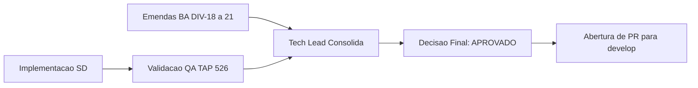

# Aprovacao Final do Tech Lead — Envio em Partes e Entrada Padrao

## Identificacao

- Projeto ou produto: Aplicacao CLI em shell script para integracao com a Dropbox API v2
- Responsavel Tech Lead: Tech Lead
- Data da aprovacao: 2026-08-19
- Escopo avaliado: Implementacao de `lib/transfer.sh`, refatoracao de `lib/hash.sh` com API incremental, atualizacao de `commands/upload.sh`, suite de testes e documentacao formal na branch `feature/upload-em-partes-e-entrada-padrao`
- Uso do template padrao neste fechamento?: Sim
- Em caso de nao, justificativa explicita para excecao: Nao aplicavel — template padrao seguido integralmente, adaptando-se com justificativa explicita os campos de UI/UX, Design System e persistencia
- Status final: Aprovado

## Artefatos obrigatorios revisados

- Revisao consolidada do Tech Lead: SIM
- Link ou referencia do arquivo concreto da revisao consolidada do Tech Lead: `/home/sales/dropbox_api/docs/registros/2026-08-19_revisao-consolidada-upload-em-partes-e-entrada-padrao.md`
- System Design revisado: SIM — `docs/arquitetura/system-design.md` (v1.2)
- Template padrao de System Design utilizado?: Sim
- Em caso de nao, justificativa explicita: Nao aplicavel
- PRD aplicavel?: Nao — o projeto adota `docs/requisitos/escopo-requisitos-e-criterios-de-aceite.md` como equivalente funcional
- Referencia do PRD revisado: `docs/requisitos/escopo-requisitos-e-criterios-de-aceite.md` (v1.2)
- ARD aplicavel?: Nao — o projeto adota `docs/arquitetura/system-design.md` como equivalente funcional
- Referencia do ARD revisado: `docs/arquitetura/system-design.md` (v1.2)
- Resumo das divergencias resolvidas entre PRD, ARD, implementacao e evidencias de validacao:
  - DIV-18: RF-31 emendado separando falha de leitura (exigida e cumprida) de interrupcao de produtor de cano anonimo (impossibilidade sem pipefail). Registrado em RSK-36 e submetido em DP-29.
  - DIV-19: Lacuna de RF-08 declarada (tamanho de parte fixado em 4 MiB para coincidir com bloco de resumo). Trabalho futuro registrado. Submetido em DP-30.
  - DIV-20: `lib/stream` descontinuado no desenho; absorvido por `lib/transfer` e `lib/hash`.
  - DIV-21: Procedencia do contrato alinhada ao ramo `main` de `dropbox-api-spec`; RES-18 criada.
- Bloqueios remanescentes aceitos ou justificados: Nenhum bloqueio remanescente para merge em `develop`.
- Validacao QA frontend aplicavel?: Nao — CLI em shell script sem interface web ou grafica.
- Template QA frontend utilizado?: Nao — inaplicavel.
- Documento de validacao QA frontend referenciado no fechamento final: Nao aplicavel.
- Trecho, link ou evidencia reaproveitada da validacao QA frontend: Nao aplicavel.
- Em caso de nao, justificativa explicita: Aplicacao CLI pura sem camadas de interface web.
- Documento de Design System referenciado?: Nao — inaplicavel.
- Evidencias adicionais consultadas:
  - Suite de testes TAP completa executada via `bash tests/run.sh < /dev/null`: 16 arquivos, 526 casos aprovados, 0 reprovados, 2 pulados.
  - Analise estatica `shellcheck` exit 0 em modo `-x` e modo padrao.
  - Guarda de remocao de casos executada via `bash scripts/verificar-remocao-de-casos.sh`: exit 0.
  - Registro de entrega do Senior Developer em `docs/registros/2026-08-19_entrega-envio-em-partes-e-entrada-padrao.md`.

## Gates aplicados

| Gate | Aplicavel | Resultado | Evidencia | Observacoes |
|---|---|---|---|---|
| Business Analyst / Requisitos e System Design | Sim | APROVADO | `docs/requisitos/` e `docs/arquitetura/system-design.md` atualizados | Divergencias DIV-18 a DIV-21 formalmente tratadas |
| QA Expert / Suite de testes e instrumentos | Sim | APROVADO | 526 casos aprovados, zero falhas; correcoes em instrumentos auditadas | Portao verde verificado |
| UX Expert / Interface | Nao | Nao se aplica | CLI pura em shell script | Sem componentes graficos |
| DBA / Persistencia | Nao | Nao se aplica | PRJ-DEC-07 mantido: sem estado local persistente | Sem banco de dados ou cursores persistentes no MVP |

## Criterios de aceite consolidados

| Criterio | Status | Evidencia | Observacoes |
|---|---|---|---|
| Revisao consolidada do Tech Lead registrada | APROVADO | `docs/registros/2026-08-19_revisao-consolidada-upload-em-partes-e-entrada-padrao.md` | Registrada e vinculada |
| Referencia concreta ao arquivo da revisao consolidada | APROVADO | Caminho absoluto registrado na secao de artefatos | Auditavel |
| Requisitos claros e rastreaveis | APROVADO | RF-31, RF-08, RF-09, RF-15 rastreados nos testes e no codigo | Rastreabilidade mantida |
| PRD revisado quando aplicavel | APROVADO | Requisitos atualizados na v1.2 | Equivalente funcional |
| ARD revisado quando aplicavel | APROVADO | System Design v1.2 | Equivalente funcional |
| Divergencias tratadas | APROVADO | DIV-18 a DIV-21 documentadas e pacificadas | Todas tratadas |
| System Design aderente ao template | APROVADO | `docs/arquitetura/system-design.md` | Sem desvio |
| Vinculo entre System Design e Design System | Nao se aplica | CLI pura | Sem frontend |
| Validacao QA registrada | APROVADO | Suite TAP 526/0/2 e analise estatica exit 0 | Evidencias revalidadas |
| Riscos residuais aceitaveis | APROVADO | RSK-36 aceito com recomendacao operacional de documentacao | Risco caracterizado |

## Riscos residuais e rollback

- Riscos residuais aceitos:
  - Interrupcao de produtor de pipe externo sem `pipefail` pode resultar em publicacao do prefixo lido (RSK-36). Recomendacao de documentacao na ajuda do comando registrada.
  - Tamanho de parte fixo em 4 MiB (DIV-19), adequado para o MVP e aderente ao algoritmo de `content_hash`.
- Riscos residuais nao aceitos: Nenhum.
- Plano de rollback:
  - Reversao limpa de merge da branch `feature/upload-em-partes-e-entrada-padrao` ou restauracao pontual dos commits. Nenhum dado do operador ou estado local persistente e corrompido.
- Dependencias criticas para monitoramento:
  - Conclusao do PR #13 sobre `bin/dbx` para insercao da recomendacao de `set -o pipefail`.

## Decisao final

- Decisao do Tech Lead: **APROVADO**. A entrega de envio em partes e entrada padrao esta aprovada para commit semantico, push e abertura de Pull Request direcionado a `develop`.
- Condicoes para fechamento:
  - Publicacao dos commits seguindo o padrao Conventional Commits.
  - Envio do ramo ao remoto (`origin`).
  - Abertura de Pull Request para `develop` com label `review`.
- Pendencias remanescentes:
  - Decisoes de negocio `DP-29` e `DP-30` submetidas ao solicitante.
- Escalonamentos necessarios: Nenhum.
- Sintese final do impacto global da entrega: O projeto passa a suportar envio de arquivos de qualquer tamanho via sessao sequencial com integridade ponta a ponta e fluxos por entrada padrao (`stdin`), cumprindo os requisitos funcionais P0 estabelecidos para esta fase.

