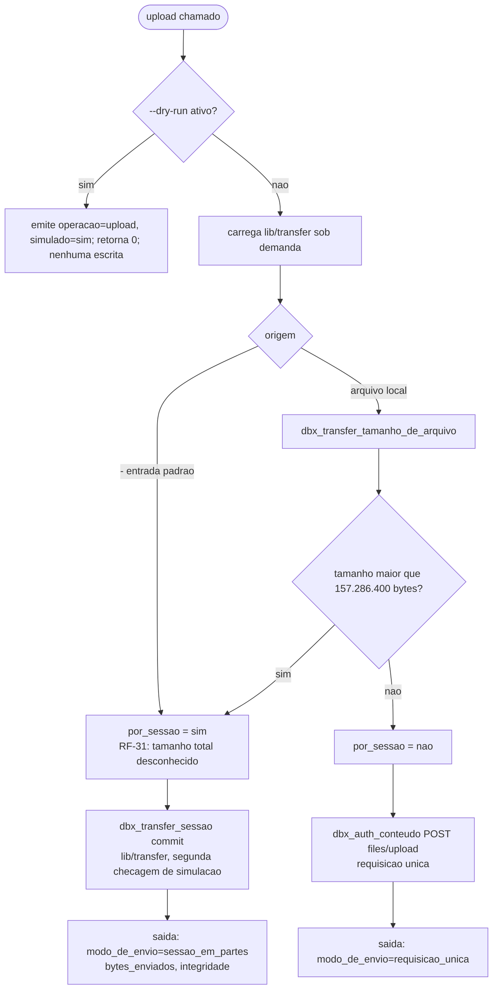

# Registro Tecnico de Entrega — Envio em Partes e Entrada Padrao no `upload`

## Identificacao

| Campo | Valor |
|---|---|
| Escopo | sessao de envio em partes da Dropbox; remocao da recusa de `-` (entrada padrao) em `commands/upload.sh` |
| Requisitos | RF-31 (P0), RF-08 (P0), RF-09 (P0); RF-15 preservado |
| Branch | `feature/upload-em-partes-e-entrada-padrao`, a partir de `develop` |
| Papel | Senior Developer |
| Data | 2026-08-19 |
| Commit | nenhum — sem commit nesta entrega, por determinacao do solicitante |
| Estado | pronto para handoff ao QA |

## Arquivos

| Situacao | Arquivo |
|---|---|
| Novo | `lib/transfer.sh` |
| Novo | `tests/unit/transfer_test.sh` |
| Alterado | `lib/hash.sh` |
| Alterado | `commands/upload.sh` |
| Alterado | `tests/unit/hash_test.sh` |
| Alterado | `tests/unit/harness_test.sh` |
| Alterado | `tests/integracao/comandos_test.sh` |

## Decisoes de desenho

Fixadas pelo Tech Lead e implementadas nesta entrega, na ordem em que se encadeiam.

### 1. Sessao SEQUENCIAL, parte FIXA em 4 MiB — lacuna de RF-08 declarada

O tamanho de parte usado no envio em partes (4.194.304 bytes) e a MESMA grandeza do bloco do `content_hash`. Torna-lo configuravel nesta entrega, sem antes separar as duas nocoes — "parte de rede" e "bloco de resumo" —, quebraria a cadeia de resumos em silencio: uma parte diferente do bloco produziria um `content_hash` bem formado e errado, divergencia que so apareceria na comparacao com o servico.

A lacuna de RF-08 ("tamanho de parte configuravel") esta DECLARADA no cabecalho de `lib/transfer.sh`, com a razao tecnica e o trabalho futuro registrados ali mesmo (separar as duas nocoes antes de expor o valor).

### 2. Sequencia da sessao: `start` vazio -> `append_v2` por bloco cheio -> `finish` com bloco final e `commit`

`start` sai com corpo vazio — em sessao sequencial e permitido mandar dado ja no inicio, mas nao mandar mantem uma unica forma de enviar parte (a do `append_v2`), com a regra de deslocamento tendo um dono so. `finish` leva o ultimo bloco, possivelmente vazio, mais o objeto `commit`.

O `commit` e o MESMO objeto usado na requisicao unica: montado uma unica vez em `_dbx_upload_objeto_de_publicacao` (em `commands/upload.sh`) e passado pronto para `lib/transfer.sh`. Monta-lo em cada caminho separadamente seria a forma exata da familia de gemeos ja paga neste projeto.

### 3. Teto de ocupacao em disco: um bloco

Arquivo unico reaproveitado a cada volta, em area criada por `mktemp -d` sob `umask 077` (area `0700`, arquivo `0600`), removida no caminho normal e por `trap` em `INT`, `TERM`, `HUP` e `EXIT`.

### 4. Leitura sem cano

`head -c` com o status observado diretamente (sem passar por pipeline), e `wc -c` para o tamanho do bloco lido. Por cano, apenas o status do ultimo comando e observavel — EIO, truncamento sob leitura ou produtor morto no meio produziriam resumo bem formado de conteudo incompleto com status zero.

### 5. `content_hash` com uma implementacao

`lib/hash.sh` ganhou API incremental: `dbx_hash_acumular_iniciar`, `dbx_hash_acumular_bloco <arquivo>`, `dbx_hash_acumular_encerrar <arquivo_de_trabalho>`, com os canais publicos `DBX_HASH_RESULTADO` e `DBX_HASH_BYTES`. `_dbx_hash_calcular` foi REESCRITO como consumidor dessa API — o algoritmo mora em um lugar so, e o caso `calculo_de_uma_passada_passa_pela_api_incremental` reprova quem reintroduzir um segundo caminho.

### 6. Integridade ponta a ponta

O `content_hash` acumulado localmente (parte a parte, pela API incremental) e comparado com o devolvido pelo `finish`. Divergencia produz classe `integridade` (codigo 11).

`content_hash` NAO e enviado por parte no `append_v2`, embora o campo exista no argumento. Motivo registrado em comentario: a interpretacao exata do campo por chamada — se e o resumo daquela parte, do acumulado ou do arquivo final — nao pode ser validada fora do servico, e a suite nao apanharia um envio errado porque o duplo aceitaria qualquer valor.

### 7. RF-09: retentativa por parte e reconciliacao de deslocamento

Duas camadas:

1. `idempotente=sim` no `append_v2` — a retentativa interna de `lib/http` repete a MESMA requisicao com o MESMO deslocamento.
2. Reconciliacao de deslocamento em `incorrect_offset`: se `correct_offset == deslocamento + tamanho`, a parte ja foi aceita numa tentativa anterior cuja resposta se perdeu, e o codigo trata como progresso e avanca. Qualquer outro valor aborta com classe `nao_concluida` (codigo 14) e diagnostico que nomeia o deslocamento esperado e o recebido.

### 8. Nada parcial publicado

O arquivo so aparece no destino quando o `finish` retorna. Nao existe chamada de aborto de sessao no contrato documentado, e nenhuma foi inventada — uma sessao abandonada expira sozinha no servico.

### 9. RF-08: roteamento por tamanho

Arquivo local acima de 150 MiB (`DBX_TRANSFER_LIMITE_REQUISICAO=157286400`) e roteado automaticamente pela sessao; abaixo disso segue por `files/upload`. Um unico laco de sessao (`_dbx_transfer_conduzir`) serve tanto o fluxo pela entrada padrao quanto o arquivo local acima do teto — dois lacos separados repetiriam a familia de gemeos, com a proxima correcao de deslocamento valendo para um lado so.

### 10. RF-15: gate de simulacao antes da bifurcacao

A verificacao de simulacao esta em `commands/upload.sh` ANTES da bifurcacao entre os dois caminhos de escrita (sessao e requisicao unica), dominando os dois. `lib/transfer.sh` tambem recusa executar sob simulacao, como segunda linha de defesa — falha fechada para um chamador futuro que esqueca o gate no comando.

## Procedencia do contrato

O desenho da sessao segue o `files.stone` do repositorio `dropbox/dropbox-api-spec`, ramo `main`. E contrato DOCUMENTADO, lido, NAO exercitado contra o servico real.

Isso responde a pendencia registrada em `docs/registros/2026-08-18_entrega-comandos-diretos-parcial.md`, linha 113 ("confirmar que a Dropbox aceita retentativa por parte em `append_v2`"): a resposta e SIM, por documentacao.

- `offset` e documentado como "The amount of data that has been uploaded so far. We use this to make sure upload data isn't lost or duplicated in the event of a network error".
- `incorrect_offset` e documentado como "This error may occur when a previous request was received and processed successfully but the client did not receive the response, e.g. due to a network error".

A pendencia passa de "nao medida" para "respondida por documentacao, ainda nao exercitada" — permanece nao exercitada contra o servico real ate a validacao do QA (ou etapa posterior) contra a API viva.

## Portoes (evidencias de validacao)

| Verificacao | Comando | Resultado |
|---|---|---|
| Suite completa | `bash tests/run.sh` | APROVADA — 16 arquivos, 522 casos aprovados, 0 reprovados, 2 pulados; tempo aproximado 34 s (base em `develop`: 489/0/2) |
| Analise estatica com fontes externas | `shellcheck -x bin/dbx lib/*.sh commands/*.sh tests/**/*.sh` | exit 0 |
| Analise estatica sem `-x` | `shellcheck bin/dbx lib/*.sh commands/*.sh tests/**/*.sh` | exit 0 |
| Guarda de remocao de casos | `bash scripts/verificar-remocao-de-casos.sh` | exit 0 — "491 -> 502 caso(s), nenhuma reducao nao declarada" |

## Cobertura de teste nova

| Arquivo | Casos novos |
|---|---|
| `tests/unit/transfer_test.sh` | 22 |
| `tests/unit/hash_test.sh` | 5 |
| `tests/unit/harness_test.sh` | 1 |
| `tests/integracao/comandos_test.sh` | 6 |

Em `tests/integracao/comandos_test.sh`, o caso `teste_upload_recusa_entrada_padrao_com_diagnostico` foi SUBSTITUIDO, nao apagado — a recusa de `-` deixou de valer com esta entrega, e o caso que a fixava passou a descrever comportamento inexistente.

## Defeitos encontrados durante a entrega

Sem suavizar. Quatro achados, de naturezas distintas.

### D1 — no INSTRUMENTO: colisao de nomes entre auxiliares de teste

O auxiliar novo `_rodar_com_entrada`, adicionado a `tests/integracao/comandos_test.sh`, colidiu com outro de mesmo nome definido MAIS ABAIXO no mesmo arquivo, com contrato diferente: um recebe caminho de arquivo, o outro recebe o texto a alimentar. Em `bash`, a definicao posterior vence. Resultado: o caminho de um arquivo de 5 MiB passou a ser gravado num arquivo temporario e servido como se fosse o proprio conteudo — o comando leu 41 bytes de um fluxo que deveria ter 5 MiB, e a suite acusou a IMPLEMENTACAO por um defeito do instrumento.

Correcao: o auxiliar foi renomeado para `_rodar_com_fluxo`.

Contramedida nova: `teste_nenhum_arquivo_de_teste_redefine_uma_funcao_propria`, em `tests/unit/harness_test.sh`, com prova de discriminacao nos dois sentidos e mutacao verificada no proprio repositorio — duplicando `_duplo` em `tests/unit/http_test.sh`, a auditoria reprovou com `"http_test.sh:_duplo"`; restaurado o arquivo original, a auditoria voltou a aprovar.

### D2 — na AUDITORIA existente: `_chaves_sensiveis_em_maiuscula` captura `_` isolado

`_chaves_sensiveis_em_maiuscula`, em `tests/integracao/composicao_test.sh`, extrai `[a-z_]+` do bloco da tabela de chaves sensiveis e captura tambem o caractere `_` isolado, vindo do proprio nome `DBX_ERRORS_CHAVES_SENSIVEIS`. Com `_` na lista de chaves sensiveis, o teste "o componente lida com credencial?" passa a casar com QUALQUER componente que use uma variavel no formato `DBX_X_Y`.

A auditoria fica mais ESTRITA do que declara, nao mais frouxa — mas a justificativa escrita ("o componente lida com credencial") e falsa para a maioria dos componentes que ela agora aciona. Nao foi corrigida nesta entrega por estar fora do escopo; fica registrada.

### D3 — no ALCANCE de auditoria existente: universo restrito a `tests/unit` e `tests/support`

`teste_massa_adversarial_nao_e_construida_por_substituicao_de_comando`, em `tests/unit/json_test.sh`, varre apenas `tests/unit/*.sh` e `tests/support/*.sh`; `tests/integracao/*.sh` fica fora do universo varrido. Estender exigiria refinar o padrao, porque ha dois usos legitimos de `$(printf '%s' ... | tr ...)` em `tests/integracao/composicao_test.sh`. Registrado, nao corrigido.

### D4 — no ALCANCE de `scripts/verificar-remocao-de-casos.sh`: universo vem de `git ls-tree`

O universo do portao vem de `git ls-tree`, entao um arquivo de teste ainda NAO versionado nao entra na contagem. Por isso o portao reporta "491 -> 502" enquanto a suite executa 524 casos (522 aprovados + 2 pulados): os 22 casos de `tests/unit/transfer_test.sh` sao invisiveis ao portao ate o arquivo ser commitado. Nao e reducao — e limite de alcance do instrumento, que so enxerga o que ja esta sob controle de versao.

## Limites declarados

### Produtor de cano anonimo que morre no meio e indistinguivel de fim de fluxo legitimo

O cano fecha e o processo ve EOF nos dois casos; o status de saida do produtor pertence ao shell do operador e nunca chega a este processo. O criterio de RF-31 "dado que a origem do fluxo falhe no meio, entao nenhum arquivo parcial e publicado" e cumprido para FALHA DE LEITURA (status nao zero do leitor), NAO para um produtor que encerrou mal apos escrever um prefixo.

MEDIDO: um produtor que escreve 5.000.000 bytes e sai com status 3 faz o comando publicar os 5.000.000 bytes e sair com ZERO. Com `set -o pipefail` no shell do operador, o encadeamento devolve 3.

Recomendacao ao operador: usar `set -o pipefail`. Pendencia: essa recomendacao vive hoje so em comentario, e o lugar dela e o texto de ajuda, que mora em `bin/dbx` — arquivo fora do alcance desta entrega por haver PR aberto (#13) sobre ele.

### Teto de ocupacao nao e "sempre uma parte"

A area recebe, no encerramento, a cadeia de resumos de 32 bytes por bloco. O pico real e o MAIOR entre uma parte e 32 x N; ultrapassar uma parte exigiria 131.072 blocos, isto e, 512 GiB de conteudo.

### A medicao de ocupacao amostra em instantes de chamada

O teste amostra nos INSTANTES DE CHAMADA, e nao continuamente; um pico entre duas chamadas nao seria visto. A propriedade verificada e a mais forte disponivel: o pico NAO CRESCE quando o numero de partes dobra (2 partes contra 4 partes, mesmo valor).

### `content_hash` por parte nao enviado

`content_hash` por parte no `append_v2` nao foi enviado; a interpretacao exata do campo por chamada nao pode ser validada offline.

### Serializacao de `incorrect_offset` nao verificada

A serializacao exata da carga de uniao de `incorrect_offset` (achatada em `error` ou aninhada sob a tag) NAO foi verificada contra o servico; `lib/transfer.sh` aceita as duas formas e falha fechada se nenhuma estiver presente.

### `dbx_transfer_sessao` remove tratadores de sinal, nao restaura os do chamador

`dbx_transfer_sessao` REMOVE os tratadores de `INT`/`TERM`/`HUP`/`EXIT` ao terminar, e nao restaura os que o chamador porventura tivesse. Hoje ninguem no produto os arma antes de chamar; quando alguem armar, a linha precisa virar salvar e restaurar, e nao ser apagada.

## Divergencias contra os requisitos

Para o Tech Lead consolidar.

- **RF-08** pede "tamanho de parte configuravel"; a entrega fixa 4 MiB. Lacuna declarada, com razao tecnica e trabalho futuro (ver Decisao de desenho 1).
- A matriz de rastreabilidade de `docs/requisitos/escopo-requisitos-e-criterios-de-aceite.md` (linhas 490-491) aponta `lib/stream` para RF-31 e RF-32. Esse componente NAO existe e nao foi criado — a responsabilidade de RF-31 ficou em `lib/transfer`. A linha da matriz esta desatualizada e precisa de correcao (RF-32 permanece pendente, fora do escopo desta entrega).
- A pendencia da linha 113 de `docs/registros/2026-08-18_entrega-comandos-diretos-parcial.md` passa de "nao medida" para "respondida por documentacao, ainda nao exercitada" (ver secao Procedencia do contrato).

## Plano de reversao

A entrega e aditiva. Reverter significa:

1. Restaurar `commands/upload.sh`, `lib/hash.sh`, `tests/unit/hash_test.sh`, `tests/unit/harness_test.sh` e `tests/integracao/comandos_test.sh` ao estado de `develop`.
2. Remover `lib/transfer.sh` e `tests/unit/transfer_test.sh`.

Nenhum dado do operador e afetado; nenhum estado local persistente foi introduzido (PRJ-DEC-07 e RSK-23 preservados).

## Handoff para QA

Itens a validar de forma independente:

1. Ordem exata das chamadas (`start` -> `append_v2`* -> `finish`) e dos deslocamentos (`offset`) em cada uma.
2. Teto de ocupacao em disco — um bloco, com a ressalva da cadeia de resumos acima de 512 GiB.
3. Permissoes da area temporaria (`0700`) e do arquivo de bloco (`0600`).
4. Ausencia de residuo em disco apos sucesso.
5. Comportamento sob falha de leitura da origem e sob interrupcao (`INT`/`TERM`/`HUP`) no meio da sessao — nada publicado, sem residuo.
6. Reconciliacao de `incorrect_offset` nos dois sentidos: `correct_offset` coerente (avanca) e incoerente (aborta com diagnostico).
7. Divergencia de `content_hash` entre o local e o devolvido pelo `finish`.
8. `--dry-run` no ramo novo (sessao em partes), confirmando que nenhuma chamada de escrita e emitida.
9. Roteamento por tamanho — arquivo abaixo e acima de `DBX_TRANSFER_LIMITE_REQUISICAO` (157.286.400 bytes).
10. Os quatro defeitos e limites declarados acima (D1-D4 e os seis limites), confirmando que permanecem no estado descrito e nao foram silenciosamente resolvidos ou agravados.

## Diagramas

### Sequencia da sessao em partes, com reconciliacao de deslocamento

```mermaid
sequenceDiagram
    participant CMD as commands/upload.sh
    participant TR as lib/transfer.sh
    participant HTTP as lib/auth / lib/http
    participant DBX as Dropbox (content API)

    CMD->>TR: dbx_transfer_sessao(commit)
    TR->>HTTP: POST upload_session/start {"close":false} (corpo vazio)
    HTTP->>DBX: requisicao
    DBX-->>TR: session_id
    loop enquanto o bloco lido estiver cheio (4 MiB)
        TR->>TR: head -c 4194304 -> bloco; dbx_hash_acumular_bloco
        TR->>HTTP: POST append_v2 {cursor:{session_id, offset}, close:false} idempotente=sim
        HTTP->>DBX: requisicao
        alt sucesso
            DBX-->>TR: 200
            TR->>TR: deslocamento += tamanho da parte
        else incorrect_offset
            DBX-->>TR: error incorrect_offset {correct_offset}
            alt correct_offset == deslocamento + tamanho
                TR->>TR: parte ja aceita antes; avanca deslocamento
            else correct_offset diverge
                TR-->>CMD: falha nao_concluida (14), esperado x recebido
            end
        else outra falha
            DBX-->>TR: erro remoto
            TR-->>CMD: falha na classe reportada por lib/http
        end
    end
    Note over TR: leitura curta (bloco menor que 4 MiB, inclusive 0) encerra o laco
    TR->>HTTP: POST finish {cursor:{session_id, offset}, commit} + bloco final
    HTTP->>DBX: requisicao
    DBX-->>TR: metadado + content_hash remoto
    TR->>TR: dbx_hash_acumular_encerrar -> content_hash local
    alt hashes iguais
        TR-->>CMD: integridade = conferida
    else hashes divergem
        TR-->>CMD: falha integridade (11)
    end
```

### Fluxo de decisao de `commands/upload.sh`


