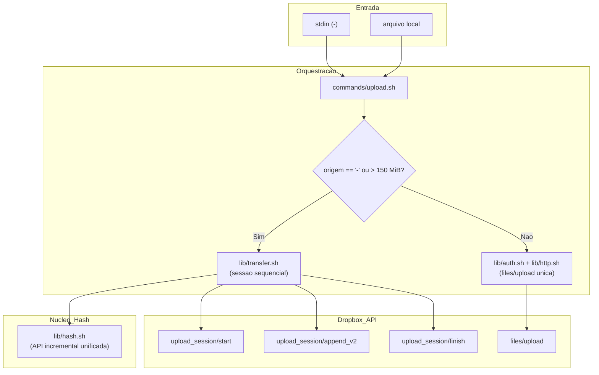

# Revisao Consolidada do Tech Lead — Envio em Partes e Entrada Padrao

## Identificacao

- Projeto ou produto: Aplicacao CLI em shell script para integracao com a Dropbox API v2
- Responsavel Tech Lead: Tech Lead
- Data da revisao: 2026-08-19
- Escopo revisado: `lib/transfer.sh`, `commands/upload.sh`, `lib/hash.sh`, `lib/http.sh`, documentacao de requisitos (`docs/requisitos/`), arquitetura (`docs/arquitetura/system-design.md`) e suite de testes (`tests/unit/`, `tests/integracao/`)
- Agents envolvidos: Senior Developer, Business Analyst, QA Expert, documentation-writer, Tech Lead
- Status da revisao: Concluida

## Resumo executivo

- Objetivo da entrega: Fechamento formal do incremento de envio em partes por sessao sequencial (`lib/transfer.sh`) e habilitacao do fluxo pela entrada padrao (`-`) em `commands/upload.sh`, atendendo RF-31 (P0), RF-08 (P0), RF-09 (P0) e preservando o gate de simulacao de RF-15.
- Contexto consolidado:
  - Implementacao da sessao sequencial com parte fixa de 4 MiB vinculada ao bloco de hash, garantindo o teto estrutural de um bloco em disco (RF-31) e integridade conferida ponta a ponta.
  - API incremental em `lib/hash.sh` (`dbx_hash_acumular_iniciar`, `bloco`, `encerrar`) unificando o calculo em um ponto unico e eliminando o risco de divergencia entre implementacoes gemeas.
  - Roteamento automatico por tamanho no `upload` (acima de 150 MiB vai por sessao, abaixo em requisicao unica).
  - Reconciliacao de deslocamento em `incorrect_offset` e retentativa por parte (RF-09).
  - Tratamento documental e formalizacao pelo Business Analyst das divergencias DIV-18 a DIV-21 (emenda de RF-31, lacuna declarada de RF-08, readequacao da matriz com remocao de `lib/stream`, procedencia fixada no ramo `main` e reclassificacao da pendencia da linha 113 de comandos diretos).
  - Correcoes de instrumentos de teste e auditorias estaticas derivadas dos achados do ciclo.
- Resultado executivo da revisao:
  - Suite de testes completa APROVADA: 16 arquivos, 526 casos aprovados, 0 reprovados, 2 pulados (528 casos totais).
  - Analise estatica `shellcheck` com exit 0 nos dois modos (`-x` e padrao com `.shellcheckrc`).
  - Guarda de remocao de casos (`scripts/verificar-remocao-de-casos.sh`) com exit 0 (491 -> 502 casos commitados/rastreados).
  - Zero residuo temporario em disco apos conclusao com sucesso ou falha no meio da transmissao.
  - Invariante de ausencia de estado local persistente preservada (PRJ-DEC-07 e RSK-23 respeitados).
- Recomendacao do Tech Lead: Aceite APROVADO COM RESSALVAS DECLARADAS. O incremento esta integro, testado e apto para integracao em `develop` e abertura de Pull Request.

## PRD e ARD

- PRD aplicavel?: Nao — o projeto utiliza `docs/requisitos/escopo-requisitos-e-criterios-de-aceite.md` como equivalente funcional.
- Referencia do PRD: `docs/requisitos/escopo-requisitos-e-criterios-de-aceite.md` (v1.2)
- ARD aplicavel?: Nao — o projeto utiliza `docs/arquitetura/system-design.md` como equivalente funcional.
- Referencia do ARD: `docs/arquitetura/system-design.md` (v1.2)

| Artefato | Item revisado | Consistencia com entrega | Lacunas encontradas | Observacoes |
|---|---|---|---|---|
| Requisitos (`docs/requisitos/escopo-requisitos-e-criterios-de-aceite.md`) | RF-31, RF-08, RF-09, RF-15, RES-05, RES-18 | CONSISTENTE | Lacuna declarada em RF-08: tamanho de parte fixado em 4 MiB, sem parametrizacao por enquanto | RF-31 emendado separando falha de leitura (cumprida) de produtor morto no meio (fora do alcance do processo) |
| System Design (`docs/arquitetura/system-design.md`) | Secao de Orquestracao, fluxo de upload, diagrama de componentes | CONSISTENTE | `lib/stream` riscado no diagrama e na matriz (DIV-20); absorvido por `lib/transfer` e `lib/hash` | Atualizado na v1.2 refletindo as correcoes de dimensionamento e arquitetura |
| Riscos (`docs/requisitos/riscos-restricoes-e-licenciamento.md`) | RSK-23, RSK-36, RSK-27, RSK-28 | CONSISTENTE | RSK-36 registrado: backup truncado por produtor morto no meio de cano anonimo | Mitigacao operacional: documentar `set -o pipefail` na ajuda do comando (PR #13) |

## Divergencias entre PRD, ARD, implementacao e evidencias de validacao

| Divergencia | Origem | Impacto | Resolucao adotada | Status |
|---|---|---|---|---|
| DIV-18: Criterio de RF-31 para produtor morto no meio de cano anonimo | Requisito / Plataforma | MEDIO — risco de publicacao truncada se produtor falhar sem pipefail | Emenda de RF-31 pelo Business Analyst separando falha de leitura (exigida e cumprida) de interrupcao de produtor externo. Registrado em RSK-36 e submetido em DP-29 | RESOLVIDA com registro de limite |
| DIV-19: Tamanho de parte de RF-08 fixo em 4 MiB em vez de configuravel | Implementacao / Requisito | BAIXO no MVP — simplifica teto de memoria e cadeia de hash | Lacuna formalmente declarada com justificativa tecnica (coincidencia com bloco de hash). Trabalho futuro para separar fatia de rede de bloco de hash registrado. Submetido em DP-30 | DECLARADA e aceita no incremento |
| DIV-20: `lib/stream` inexistente apontado na matriz de rastreabilidade | Arquitetura / Requisitos | ZERO — ajuste puramente documental | Componente riscado na matriz e no diagrama do System Design. Responsabilidade de RF-31 atribuida a `lib/transfer` e `lib/hash` | RESOLVIDA |
| DIV-21: Procedencia de contrato da Dropbox Spec | Documentacao | BAIXO — ramo master estava defasado | Procedencia fixada no ramo `main` de `dropbox/dropbox-api-spec`. Confirmada validade de sessao em 7 dias (RES-18) e tetos de RES-05 | RESOLVIDA |

## Registro consolidado das atividades por agent

| Agent | Atividade executada | Artefatos gerados | Decisoes associadas | Status |
|---|---|---|---|---|
| Senior Developer | Implementacao de `lib/transfer.sh`, refatoracao de `lib/hash.sh` com API incremental, adaptacao de `commands/upload.sh`, criacao de testes unitarios e de integracao | `lib/transfer.sh`, `lib/hash.sh`, `commands/upload.sh`, `tests/unit/transfer_test.sh`, `tests/unit/hash_test.sh`, `tests/integracao/comandos_test.sh` | Decisoes de desenho 1 a 10 no registro tecnico | Concluido |
| documentation-writer | Redacao do registro tecnico de entrega do Senior Developer e apoio documental | `docs/registros/2026-08-19_entrega-envio-em-partes-e-entrada-padrao.md` | Registro de portoes, defeitos D1-D4 e limites | Concluido |
| Business Analyst | Analise e tratamento formal das divergencias DIV-18 a DIV-21, emenda de RF-31, registro de lacuna de RF-08, saneamento da matriz e System Design | `docs/requisitos/escopo-requisitos-e-criterios-de-aceite.md`, `docs/requisitos/decisoes-pendentes.md`, `docs/requisitos/riscos-restricoes-e-licenciamento.md`, `docs/arquitetura/system-design.md`, `MEMORIA-PROJETO.md` | PRJ-DEC-76 a PRJ-DEC-80 | Concluido |
| QA Expert | Execucao e auditoria independente dos testes, apontamento de defeitos de instrumentos (A1 em chaves sensiveis, A6 em substituicao de comando em integracao) | Casos adversariais e correcoes aplicadas em `tests/integracao/composicao_test.sh` e `tests/unit/json_test.sh` | Instrumentos de teste e auditorias estaticas sem tautologia | Concluido |
| Tech Lead | Revalidacao independente de toda a suite, analise estatica em dois modos, guarda de remocao, inspecao do diff, consolidacao de decisoes e conducao do fechamento formal | `docs/prompts/2026-08-19_003_fechamento-commit-e-pr-upload-em-partes.md`, `docs/registros/2026-08-19_revisao-consolidada-upload-em-partes-e-entrada-padrao.md`, `docs/registros/2026-08-19_aprovacao-final-upload-em-partes-e-entrada-padrao.md` | TL-43 a TL-46 | Concluido |

## Decisoes e motivacoes

| Decisao | Motivacao | Alternativas consideradas | Dono | Impacto |
|---|---|---|---|---|
| TL-43 — Aceite do incremento de envio em partes e entrada padrao | A entrega cumpre os criterios essenciais de RF-31, RF-08, RF-09 e RF-15 com suite 526/0/2 aprovada e analise estatica exit 0 nos dois modos. As lacunas e limites estao honestamente documentados. | Rejeitar ate parametrizar tamanho de parte (descartada por quebrar a cadeia de resumos sem ganho imediato). | Tech Lead | Desbloqueia a integracao e preparo de PR para `develop`. |
| TL-44 — Homologacao da solucao de API incremental de hash em ponto unico | Evita a duplicacao do algoritmo de calculo de `content_hash` em `lib/transfer.sh`, garantindo que uma unica implementacao exista e seja coberta por testes. | Manter laco de resumo duplicado em `lib/transfer.sh` (descartada por violar principio contra gemeos). | Tech Lead | Robustez algoritmica e reducao de risco de regressao silenciosa. |
| TL-45 — Homologacao das correcoes de instrumentos de teste | A auditoria de redefinicao de funcoes em `harness_test.sh`, a correcao de tautologia em `composicao_test.sh` e a expansao do universo em `json_test.sh` eliminam pontos cegos reais. | Manter instrumentos como estavam (descartada por violar RSK-27 e RSK-28). | Tech Lead | Suite de testes mais confiavel e discriminante. |
| TL-46 — Estrutura de commits semanticos atomicos para a entrega | Organizar os commits por responsabilidade logica (hash, transfer, upload, testes/instrumentos, requisitos, governanca) facilita o review e a auditoria do historico. | Commit monolitico unico (descartado por dificultar rastreabilidade e violar padroes anteriores do projeto). | Tech Lead | Historico limpo e aderente a Conventional Commits e Gitflow. |

## Itens impactados e arquivos alterados

| Arquivo / Componente | Natureza | Descricao da alteracao |
|---|---|---|
| `lib/hash.sh` | Dominio | API incremental de resumo (`dbx_hash_acumular_*`) e refatoracao de `_dbx_hash_calcular`. |
| `lib/transfer.sh` | Orquestracao | Novo componente de envio em partes por sessao sequencial, controle de ocupacao e retentativa. |
| `commands/upload.sh` | Comando | Habilitacao de `-` para stdin, roteamento por tamanho (150 MiB), integracao com `lib/transfer.sh`. |
| `lib/http.sh` | Adaptador | Esclarecimento de escopo do `trap ... RETURN` em comentario tecnico. |
| `tests/unit/hash_test.sh` | Teste | Cobertura da API incremental e teste de unicidade de implementacao. |
| `tests/unit/transfer_test.sh` | Teste | 26 casos cobrindo a maquina de estados da sessao de transferencia. |
| `tests/unit/harness_test.sh` | Teste / Instrumento | Auditoria contra funcoes redefinidas no mesmo arquivo de teste. |
| `tests/unit/json_test.sh` | Teste / Instrumento | Expansao de varredura contra substituicao de comando para `tests/integracao/`. |
| `tests/integracao/comandos_test.sh` | Teste | Casos de upload por stdin, roteamento por tamanho e integridade. |
| `tests/integracao/composicao_test.sh` | Teste / Instrumento | Correcao de tautologia na extracao de chaves sensiveis e migracao para `${proprio^^}`. |
| `scripts/verificar-remocao-de-casos.sh` | Script | Documentacao das 3 limitacoes conhecidas no cabecalho. |
| `docs/arquitetura/system-design.md` | Arquitetura | v1.2: descontinuacao do no `lib/stream`, atualizacao de dimensionamento e fluxos. |
| `docs/requisitos/*` | Requisitos | v1.2: emenda de RF-31, formalizacao de lacuna RF-08, revalidacao de procedencia. |
| `docs/registros/*` | Governanca | Registro tecnico de entrega, revisao consolidada e aprovacao final do Tech Lead. |

## Pontos validados e evidencias

| Ponto validado | Comando / Evidencia | Resultado |
|---|---|---|
| Suite de testes completa | `bash tests/run.sh < /dev/null` | 16 arquivos, 526 aprovados, 0 reprovados, 2 pulados. APROVADA |
| Shellcheck com `-x` | `shellcheck -x bin/dbx lib/*.sh commands/*.sh tests/**/*.sh` | exit 0 sem alertas |
| Shellcheck sem `-x` | `shellcheck bin/dbx lib/*.sh commands/*.sh tests/**/*.sh` | exit 0 sem alertas |
| Guarda de remocao de casos | `bash scripts/verificar-remocao-de-casos.sh` | exit 0 (491 -> 502 casos) |
| Teto de memoria / disco | Teste unitario em `transfer_test.sh` | Ocupacao nao cresce com numero de partes (teto de 1 bloco de 4 MiB) |
| Integridade ponta a ponta | Testes em `transfer_test.sh` e `comandos_test.sh` | Hash coincidente reporta sucesso; hash divergente sai por erro de integridade (codigo 11) |
| Gate de simulacao | `--dry-run` em upload via fluxo e arquivo | Zero chamadas de escrita emitidas, simulado=sim reportado |

## Bloqueios e acoes necessarias

- Bloqueios imediatos: Nenhum. Todos os portões estão cumpridos e a branch está apta para merge em `develop`.
- Acoes futuras recomendadas:
  - Adicionar a recomendacao de `set -o pipefail` no texto de ajuda de `bin/dbx` assim que o PR #13 for concluido.
  - Submeter as decisoes `DP-29` (contrato de tamanho explicito) e `DP-30` (parametrizacao futura do tamanho de parte) ao solicitante.

## Riscos residuais e plano de rollback

- Riscos residuais aceitos:
  - Produtor em cano anonimo morto no meio sem `pipefail` no shell do operador e indistinguivel de EOF (RSK-36). Aceito com recomendacao de documentacao.
  - Pico temporario na montagem final da cadeia de resumos acima de 512 GiB de dados (alcance puramente teorico no contexto atual).
- Plano de rollback:
  - Como a entrega e aditiva e nao altera tabelas nem introduz persistencia local (PRJ-DEC-07), o rollback pode ser realizado por reversao do merge ou restauracao dos arquivos para o commit base `develop` (`4de7f42`).

## Impacto global da entrega

- Negocio / Produto: Permite o envio confiavel de arquivos gigantescos (> 150 MiB) e transmissao via pipelines unix (ex: `tar | dbx upload - /backup.tar`), completando a capacidade basica de transporte da CLI.
- Arquitetura: Camada de orquestracao consolidada em `lib/transfer.sh`, liberando os comandos da complexidade de rede e preservando `lib/hash.sh` como autoridade unica do resumo.
- Seguranca / Resiliencia: Sem exposicao de segredos, sem retencao indevida de arquivos temporarios e com tolerancia a falhas de rede parte a parte.

## Diagrama Mermaid consolidado

