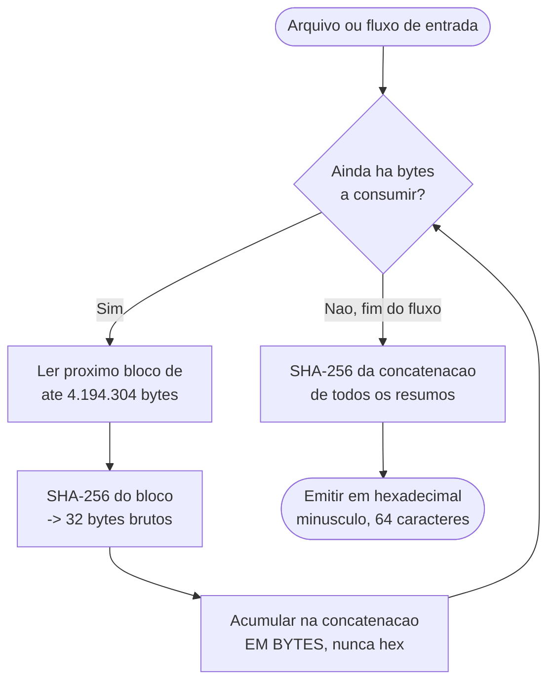

# Registro de Procedência — Vetores de Teste do `content_hash`

| Campo | Valor |
|---|---|
| Projeto | `dropbox_api` — aplicacao CLI em shell script para integracao com Dropbox |
| Componente coberto | `lib/hash.sh` |
| Suite associada | `tests/unit/hash_test.sh`, `tests/unit/hash_vetor_oficial_test.sh` |
| Data do registro | 2026-08-17 |
| Requisitos rastreados | RF-34 (criterio de aceite), RF-33, RF-07, RF-11, RF-31, RF-32 |
| Decisao de origem do algoritmo | `PRJ-DEC-08` |

## Proposito

Este documento existe porque `tests/unit/hash_test.sh` aponta para ele no cabecalho, declarando que os valores esperados fixados na suite **nao foram copiados da implementacao sob teste**. Um revisor precisa conseguir reproduzir cada valor por conta propria, sem confiar na palavra de quem escreveu `lib/hash.sh`. As secoes abaixo separam tres procedencias distintas — vetor oficial confirmado, vetores derivados de forma independente e vetores-armadilha — e registram a unica ambiguidade que a especificacao publicada nao resolve.

---

## 1. Algoritmo (`PRJ-DEC-08`)

O `content_hash` da Dropbox e definido, na documentacao oficial (`dropbox.com/developers/reference/content-hash`), pelo seguinte procedimento:

1. Dividir o conteudo do arquivo em blocos de **4 MiB exatos** (4.194.304 bytes = 2^22). O ultimo bloco pode ser menor; nenhum bloco alem dele pode ficar vazio.
2. Aplicar SHA-256 a cada bloco, obtendo um resumo de 32 bytes por bloco.
3. Concatenar os resumos **em bytes brutos**, nunca em representacao hexadecimal. Esta e a etapa em que uma implementacao apressada costuma errar (ver secao 4).
4. Aplicar SHA-256 sobre a concatenacao obtida no passo 3.
5. Emitir o resultado do passo 4 em hexadecimal minusculo, com exatamente 64 caracteres.



Este algoritmo esta implementado em `lib/hash.sh`. A leitura por blocos e o laco principal ficam em `_dbx_hash_calcular`; a conversao de cada resumo em escapes de byte fica em `_dbx_hash_anexar_escapes`, que acumula um bloco por vez para manter o custo linear (ver decisao D2 e o defeito D3 no registro de entrega). A materializacao final usa o `printf '%b'` interno do shell, e nao `xxd`, por estar `xxd` fora do conjunto de dependencias permitido por RNF-02.

---

## 2. Vetor oficial da Dropbox — CONFIRMADO EXPERIMENTALMENTE

| Campo | Valor |
|---|---|
| Arquivo | `milky-way-nasa.jpg` |
| Origem | `https://www.dropbox.com/static/images/developers/milky-way-nasa.jpg` |
| Tamanho | 9.711.423 bytes (2 blocos de 4.194.304 bytes cheios + resto de 1.322.815 bytes = 3 blocos ao todo) |
| SHA-256 do proprio arquivo (fixado como verificacao de insumo) | `83e1d9c98ee2dd2d50bc6c66450ee80cbecbcff0732e00b4feca4660647dbd82` |
| `content_hash` esperado (criterio de aceite de RF-34) | `485291fa0ee50c016982abbfa943957bcd231aae0492ccbaa22c58e3997b35e0` |

**Status: nao pendente.** A implementacao de `lib/hash.sh` reproduz o valor acima, tanto pela rota de arquivo (`dbx_hash_conteudo_arquivo`) quanto pela rota de fluxo (`dbx_hash_conteudo_fluxo`) — ver `teste_vetor_oficial_de_content_hash` e `teste_vetor_oficial_por_fluxo` em `tests/unit/hash_vetor_oficial_test.sh`.

### Por que o arquivo nao e versionado

O arquivo tem 9,3 MiB de conteudo de terceiro (imagem publicada pela Dropbox, sem licenca de redistribuicao declarada para este repositorio). O caso de teste correspondente e condicional:

- `DBX_TESTES_REDE=1` — a suite baixa o arquivo do host oficial de documentacao da Dropbox antes de comparar;
- `DBX_TESTE_ARQUIVO_OFICIAL=/caminho/local` — usa uma copia ja obtida pelo executor, sem rede;
- **sem nenhuma das duas variaveis**, o caso e reportado como **PULADO** (`SKIP` no formato TAP), e a suite padrao continua executando sem rede, preservando RNF-14.

### Salvaguarda de insumo

Antes de comparar o `content_hash`, a suite confere o SHA-256 e o tamanho do arquivo obtido contra os valores fixados acima. Se o servidor da Dropbox entregar um arquivo diferente do esperado — troca de conteudo, redirecionamento, resposta de erro salva como se fosse o arquivo — o caso e **PULADO com aviso de insumo divergente**, em vez de reprovar de forma enganosa (o que faria parecer um defeito em `lib/hash.sh` quando o problema seria externo).

---

## 3. Vetores derivados de forma independente

Os sete vetores abaixo **nao vieram da Dropbox** e **nao foram extraidos da implementacao sob teste** — isso seria um teste circular, incapaz de detectar um algoritmo implementado errado de forma consistente com ele mesmo. Foram calculados por um **oraculo escrito em Python** (biblioteca `hashlib` da biblioteca padrao), redigido diretamente a partir da especificacao descrita na secao 1, **antes de existir qualquer linha de `lib/hash.sh`**. O oraculo em si nao faz parte deste repositorio; os valores que ele produziu foram transcritos para a suite.

| Fixture | Conteudo | Tamanho (bytes) | `content_hash` esperado |
|---|---|---|---|
| `vazio` | sem bytes | 0 | `e3b0c44298fc1c149afbf4c8996fb92427ae41e4649b934ca495991b7852b855` |
| `um_byte` | o byte `0x41` (`A`) | 1 | `1cd6ef71e6e0ff46ad2609d403dc3fee244417089aa4461245a4e4fe23a55e42` |
| `quase_bloco` | `0x41` repetido | 4.194.303 | `647c8627d70f7a7d13ce96b1e7710a771a55d41a62c3da490d92e56044d311fa` |
| `bloco_exato` | `0x00` repetido | 4.194.304 | `c7e946d101855255d919ef0c70718633adf77d3dfb3adeeecf5d0cb4e951be58` |
| `bloco_mais_um` | 4 MiB de `0x00` + um `0x41` | 4.194.305 | `11d29899ccb4a260814f07931519a87c793ec37a2d50e145ae9e1269a3b4bcd8` |
| `dois_blocos_resto` | 4 MiB de `0x00` + 4 MiB de `0xFF` + sete `0x41` | 8.388.615 | `002579d0d7791a3e8c75d539c7495efa6c225e5a47e27ca8afea0c4a34714db8` |
| `grande` | `0x00` repetido, 16 blocos cheios | 67.108.864 | `a4e26995fdee474eebe1999bd311b50162f28858425920b0102fcb6896a2e117` |

Cada fixture cobre uma fronteira especifica do algoritmo:

- `vazio` — zero blocos (ver ambiguidade na secao 5).
- `um_byte` — bloco unico, muito menor que 4 MiB; verifica que ainda ha uma segunda passagem de SHA-256 sobre o resumo, e nao apenas o SHA-256 direto do conteudo.
- `quase_bloco` — um byte a menos que o limite de bloco; nao pode gerar um segundo bloco.
- `bloco_exato` — exatamente um bloco; tambem nao pode gerar um segundo bloco vazio.
- `bloco_mais_um` — o menor caso com dois blocos (um cheio, um de um byte).
- `dois_blocos_resto` — dois blocos cheios mais um resto que nao e multiplo de nada relevante (7 bytes), cobrindo o caso geral de N blocos mais resto.
- `grande` — 16 blocos cheios sem resto, usado para verificar que o pico de memoria nao acompanha o tamanho da entrada (ver `teste_arquivo_grande_nao_e_carregado_em_memoria` em `tests/unit/hash_test.sh`).

### Geracao das fixtures

As fixtures sao geradas **em tempo de execucao** por `tests/support/fixtures.sh`, funcao `fixture_criar`, sempre com **conteudo deterministico** — sequencias fixas de bytes repetidos (`0x00`, `0xFF`, `0x41`), nunca `/dev/urandom` — para que os valores esperados fixados na tabela acima permanecam validos entre execucoes e entre maquinas. Nenhuma fixture e versionada no repositorio; todas sao escritas sob o diretorio temporario da execucao (`$DBX_TESTES_TMP`, criado por `tests/run.sh`) e removidas ao final pelo `trap` do executor, preservando a invariante de ausencia de estado local (`PRJ-DEC-07`).

---

## 4. Vetores-armadilha

Os dois valores abaixo sao o que uma implementacao **incorreta** produziria se concatenasse as representacoes **hexadecimais** dos resumos de bloco em vez dos **bytes brutos**, no passo 3 do algoritmo (secao 1). A suite afirma explicitamente que o resultado de `lib/hash.sh` **nao pode** ser igual a estes valores:

| Fixture | `content_hash` da armadilha (concatenacao hexadecimal, incorreta) |
|---|---|
| `bloco_mais_um` | `5e4902cc7e48f60d8d8c20edf768a600c87692d3649bf6be2d5ce2ab583d2364` |
| `dois_blocos_resto` | `ebd94ae9e1e6500a61221d63f2526847e88b28e85123feb2ca3e6d41e8fa16ad` |

### Por que a armadilha e perigosa

Os dois valores acima sao hexadecimais bem formados de 64 caracteres — sintaticamente indistinguiveis de um `content_hash` valido. Uma suite que verificasse apenas o formato da saida (`^[0-9a-f]{64}$`) aprovaria uma implementacao que concatena em hexadecimal em vez de bytes brutos. A divergencia so apareceria na comparacao com a API real, no momento em que um envio ja concluido reportasse `content_hash_mismatch` — ou pior, silenciosamente deixasse de detectar a corrupcao de um arquivo, porque a comparacao local-com-local (RF-33, omissao por conteudo identico) continuaria "funcionando" ao comparar um valor errado consigo mesmo. Os testes `teste_nao_concatena_resumos_em_hexadecimal_com_dois_blocos` e `teste_nao_concatena_resumos_em_hexadecimal_com_bloco_mais_um` existem exatamente para fechar essa lacuna, comparando o resultado contra o valor proibido, e nao apenas contra o formato esperado.

---

## 5. Caso do arquivo vazio: especificado, nao inferido

**Correcao de registro (apos apontamento do QA no ciclo 1):** a versao anterior desta secao afirmava que a especificacao publicada pela Dropbox nao cobria o caso do arquivo vazio e deixava como pendencia "confirmar contra a API real". **Essa afirmacao era falsa e foi removida.** A especificacao oficial (`dropbox.com/developers/reference/content-hash`) trata o caso de forma explicita, com o seguinte texto:

> "Note there is no block for an empty file of zero length. In this case an empty string would be formed in step 3 above."

Ou seja: para um arquivo de zero bytes, o passo 3 do algoritmo (concatenacao dos resumos de bloco) produz uma string vazia por definicao, nao por ausencia de regra. Aplicando o passo 4 (SHA-256 sobre a concatenacao) a uma entrada vazia, o resultado e:

```
e3b0c44298fc1c149afbf4c8996fb92427ae41e4649b934ca495991b7852b855
```

Este valor esta, portanto, **especificado**, e nao inferido por extensao do algoritmo por quem implementou `lib/hash.sh`. Nao ha pendencia de confirmacao contra a API para este caso, e a recomendacao anterior ao QA Expert nesse sentido foi removida deste documento.

A mesma passagem da especificacao tambem confirma que o passo 3 concatena os resumos de bloco **em formato binario** ("an empty string", nao "uma string hexadecimal vazia" ou equivalente), o que sustenta a distincao ja documentada na secao 4 e reforca por que os dois vetores-armadilha (concatenacao hexadecimal) devem ser explicitamente rejeitados pela suite.

---

## 6. Medicao de capacidade

Medicao executada com entrada lida de `/dev/zero`, aferida com GNU `time`, uma unica execucao por linha da tabela:

| Tamanho | Blocos | Tempo (s) | Taxa (MiB/s) | Pico de memoria (KiB) |
|---|---|---|---|---|
| 1 GiB | 256 | 4,25 | 241 | 8.000 |
| 2 GiB | 512 | 8,03 | 255 | 8.000 |
| 4 GiB | 1.024 | 16,08 | 255 | 8.000 |
| 8 GiB | 2.048 | 32,53 | 252 | 8.000 |

Leitura da tabela: o tempo dobra exatamente quando o tamanho dobra, a taxa fica constante em torno de 250 MiB/s e o pico de memoria nao varia com o tamanho da entrada — consistente com a memoria proporcional a quantidade de blocos, e nao ao conteudo (ver decisao D2 do registro de entrega). Extrapolando para 100 GiB, o tempo esperado e da ordem de 7 minutos, limitado pela taxa do SHA-256 e nao mais pela conversao de resumos em bytes (a conversao quadratica que dominava o tempo em ciclos anteriores foi corrigida — ver "Ciclo 1 de QA — reprovacao e correcoes" no registro de entrega).

O valor de `content_hash` obtido para a entrada de 8 GiB pela implementacao em shell, `f5c0d997f9e1942d1de94c46024d5038b15744fac18a7d1fcfec479ce97ad2c9`, foi conferido contra o mesmo oraculo independente em Python (mencionado na secao 3) e coincide. A contagem de bytes reportada pela implementacao para essa execucao foi exatamente `8589934592`.

---

## 7. Como reproduzir

```bash
# Suite completa sem rede (usa apenas os vetores derivados desta secao 3;
# o caso do vetor oficial da secao 2 aparece como PULADO)
bash tests/run.sh hash_test

# Habilita o vetor oficial da Dropbox (baixa milky-way-nasa.jpg)
DBX_TESTES_REDE=1 bash tests/run.sh vetor_oficial

# Alternativa sem rede, com copia local ja obtida
DBX_TESTE_ARQUIVO_OFICIAL=/caminho/para/milky-way-nasa.jpg bash tests/run.sh vetor_oficial
```

Qualquer revisor pode reproduzir os valores da secao 3 escrevendo um oraculo equivalente (por exemplo em Python, com `hashlib.sha256`) a partir do algoritmo descrito na secao 1, sem consultar `lib/hash.sh`.
