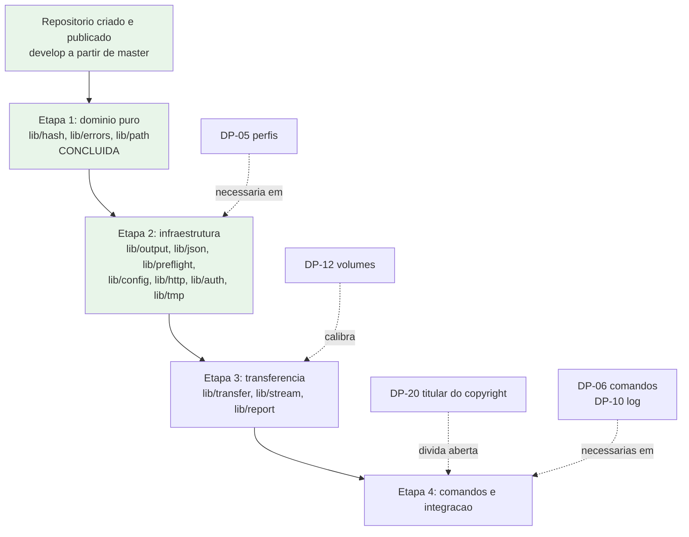

# Decisoes Pendentes do Solicitante

| Campo | Valor |
|---|---|
| Projeto | `dropbox_api` |
| Responsavel | Business Analyst |
| Data | 2026-08-17 |
| Versao | **v0.8** |
| Status | 🔴 **Cinco decisoes bloqueantes reabertas pelo `sync`.** `DP-06` resolvida, mas a escolha por sincronizacao bidirecional com propagacao de exclusao reabriu `DP-09` e criou `DP-21` a `DP-24` e `DP-26`. **Nao iniciar `sync` antes de `DP-21` e `DP-22`** — sao as que determinam se a ferramenta pode destruir dado |

> ### ⚠️ Correcao de registro — DP-07 e DP-08 ja estavam decididas
>
> As versoes v0.2 a v0.4 deste documento registraram `DP-07` e `DP-08` como **em aberto**. **Estava errado.** O solicitante havia respondido a uma pergunta explicitamente rotulada como "Dependencias e plataforma (DP-07 e DP-08)" escolhendo **"So cURL, bash 4+, Linux"**. Essa resposta era a decisao, e nunca foi propagada para os documentos de requisitos.
>
> O erro se agravou em cadeia: o documento desatualizado passou a ser lido como prova de que nao havia decisao; a partir dai foi aberta a divergencia `DIV-15` acusando a implementacao de antecipar decisao do solicitante, `RNF-01` foi congelado e o risco `RSK-25` foi criado sobre um exemplo falso.
>
> **Nada disso se sustentava.** A premissa do Senior Developer estava **correta** desde o inicio. Esta versao corrige as quatro consequencias. A falha real — decisao tomada e nao refletida no documento — esta registrada como `RSK-26`.
| Documentos relacionados | [Escopo e requisitos](escopo-requisitos-e-criterios-de-aceite.md) · [Funcionalidades candidatas](funcionalidades-candidatas.md) · [Riscos e licenciamento](riscos-restricoes-e-licenciamento.md) · [System Design](../arquitetura/system-design.md) |

> Este documento lista apenas o que **nao pode ser inferido com seguranca** a partir da demanda. Nada aqui foi decidido pelo Business Analyst.

---

## Como ler a priorizacao

| Nivel | Significado |
|---|---|
| **P0 — Bloqueante** | Impede o inicio da implementacao. Resposta necessaria antes de qualquer linha de codigo |
| **P1 — Estruturante** | Nao impede o inicio, mas define arquitetura e escopo do MVP. Mudar depois custa retrabalho relevante |
| **P2 — Refinamento** | Pode ser decidido durante a execucao sem retrabalho estrutural |
| **Resolvida** | Decisao registrada pelo solicitante. Mantida no documento para rastreabilidade |

---

## Painel de estado

| ID | Assunto | Estado | Prioridade atual |
|---|---|---|---|
| DP-01 | Licenciamento e forma de uso do modelo | ✅ **Resolvida** | — |
| DP-02 | Quais funcionalidades novas justificam o projeto | ✅ **Resolvida** | — |
| DP-03 | Modo de uso predominante | ✅ **Resolvida** | — |
| DP-04 | Tipo de conta e escopo de acesso | ✅ **Resolvida** | — |
| DP-05 | Multiplas contas ou perfis | ✅ **Resolvida** | — |
| DP-06 | Conjunto de comandos do MVP | ✅ **Resolvida — reabre estado local** | — |
| DP-07 | Plataformas e shells suportados | ✅ **Resolvida** *(registro corrigido na v0.5)* | — |
| DP-08 | Dependencias e interpretacao de JSON | ✅ **Resolvida** *(registro corrigido na v0.5)* | — |
| DP-09 | Semantica de sincronizacao e estado local | 🔄 **REABERTA por DP-06** | Desdobrada em DP-21 a DP-24 |
| DP-21 | Semantica de resolucao de conflito | ✅ **Resolvida — ultimo a escrever vence** | — |
| DP-22 | Conflito de exclusao contra alteracao | ✅ **Resolvida — honrar a exclusao** | — |
| DP-23 | Ciclo de vida e localizacao da linha de base | ✅ **Resolvida — `$XDG_STATE_HOME`; corrompida recusa** | — |
| DP-24 | Teto de exclusoes | ✅ **Resolvida — sem teto** | — |
| DP-25 | `config`, `unlink` e `space` constam do MVP? | ✅ **Resolvida — os tres entram; nove comandos** | — |
| DP-26 | Reavaliacao de `RSK-24` sob percurso recursivo | ✅ **Resolvida — travessia por descida adotada; aceite NAO mantido** | — |
| DP-10 | Auditoria, log e conformidade | ⬜ Em aberto | P1 |
| DP-11 | Armazenamento de credencial | ✅ **Resolvida** | — |
| DP-12 | Volume, frequencia e dimensionamento | 🟡 Parcialmente calibrada por medicao | P1 |
| DP-13 | Shell interativo | ⬜ Em aberto | P2 |
| DP-14 | Empacotamento e distribuicao | ⬜ Em aberto | P2 |
| DP-15 | Idioma da interface | ⬜ Em aberto | P2 |
| DP-16 | Monitoramento de alteracoes | ⬜ Em aberto | P2 |
| DP-17 | Rede corporativa | ⬜ Em aberto | P2 |
| DP-18 | Compartilhamento | ⬜ Em aberto | P2 |
| DP-19 | Governanca do repositorio | ✅ **Resolvida** *(consumada na pratica)* | — |
| DP-20 | Titular do copyright e licenca | ✅ **Resolvida — MIT, Adriano Sales Santos** | — |
| DIV-16b | Formato de saida para nomes com quebra de linha | ✅ **Resolvida** — destrava `lib/output` | — |

### Verificacao por evidencia observavel — disciplina adotada apos a terceira ocorrencia de `RSK-26`

> **Por que esta secao existe.** A mitigacao original de `RSK-26` era *"propagar a decisao ao artefato na mesma rodada em que e recebida"*. Ela **depende de alguem lembrar**, e falhou tres vezes — duas com o coordenador, uma com este agente. Disciplina que depende de memoria nao e mitigacao; e intencao.
>
> **Nem toda decisao tem evidencia observavel, mas as que tem podem ser verificadas unilateralmente**, sem depender de propagacao. `DP-20` tinha: bastava ler o `LICENSE`. Este agente reportou a pendencia por varias rodadas sem nunca abrir o arquivo que a responderia.

**Regra:** decisao com artefato observavel **nao pode ser reportada como pendente sem verificacao do artefato na mesma rodada**.

| Decisao | Evidencia observavel | Verificacao |
|---|---|---|
| `DP-20` — titular e licenca | `LICENSE` na raiz | ✅ Verificado: MIT, `Adriano Sales Santos`, 2026 |
| `DP-19` — repositorio e Gitflow | Estado do repositorio git | ✅ Publicado; `develop` e `feature/*` ativos |
| `DP-07` — plataforma e piso de shell | Recursos em uso no codigo entregue | ✅ `bash` 4.4 confirmado pelos recursos exigidos |
| `DP-08` — dependencias | Ausencia de invocacao de `jq` no codigo | ✅ Auditoria estatica prevista em `RNF-02` |
| `DP-11` — armazenamento da credencial | Caminho e permissao do arquivo de configuracao | Verificavel quando `lib/config` existir |
| `DP-23` — localizacao da linha de base | Caminho sob `$XDG_STATE_HOME` | Verificavel quando `lib/state` existir |
| `DP-05`, `DP-06`, `DP-25` | Conjunto de comandos implementados | Verificavel quando os comandos existirem |
| `DP-10`, `DP-12` | **Nenhuma** — sao informacao que so o solicitante possui | Dependem de propagacao; nao ha alternativa |

**Consequencia pratica:** das pendencias que restam, **nenhuma tem evidencia observavel** — `DP-10` (politica de log) e `DP-12` (volumes de negocio) sao informacao que so existe com o solicitante. Isso significa que, para elas, a verificacao unilateral nao se aplica e a propagacao continua sendo o unico caminho. **Mas tambem significa que nao ha, hoje, nenhuma decisao ja tomada que este documento possa estar deixando de refletir sem perceber.**


---

## P0 — Nenhuma decisao bloqueante em aberto

> ✅ Todas as decisoes P0 foram resolvidas. O escopo do MVP esta fechado e os requisitos correspondentes estao formalizados nas secoes 5.5 e 5.6 de [escopo-requisitos-e-criterios-de-aceite.md](escopo-requisitos-e-criterios-de-aceite.md).
>
> As pendencias restantes sao **estruturantes (P1)** e **de refinamento (P2)**. Elas condicionam decisoes tecnicas de implementacao, mas nao impedem o inicio do trabalho — ver a secao "O que o Senior Developer precisa para comecar" ao final deste documento.

---

## Decisoes resolvidas

### DP-02 — Quais funcionalidades novas justificam o projeto ✅

**Decisao do solicitante: escopo do MVP aprovado exatamente como recomendado pelo Business Analyst.**

| Item | Decisao |
|---|---|
| **Bloco 0 integral** — base endurecida | ✅ Aprovado como requisito de base nao negociavel |
| **F-01** — transferencia por fluxo `stdin`/`stdout` | ✅ Aprovada → **RF-31, RF-32** |
| **F-02** — transferencia incremental por `content_hash` | ✅ Aprovada → **RF-33, RF-34** |
| **F-04** — contrato de automacao | ✅ Aprovada → RF-15, RF-28, RF-29 + **RF-35** |
| **F-05** — relatorio de execucao | ✅ Aprovada → **RF-36** |
| **F-03** — retomada de transferencia interrompida | ❌ Fora do MVP, mantida como backlog |
| **Blocos 2 e 3** (F-06 a F-22) | ❌ Fora do escopo desta versao, backlog preservado |

**Consequencias registradas:**

1. **Premissa de valor consolidada.** O MVP entrega tres capacidades que o `Dropbox-Uploader` nao possui: envio de backup por fluxo sem disco intermediario, omissao de reenvio por comparacao de conteudo, e um contrato de automacao consumivel por orquestrador. RSK-02 e RSK-20 estao **encerrados**.
2. **O MVP nao introduz estado local persistente.** F-03 era a unica candidata aprovavel que o exigiria. Com o corte, `DP-09` **permanece fechada**, o handoff do DBA **nao** e acionado, e a secao de dimensionamento de banco do System Design permanece formalmente nao aplicavel por ausencia de mecanismo de persistencia — nao por omissao.
3. **Requisitos formalizados:** RF-31 a RF-36, com criterio de aceite verificavel cada um, integrados a matriz de rastreabilidade.
4. **Desbloqueio tecnico:** o algoritmo do `content_hash`, exigido por F-02, foi **confirmado** com vetor de teste oficial, liberando `lib/hash` (ver DIV-14).

> ⚠️ **Nao reabrir.** Qualquer proposta de introduzir estado local persistente nesta versao constitui mudanca de escopo e exige nova decisao do solicitante.

---

### DP-09 — Semantica de sincronizacao e estado local ✅ *(fechada sem impacto)*

**Fechada por consequencia de DP-02.** As quatro funcionalidades que exigiriam estado local persistente — F-03 (retomada), F-06 (espelhamento), F-12 (trava de concorrencia) e F-14 (deteccao por cursor) — ficaram todas fora do escopo.

**Estado no MVP:** envio aditivo, sem espelhamento e sem remocao de orfaos. A unica persistencia local e o arquivo de configuracao com a credencial. Nao ha cursor, catalogo, indice nem arquivo de trava.

**Consequencia:** nao ha handoff do DBA nesta versao. Reabre apenas se alguma das quatro candidatas for promovida do backlog.

---

## Demais decisoes resolvidas

### DP-01 — Regime de licenciamento e forma de uso do modelo ✅

**Decisao do solicitante: reimplementacao independente.** O `Dropbox-Uploader` sera usado como **referencia conceitual apenas**. Nenhum trecho de codigo GPLv3 sera copiado, adaptado ou traduzido.

**Consequencias registradas:**

1. **Nao ha obrigacao copyleft.** O projeto e livre para adotar qualquer licenca, inclusive permissiva ou proprietaria. O risco RSK-01 esta **mitigado**, remanescendo apenas o dever de disciplina na execucao.
2. **Salvaguardas operacionais obrigatorias**, agora vinculantes para o Senior Developer:
   - Nao copiar codigo, estrutura interna de funcoes, nomes internos de variaveis nem texto literal de mensagens do modelo.
   - Nao copiar o `README` nem a documentacao do modelo.
   - Tomar a **documentacao oficial da Dropbox** como fonte primaria dos contratos de integracao, e nao o codigo do modelo.
   - Registrar formalmente, no fechamento, que nenhum trecho de codigo do modelo foi incorporado.
3. **Ganho colateral confirmado:** a reimplementacao independente evita herdar os defeitos identificados no modelo (DIV-01 a DIV-06), que passam a compor o Bloco 0 de base endurecida.
4. **Pendencia derivada:** a escolha da licenca especifica permanece aberta e foi registrada como **DP-20**, em prioridade P1.

Requisito afetado: RNF-17.

---

### DP-03 — Modo de uso predominante ✅

**Decisao do solicitante: ambos.** A ferramenta sera usada de forma **interativa** por operador humano **e** de forma **automatizada** por `cron` e pipelines de CI.

**Consequencias registradas:**

| Exigencia decorrente | Requisito | Mudanca de status |
|---|---|---|
| Deteccao de terminal associado; comportamento distinto conforme a presenca de TTY | RNF-19 | Reforcado e promovido a estrutural |
| Ausencia de solicitacao de entrada bloqueante quando nao houver TTY; operacoes que exigiriam confirmacao falham com codigo dedicado | RNF-19, RF-21 | Reforcado |
| Saida estruturada parseavel por script, com diagnostico separado na saida de erro | RF-28 | **Promovido de P1 para P0** |
| Codigos de saida deterministicos e distintos por classe de falha | RF-29 | Ja era P0; agora e tambem diferencial declarado |
| Modo de simulacao | RF-15 | **Promovido de P1 para P0** |
| Saida legivel por humano com formatacao adequada quando houver TTY | RF-26, RF-27 | Mantido |

**Consequencia arquitetural:** a camada de saida deixa de ser um formatador simples e passa a ser um componente com **duas apresentacoes sobre o mesmo modelo de resultado**, selecionadas por deteccao de TTY e por sinalizador explicito. Registrado no System Design.

**Consequencia de escopo:** o conjunto F-04 (contrato de automacao) deixa de ser conveniencia e passa a ser requisito estrutural do produto.

---

### DP-04 — Tipo de conta e escopo de acesso ✅

**Decisao do solicitante:** conta **pessoal / individual**, com aplicativo registrado com acesso a **Dropbox inteira** (`Full Dropbox`), **nao** restrito a pasta do aplicativo.

**Consequencias registradas:**

1. **Simplificacao:** nao ha Dropbox Business ou Team no escopo. Nao ha impersonacao administrativa, nao ha selecao de membro, nao ha manipulacao de namespace de equipe. O requisito **RF-06 (suporte a Business/Team) fica formalmente fora do escopo** e deixa de ser condicional.
2. **Ampliacao de superficie de risco:** com acesso a Dropbox inteira, um comprometimento da credencial expoe **todo o conteudo da conta**, e nao apenas uma pasta isolada. Uma exclusao acidental ou um caminho remoto mal formado tambem alcancam qualquer area da conta. Registrado como **RSK-19** no documento de riscos.
3. **Escolha irreversivel consumada:** a alteracao do tipo de acesso exige recriar o aplicativo no Dropbox App Console e refazer a autorizacao. O risco RSK-12 esta **encerrado por decisao**, com a consequencia assumida.
4. **Mitigacoes agora obrigatorias:**
   - Conceder **apenas os escopos OAuth estritamente necessarios** aos comandos habilitados, mesmo com acesso amplo ao espaco de arquivos (o tipo de acesso e independente do conjunto de escopos).
   - Elevar o peso de DP-11 (armazenamento de credencial): a proteção do refresh token passa a ser o unico controle entre um usuario local e o conteudo integral da conta.
   - Reforcar RNF-03 e RNF-04, ja especificados.
   - Tratar como obrigatoria a confirmacao explicita em operacoes destrutivas (RF-21) e recomendar restricao de caminho raiz configuravel, para que uma rotina de automacao nao consiga operar fora da area pretendida.
5. **Recomendacao adicional do Business Analyst:** avaliar o uso de um aplicativo Dropbox distinto, com acesso restrito a pasta do aplicativo, para as rotinas nao assistidas que nao precisem alcancar toda a conta. Reduz o raio de exposicao sem alterar a decisao tomada.

Requisitos afetados: RF-06 (fora de escopo), RF-21, RNF-03, RNF-04.

---

## P1 — Estruturantes

### DP-20 — Titular do copyright e licenca ✅ **RESOLVIDA — e ja estava, ha varias rodadas**

**Decisao do solicitante: licenca MIT, titular `Adriano Sales Santos`.**

**Verificado por leitura direta do artefato** em `/home/sales/dropbox_api/LICENSE`:

```
MIT License

Copyright (c) 2026 Adriano Sales Santos
```

O `LICENSE` foi corrigido, commitado e publicado em `develop` e `master` ha varias rodadas. **A resolucao nunca foi propagada a este documento**, que seguiu registrando `DP-20` como aberta — e este agente seguiu reportando-a como "a unica pendencia com custo crescente" a cada rodada, corretamente em relacao ao que o documento dizia, e **erradamente em relacao a realidade**.

Terceira ocorrencia de `RSK-26` no projeto. Registro completo do risco no documento de riscos.

**Consequencias:**

| Item | Situacao |
|---|---|
| `RNF-17` (licenca definida, arquivo na raiz, cabecalhos de copyright) | ✅ **Satisfeito** quanto a licenca e ao titular. Permanece a verificacao de cabecalhos de copyright nos arquivos de codigo |
| `DIV-E` (titular em espaco reservado) | ✅ **Encerrada** |
| "Unica pendencia com custo crescente" | ❌ **Nao existe mais.** As pendencias remanescentes (`DP-10`, `DP-12`) esperam sem penalidade |
| Placeholder no historico publico | Situacao consumada e **inocua**: o commit de correcao e posterior e o estado corrente esta correto. Nao ha acao |

---

### ~~DP-20~~ — analise original preservada como registro

Com DP-01 resolvida como reimplementacao independente, o projeto tem liberdade de escolha da licenca.

> **Mudanca de situacao.** A recomendacao anterior era publicar a licenca **antes do primeiro commit**. Isso **nao ocorreu**: o repositorio foi criado e publicado com o `LICENSE` contendo o **titular do copyright em espaco reservado**. O placeholder esta agora no historico publico de `github.com:salesadriano/dropbox_sync`.
>
> Consequencias praticas: um arquivo de licenca sem titular identificado tem eficacia juridica duvidosa, e enquanto isso o repositorio esta publicamente acessivel. Alem disso, quanto mais commits e eventuais contribuicoes se acumularem, mais custosa fica a formalizacao — definir titularidade depois pode exigir concordancia de todos os que ja contribuiram. **Isto e reversivel a baixo custo agora e caro depois.** Divergencia associada: `DIV-E`.

**Perguntas:**
1. **Quem e o titular do copyright?** Pessoa fisica nominal, ou pessoa juridica?
2. Qual licenca adotar? (MIT, Apache-2.0, BSD, GPLv3 por opcao propria, proprietaria, ou sem licenca publica para uso interno)
3. O repositorio permanece publico? Havera aceitacao de contribuicoes externas? (implica politica de contribuicao e, possivelmente, acordo de contribuidor)

**Bloqueia:** RNF-17, preenchimento do `LICENSE`, cabecalhos de copyright nos arquivos de codigo.

### DP-05 — Multiplas contas ou perfis ✅

**Decisao do solicitante: uma conta so.** Um unico arquivo de credencial, **sem nocao de perfil**. Nao havera opcao `--profile`, nem arquivo por perfil, nem selecao por variavel de ambiente.

**Justificativa registrada:** acrescentar perfis depois e uma mudanca **aditiva** — um sinalizador novo e um caminho de arquivo alternativo — que **nao quebra o contrato publico congelado por RF-35**. Como o custo de adiar e baixo e o de antecipar e real (multiplexacao em `lib/config`, mais superficie de teste, mais estados possiveis), antecipar nao se justifica agora.

**Consequencias:**

1. **`RF-05` (perfis e multiplas contas) sai do escopo desta versao**, junto com `F-18`. Permanecem no backlog como incremento aditivo.
2. **O desenho de `lib/config` esta fechado.** Combinada com `DP-11`, a regra e: **um arquivo, um caminho, sem multiplexacao** — `0600` sob `$XDG_CONFIG_HOME` com recuo para `~/.config`, sem sobrescrita por ambiente, sem seletor.
3. **Simplificacao verificavel:** nenhum caminho de codigo em `lib/config` recebe seletor de perfil, e nao ha ramificacao por identidade de conta.

**Nao ha mais decisao pendente para iniciar `lib/config`.**

### DP-06 — Conjunto de comandos do MVP

**Perguntas:**
1. Dos comandos de paridade com o modelo (envio, recebimento, importacao por URL, compartilhamento, informacoes de conta, espaco, exclusao, mover, copiar, criacao de pasta, busca, listagem, monitoramento, desvinculo), quais sao realmente necessarios na primeira entrega?
2. Paridade completa com o modelo e requisito, ou apenas referencia?

**Observacao:** esta decisao trata dos comandos **ja existentes no modelo**. As funcionalidades **novas** sao tratadas em DP-02.
**Bloqueia:** dimensionamento do MVP e priorizacao dos RF da secao 5 do documento de requisitos.

### DP-07 — Plataformas e shells suportados ✅ *(registro corrigido na v0.5)*

**Decisao do solicitante: plataforma Linux, shell `bash` 4+.** Respondida a pergunta rotulada "Dependencias e plataforma (DP-07 e DP-08)" com **"So cURL, bash 4+, Linux"**. A decisao existia desde entao; o que faltou foi propaga-la a este documento.

**Refinamento tecnico do piso — 4.4, nao 4.0.** Isto **nao e decisao nova**: e a traducao precisa de "bash 4+" para o menor numero que sustenta o codigo efetivamente escrito.

| Recurso em uso | Versao minima que o suporta |
|---|---|
| `declare -A` (array associativo) | 4.0 |
| `${var,,}` (conversao para minusculas) | 4.0 |
| `declare -g` (variavel global em funcao) | **4.2** |
| `"${casos[@]}"` com array vazio sob `set -u`, na harness de teste | **4.4** |

**Consequencia material, mantida em registro:** com piso 4.4, **RHEL 6 fica fora** — sua versao de fabrica e `bash` 4.1. Se houver necessidade futura de suportar RHEL 6, e preciso reescrever a harness de teste e substituir `declare -g`; nesse caso a questao volta ao solicitante.

**Fora de escopo por decorrencia:** macOS, *BSD, BusyBox `ash` e `sh` POSIX. A camada de compatibilidade entre utilitarios GNU e BSD **deixa de ser necessaria** — simplificacao relevante de `lib/preflight` e de toda chamada a `stat`, `sed`, `date` e `base64`.

**Desbloqueia:** `RNF-01` (descongelado, piso 4.4), `lib/preflight`, e a reavaliacao de `RSK-24` — com Linux confirmado, `/proc/self/fd` deixa de ser inadmissivel por portabilidade.

---

### DP-08 — Politica de dependencias e interpretacao de JSON ✅ *(registro corrigido na v0.5)*

**Decisao do solicitante: apenas `cURL` como dependencia externa. `jq` NAO sera exigido.** O interpretador de JSON e **proprio**, escrito em shell.

Corresponde a **opcao A** das tres apresentadas: dependencia zero e portabilidade maxima, ao custo de complexidade e de superficie de teste maior no componente de interpretacao.

**Consequencias:**

1. **`lib/json` esta desbloqueado** e tem desenho definido: implementacao propria, sem caminho alternativo condicional. Nao ha os "dois caminhos de codigo" que a opcao C traria.
2. **`RNF-11` ganha peso critico.** A opcao escolhida e exatamente aquela cujo risco de defeito silencioso e maior — foi o defeito `DIV-04` do modelo de referencia. O conjunto de teste com JSON de formatacao variada, ordem de campos alterada e valores contendo `"`, `:` e `\` deixa de ser desejavel e passa a ser a principal defesa do componente.
3. **`RNF-02` fica simples de verificar:** ambiente com shell, `cURL` e coreutils executa todos os comandos.
4. **`lib/hash` continua dependendo de um utilitario de resumo SHA-256**, que faz parte do conjunto base de coreutils e nao constitui dependencia adicional.

---

### DP-11 — Armazenamento de credencial ✅

**Decisao do solicitante:** arquivo com permissao **`0600`**, localizado sob **`~/.config`** seguindo a convencao XDG — `$XDG_CONFIG_HOME` quando definido, com recuo para `~/.config`. A permissao e **verificada no preflight**. **Nao ha sobrescrita por variavel de ambiente.**

**Consequencias:**

1. **`lib/config` esta desbloqueado** quanto ao mecanismo. O que resta e a estrutura interna do arquivo, que depende de `DP-05` (perfis nomeados).
2. **Nao ha cofre de segredos** — nem `pass`, nem `gpg`, nem keyring. O controle e a permissao do sistema de arquivos.
3. **Credencial nao pode vir do ambiente.** Isso remove um vetor de vazamento comum (variavel exportada visivel a processos filhos e a `/proc/<pid>/environ`) e e coerente com `RNF-03`. **Contrapartida a registrar:** uso em container efemero e em CI passa a exigir montagem de arquivo com permissao correta, e nao injecao de variavel — restricao operacional real, decorrente da decisao.
4. **`RSK-19` permanece o risco dominante.** Com acesso a Dropbox inteira (DP-04), a permissao `0600` e literalmente o unico controle entre um usuario local privilegiado e todo o conteudo da conta. A verificacao no preflight e o que impede que uma permissao afrouxada passe despercebida.

---

### DIV-16b — Formato de saida para nomes com quebra de linha ✅

**Decisao do solicitante:** saida **orientada a linha por padrao**; opcao **`--null`** usa o byte nulo (`\0`) como terminador de registro, no padrao consagrado de `find -print0` e `xargs -0`.

Resolve a divergencia de requisito que restava de `DIV-16`: o formato de linha de `RF-28` e `RF-35` nao consegue representar sem ambiguidade um nome que contenha quebra de linha (`RNF-10`). O terminador nulo resolve, porque `\0` e o unico byte que nao pode ocorrer em um nome de arquivo POSIX.

**Escolha de desenho acertada por dois motivos:** preserva a legibilidade do padrao para uso interativo (DP-03) e adota um contrato que ferramentas de shell ja sabem consumir, em vez de inventar escape proprio.

> ⚠️ **Interacao com `RNF-22` — o modo `--null` NAO dispensa a restricao.** A redacao de cabecalho sensivel consome o **restante da linha**, e essa politica opera sobre quebras de linha, nao sobre terminadores de registro. Em `--null`, varios registros podem compartilhar a mesma linha fisica; concatenar diagnostico a um cabecalho sensivel continua destruindo o identificador de correlacao que `RF-30` existe para preservar — e, em `--null`, pode destruir **mais** conteudo do que destruiria no modo padrao. A restricao vale nos dois modos e deve ter caso de teste em cada um.

**Desbloqueia:** `lib/output`.

---

### DP-19 — Governanca do repositorio ✅ *(consumada na pratica)*

**Situacao:** o solicitante criou o repositorio, fez o commit inicial e publicou em `github.com:salesadriano/dropbox_sync`, branch `master`. **Gitflow autorizado**; `develop` criado a partir de `master`; o trabalho passa a ocorrer em `feature/*` com Conventional Commits.

**Desvios ja consumados, registrados para rastreabilidade e nao para correcao:**

| Desvio | Situacao | Tratamento |
|---|---|---|
| O commit inicial nao seguiu convencao semantica | Consumado e publicado | Nao reescrever historico publico. A convencao passa a valer dos proximos commits em diante. Sem impacto tecnico |
| O `LICENSE` foi publicado com o **titular do copyright em espaco reservado** | Consumado e publicado | **Nao e apenas cosmetico.** `DP-20` e `DIV-E` continuam abertas, e agora o placeholder esta no historico publico do repositorio. Ver a urgencia elevada de `DP-20` |

### DP-06 — Conjunto de comandos do MVP ✅

**Decisao do solicitante: `upload`, `download`, `list`, `delete`, `info` e `sync`.**

Os cinco primeiros sao diretos e ja estavam especificados. O **`sync` reabre o que estava fechado**, com tres escolhas explicitas: **bidirecional**, **remocao de orfaos sob opcao explicita** (promove `F-06` do Bloco 2) e **cursor persistente** (aproxima `F-14`).

**Fora do MVP, mantidos no backlog:** `mkdir`, `move`, `copy`, `search`, `share`, `saveurl`, `monitor`, `space`.

**Consequencias de escopo — registradas, nao apagadas:**

| Item | Situacao anterior | Situacao agora |
|---|---|---|
| `PRJ-DEC-07` — ausencia de estado local persistente | Invariante registrado em cinco lugares e vigiado por `RSK-23` | **Revogado para o `sync`**, por decisao do solicitante em `DP-06`. Permanece valido para os demais comandos. A razao original continua rastreavel: nao foi um erro, foi uma decisao valida para um escopo que mudou |
| `DP-09` — semantica de sincronizacao e estado local | "Fechada sem impacto", justamente porque nenhuma funcionalidade do MVP exigia estado | 🔄 **REABERTA** |
| Handoff do DBA | Nao acionado | ✅ **ACIONADO.** O gatilho registrado era exatamente este: promover `F-03`, `F-06`, `F-12` ou `F-14` reintroduz estado persistente. **`F-06` entrou** |
| `RSK-23` | Vigilancia contra estado local "conveniente" | **Reescrito.** O estado passa a ser **autorizado e delimitado**; o risco vira "estado alem do delimitado" (`RNF-26`) |
| `RSK-24` — TOCTOU | Aceite reconfirmado, apoiado em a mitigacao nao cobrir percurso recursivo — aceitavel porque **nao havia percurso recursivo no escopo** | ⚠️ **REABERTO. Agora ha percurso recursivo, e ele apaga.** Ver `DP-26` |

---

### DP-09 — Semantica de sincronizacao e estado local 🔄 **REABERTA**

Estava fechada sem impacto porque nenhuma funcionalidade do MVP exigia estado. `DP-06` mudou isso. O estado agora autorizado esta delimitado em `RNF-26`: **linha de base de sincronizacao** e **cursor de enumeracao**, ambos vinculados ao par de raizes. Qualquer outra persistencia continua fora de escopo.

As perguntas remanescentes desta decisao foram desdobradas em `DP-21` a `DP-24`, por serem especificas demais para caber num item so.

---

## Decisoes do `sync` — resolvidas

> **Registro de metodo.** `DP-21`, `DP-22` e `DP-24` foram decididas **contra a recomendacao do Business Analyst**, com o custo apresentado e aceito. A recomendacao e a sua razao ficam registradas abaixo para que uma revisao futura saiba que a analise ocorreu e o custo foi ponderado — **nao para reabrir a decisao**. A analise de fato permanece valida: a incomparabilidade entre `mtime` local e `server_modified` e propriedade dos sistemas envolvidos. O que a decisao estabelece e **o que fazer diante dela**, prerrogativa do solicitante.

| Decisao | Escolha do solicitante | Recomendacao contraria | Razao registrada |
|---|---|---|---|
| `DP-21` | **Ultimo a escrever vence** | Recusar e reportar como padrao | Ordenacao por carimbo de tempo compara grandezas de relogios distintos; o erro e possivel e a perda, silenciosa |
| `DP-22` | **Honrar a exclusao** | Ressuscitar, ou recusar | Destroi a alteracao do lado que nao apagou |
| `DP-24` | **Sem teto de exclusoes** | Teto configuravel | Transfere integralmente a protecao contra exclusao em massa para `RF-41(a)` |
| `DP-23` | **Base sob `$XDG_STATE_HOME`; corrompida recusa** | ✅ Recomendacao acatada | Estado e descartavel e reconstruivel; configuracao nao. Ciclos de vida distintos |
| `DP-26` | **Travessia por descida adotada — aceite do risco NAO mantido** | ✅ Recomendacao do QA acatada | O TOCTOU deixa de ser risco aceito e passa a ter **mitigacao estrutural** (`RNF-28`). Verificado experimentalmente: com caminho absoluto reconstruido o ataque apaga fora da raiz; com descida e nome relativo, na mesma janela, o alvo sobrevive. **Limite declarado:** reducao de superficie, nao eliminacao |
| `DP-25` | **`config`, `unlink` e `space` entram — nove comandos** | ✅ Confirmado em vez de presumido | A analise da entrada de `unlink` revelou um caminho de destruicao de dado que gerou `RF-52` |

### O que foi feito para minimizar o custo dentro da decisao

Quatro medidas, todas compativeis com as escolhas e nenhuma re-litigando:

1. **A incerteza foi confinada a ordenacao.** `RF-39` fixa que a **deteccao** de conflito usa exclusivamente `content_hash` contra a linha de base — **nenhum carimbo de tempo participa de saber *se* algo mudou**. Carimbo entra apenas em `RF-39a`, para decidir *qual* lado prevalece. Ha mutacao que reprova se carimbo vazar para a deteccao.
2. **A qualidade do sinal de ordenacao foi elevada** (`RF-39a`, `RNF-27`), sem mudar o metodo: preferencia por **comparacao de diferencas contra a linha de base**, que cancela o offset entre relogios; `client_modified` — sempre definido por esta aplicacao no envio — em vez de `server_modified`. Isso nao muda a decisao; muda **o quanto ela erra**.
3. **O desempate passou a preferir o lado recuperavel** (`RF-40a`): quando a ordenacao for indeterminada, prevalece o local, de modo que a perda recaia sobre o remoto, recuperavel pelo historico de revisoes da Dropbox.
4. **A perda ficou visivel depois da acao** (`RF-47`): cada sobrescrita e cada exclusao listada nominalmente, com lado perdedor, metodo de ordenacao e marcacao de **recuperavel** ou **permanente**.

### Recomendacao decorrente, sem alterar escopo

**`F-07` (revisoes e restauracao), hoje no backlog, tornou-se materialmente mais valioso.** E o caminho de recuperacao para metade das perdas por conflito — todas aquelas em que o lado perdedor e o remoto. Sugiro avaliar sua promocao quando o `sync` estabilizar. Registrado como recomendacao, nao como escopo.

---

## ⚠️ Decisoes abertas do `sync` — somente o solicitante pode responder

### ~~DP-21~~ — Semantica de resolucao de conflito ✅ **RESOLVIDA: ultimo a escrever vence**

Analise original preservada abaixo como registro do custo apresentado.

Em sincronizacao bidirecional, quando **os dois lados mudaram** desde a ultima sincronizacao, alguem tem de decidir. **E aqui que implementacoes de sync perdem dados.**

Sao quatro classes de conflito (secao 5.8.2 dos requisitos). As opcoes abaixo valem para as duas primeiras — criacao/criacao e alteracao/alteracao. As duas ultimas exigem decisao separada (`DP-22`).

| Opcao | Como funciona | Custo e risco |
|---|---|---|
| **A — Ultimo a escrever vence** | Compara horarios e mantem o mais recente | ❌ **Perda de dado silenciosa**: a versao perdedora desaparece sem rastro. **Agravante tecnico serio:** "ultimo" depende de comparar `mtime` local com `server_modified` da Dropbox, que **nao sao grandezas comparaveis** — relogios distintos, fuso, preservacao de `mtime` em copia, e granularidade diferente. Na pratica, escolhe o vencedor errado com frequencia nao desprezivel. **Nao recomendo, nem como opcao** |
| **B — Manter os dois, com renomeacao** | O perdedor vira copia com sufixo (`arquivo (conflito 2026-08-18).txt`) | ✅ Nao perde dado. ❌ Polui o espaco de nomes e **cresce sem limite**; em uso nao assistido **ninguem ve** as copias, que se acumulam silenciosamente. Exige convencao de nome e que as copias sejam **excluidas da deteccao subsequente**, sob pena de gerar conflito de copia de conflito. E o comportamento do proprio cliente Dropbox |
| **C — Recusar e reportar** | Nao toca no caminho em conflito; reporta e segue com os demais | ✅ Nao perde dado, nao polui. ❌ **O caminho nao converge** ate intervencao humana. Em `cron`, um conflito nao resolvido **persiste indefinidamente**; se acumularem, a rotina reporta sucesso parcial para sempre. Exige codigo de saida dedicado e relatorio legivel (ja previsto em RF-46) |
| **D — Preferencia por lado** | Um lado e declarado autoritativo e sempre vence | ✅ Deterministico e previsivel; **nao depende de relogio**. ❌ Descarta silenciosamente as alteracoes do outro lado — mesma classe de perda da opcao A, porem **previsivel**: o usuario sabe de antemao qual lado manda. Adequado quando ha de fato um lado autoritativo (backup: o local e a verdade) |

**Recomendacao do Business Analyst:** padrao **C (recusar e reportar)**, com **B** e **D** disponiveis por opcao explicita por execucao. Justificativa: `C` e a unica que **falha fechado** — nao perde dado nem polui —, e o custo dela (nao convergir sem intervencao) e visivel e mensuravel via RF-46 e codigo de saida, enquanto o custo de `A` e `D` e invisivel por construcao. **`A` deveria ser descartada mesmo como opcao**, pela incomparabilidade dos horarios.

**Perguntas:**
1. Qual a politica **padrao** de conflito?
2. Quais politicas devem estar disponiveis por opcao?
3. A opcao A (ultimo a escrever vence) deve existir, dado o problema de comparabilidade de horarios?

---

### DP-22 — Conflito de exclusao contra alteracao

Caso distinto: um lado **apagou**, o outro **alterou**. Nao ha "manter os dois" — um lado nao tem conteudo.

| Opcao | Custo |
|---|---|
| **Ressuscitar** — a alteracao vence, o arquivo volta | O usuario que apagou ve o arquivo reaparecer. Confuso, porem **nao destrutivo**. E o comportamento mais comum no mercado |
| **Honrar a exclusao** — o arquivo e apagado nos dois lados | **Destroi a alteracao do outro lado**, definitivamente |
| **Recusar e reportar** | Nao converge sem intervencao; coerente com a opcao C de `DP-21` |

**Recomendacao:** **ressuscitar**, ou **recusar** se a politica geral for C. Nunca honrar a exclusao por padrao — e a unica das tres que destroi trabalho.

**Pergunta:** qual comportamento para exclusao contra alteracao?

---

### DP-23 — Ciclo de vida e localizacao da linha de base

**Localizacao — recomendacao com fundamento:** `DP-11` colocou a **credencial** sob `$XDG_CONFIG_HOME` / `~/.config`, o que esta correto: credencial e **configuracao**. A linha de base e **estado**, nao configuracao, e a convencao XDG destina estado a **`$XDG_STATE_HOME` com recuo para `~/.local/state`**. Colocar estado em `~/.config` funcionaria, mas mistura dois ciclos de vida distintos: configuracao e escrita pelo usuario e sobrevive a tudo; estado e descartavel e reconstruivel.

**Perguntas:**
1. A linha de base fica sob `$XDG_STATE_HOME` / `~/.local/state`, conforme a convencao, ou junto da configuracao?
2. **Base corrompida ou em formato desconhecido:** recusar a execucao e exigir consentimento explicito para reconstruir (recomendado, ja em RF-42), ou reconstruir automaticamente?
3. **Arvore local alterada por fora do `sync`** — por script de limpeza, por exemplo — e indistinguivel de exclusao pelo usuario. A protecao disponivel e a de `RF-41`. Ha algum caso conhecido no ambiente do solicitante em que isso ocorre rotineiramente?
4. Um mesmo diretorio local pode ser sincronizado com mais de uma raiz remota, ou vice-versa? Se sim, o estado precisa ser segregado por par.

---

### DP-24 — Calibragem das salvaguardas contra exclusao em massa

O cenario: um defeito na travessia local — ponto de montagem nao pronto, permissao negada, ciclo de symlink — faz a arvore parecer vazia ou truncada. **Com espelhamento ligado, isso e lido como "o usuario apagou tudo".**

`RF-41` ja fixa quatro salvaguardas. As tres primeiras nao tem parametro; **a quarta precisa de numero**:

**Pergunta:** qual o teto de exclusoes por execucao? Sugestao de partida, a confirmar: **abortar se as exclusoes excederem 10% dos caminhos rastreados ou 100 arquivos, o que for menor**, com o teto configuravel e o abortar acontecendo **antes da primeira exclusao**.

**Pergunta complementar:** em modo interativo, exceder o teto deve **pedir confirmacao** em vez de abortar? Em modo nao assistido, abortar e a unica opcao segura.

> **Observacao do Business Analyst:** a salvaguarda mais valiosa de `RF-41` nao e o teto — e a alinea **(a)**, que torna qualquer erro de travessia fatal para a propagacao de exclusao. O teto protege contra o caso catastrofico; a alinea (a) protege contra o caso **parcial**, que e mais frequente e passa despercebido justamente por parecer plausivel.

---

### DP-25 — `config`, `unlink` e `space` constam do MVP?

`DP-06` listou seis comandos. **Sem `config` (RF-01) nao ha como autenticar** e a ferramenta e inoperante, entao presumi que ele permanece por necessidade operacional — mas presuncao e exatamente o que `RSK-26` manda evitar.

**Perguntas:**
1. `config` permanece no MVP? (a resposta esperada e sim, mas precisa ser explicita)
2. `unlink` (RF-04) foi cortado deliberadamente, ou esquecido?
3. `space` (RF-26) esta coberto por `info`, ou foi cortado?

---

### DP-26 — Reavaliacao de `RSK-24` (TOCTOU) sob percurso recursivo

O aceite do risco residual foi reconfirmado com base em dois argumentos, um deles: **a mitigacao nao cobre percurso recursivo, que ainda nao existia no escopo**.

**Agora existe, e ele apaga.** A exposicao mudou de grandeza:

| Dimensao | Antes | Agora |
|---|---|---|
| Janela temporal | Operacao sobre um caminho | Travessia longa de arvore inteira |
| Consequencia de escape | Ler ou escrever um arquivo fora da raiz | **Apagar** fora da raiz, com espelhamento ligado |
| Frequencia | Operacao pontual | Caminho quente do comando principal |

Os argumentos tecnicos do aceite **continuam corretos** — `readlink` compara texto e a mitigacao nao cobre recursao. O que mudou nao foi o argumento: foi **o tamanho do que esta em jogo**.

**Pergunta:** o aceite do risco residual se mantem, agora que o percurso recursivo existe e pode propagar exclusao? Se sim, `RF-41` alinea (a) passa a ser a mitigacao compensatoria de fato, e vale registra-la como tal.

---

### DP-10 — Auditoria, log e conformidade

**Perguntas:**
1. Ha exigencia de trilha de auditoria persistente das operacoes executadas? Com qual retencao?
2. O log pode conter nomes e caminhos de arquivos, ou eles sao considerados dado sensivel?
3. Ha requisito regulatorio aplicavel ao conteudo transferido (LGPD, sigilo contratual, dados de cliente)?
4. E necessario integrar o log a `syslog`, `journald` ou coletor centralizado?

**Bloqueia:** RF-30, politica de retencao, eventual mascaramento de caminhos.
**Observacao:** com acesso a Dropbox inteira (DP-04), a trilha de auditoria ganha peso, pois qualquer operacao pode alcancar qualquer area da conta.

### DP-12 — Volume, frequencia e dimensionamento

**Perguntas:**
1. Tamanho tipico e maximo dos arquivos transferidos?
2. Quantidade de arquivos por execucao e frequencia de execucao?
3. Numero de hosts que usarao o mesmo aplicativo Dropbox registrado? (a cota de chamadas e por aplicativo e por usuario)
4. Ha janela de tempo maxima para conclusao de uma rotina?
5. Banda disponivel e espaco livre na area temporaria dos hosts?

**Bloqueia:** secao de dimensionamento do System Design, tamanho padrao de parte, politica de retentativa.
**Nao bloqueia o inicio da implementacao:** valores padrao conservadores permitem comecar. A resposta serve para calibrar, e tambem para reavaliar a promocao de F-03 do backlog caso surjam arquivos de varios gigabytes ou rede instavel.

**🟡 Parcialmente calibrada na v0.4 por medicao real da camada de dominio:**

| Grandeza | Medido | Efeito na decisao |
|---|---|---|
| `content_hash` | ~320 MB/s, memoria plana em ~8 MiB | 100 GiB em ~5,4 min. **Deixa de ser gargalo.** O custo de RF-33 e administravel mesmo em arquivos muito grandes, e nao ha teto de tamanho imposto por memoria |
| `lib/path` | Profundidade 5.000 em 0,88 s | Confinamento nao e gargalo em arvores realistas |
| Redacao de erro | ~n^1.5; 256 KiB em 4,56 s | Unico ponto de atencao; irrelevante em mensagens de erro reais |

**O que ainda falta:** os volumes de negocio — tamanhos e quantidades reais, frequencia, numero de hosts, janela de tempo, banda e espaco em `$TMPDIR`. A medicao acima informa o **custo unitario**; falta o **volume** para dimensionar.

---

## P2 — Refinamento

### DP-13 — Shell interativo

Com DP-03 confirmando uso interativo, esta decisao ganhou relevancia. E desejado um modo interativo de navegacao com estado de sessao (equivalente ao `dropShell.sh` do modelo), ou a CLI por comando e suficiente para o uso interativo pretendido? Reabre integralmente a secao de Design System do System Design se aprovado.

### DP-14 — Empacotamento e distribuicao

Arquivo unico autocontido, repositorio com instalador, imagem de container, pacote de distribuicao (`deb`/`rpm`), ou formula de gerenciador? Ha exigencia de assinatura ou verificacao de integridade do artefato distribuido?
**Observacao:** a decisao de modularizacao (RNF-16) e compativel com distribuicao em arquivo unico, mas isso exige uma etapa de composicao no processo de publicacao.

### DP-15 — Idioma da interface

Mensagens, ajuda e documentacao de uso em portugues do Brasil, ingles, ou ambos? A documentacao de governanca permanece em portugues do Brasil por definicao do protocolo, independentemente desta resposta.

### DP-16 — Monitoramento de alteracoes

O comando de monitoramento por espera longa e necessario? Em caso positivo, o resultado deve apenas reportar o evento ou disparar acao configuravel? Relaciona-se com F-14 (deteccao de mudancas por cursor).

### DP-17 — Rede corporativa

Ha proxy HTTP obrigatorio, inspecao TLS corporativa com autoridade certificadora propria, ou restricao de saida por lista de dominios permitidos? Impacta a configuracao do cliente HTTP e RNF-06.

### DP-18 — Compartilhamento

Links compartilhados precisam de controle de expiracao, senha ou restricao de audiencia (F-16)? Esses recursos dependem do plano Dropbox contratado.

---

## O que o Senior Developer precisa para comecar

Resposta a pergunta operacional: o que ja esta destravado e o que continua dependente de decisao.

### A — Destravado: pode comecar agora

Trabalho com escopo, contrato e criterio de aceite definidos, sem dependencia de decisao pendente.

| # | Item | Base |
|---|---|---|
| 1 | **Estrutura modular do projeto** — `bin/dbx`, `lib/*`, `commands/*`, `tests/`, com dependencia unidirecional entre camadas | RNF-16, System Design |
| 2 | **`lib/hash`** — calculo do `content_hash`: blocos de 4 MiB, SHA-256 por bloco, concatenacao **binaria** dos resumos, SHA-256 final, saida hexadecimal. Vetor de teste oficial disponivel como criterio de aceite | RF-34 ✅ **contrato confirmado** |
| 3 | **`lib/errors`** — taxonomia de erro, correspondencia por **prefixo** do `error_summary`, tabela de codigos de saida | RF-29, RNF-08 |
| 4 | ✅ **`lib/output`** — modelo de resultado unico com duas apresentacoes; deteccao de terminal; sobreposicao por sinalizador; versionamento do contrato; **saida orientada a linha por padrao e `--null` com terminador `\0`**. **Destravado na v0.5** por DIV-16b. Atencao: `RNF-22` vale **nos dois modos** | RF-28, RF-35, RNF-19, RNF-22, DIV-16b |
| 5 | **`lib/http`** — ponto unico de saida de rede, segredo fora do `argv`, recuo exponencial com `Retry-After`, sem retentativa em `400` | RNF-03, RNF-07, RNF-12 |
| 6 | **`lib/auth`** — fluxo de refresh token, `expires_in`, revogacao com advertencia de cascata | RF-02, RF-06a, RES-04, RES-12 |
| 7 | **`lib/tmp`, `lib/path`** — temporarios com `mktemp` e limpeza por `trap`; normalizacao e confinamento de raiz | RNF-05, RNF-10, RNF-20 |
| 8 | **`lib/transfer` e `lib/stream`** — selecao entre requisicao unica e sessao; envio e recebimento por fluxo; omissao por conteudo identico | RF-07 a RF-11, RF-31 a RF-33 |
| 9 | **`lib/report`** — relatorio de execucao nas duas apresentacoes | RF-36 |
| 10 | **Suite de testes e analise estatica** — duplo de teste HTTP, execucao sem rede e sem credencial real, `shellcheck` limpo | RNF-13, RNF-14 |
| 11 | **Verificacao residual de escopos OAuth** — confirmar o escopo exigido por `files/search_v2`, `sharing/create_shared_link_with_settings`, `users/get_current_account` e `users/get_space_usage` na pagina de cada endpoint. Baixo risco: ausencia produz `401` explicito | DIV-14 |
| 12 | ✅ **`lib/json`** — interpretador **proprio**, sem `jq` e sem caminho alternativo condicional. **Destravado na v0.5** por DP-08 | RNF-02, RNF-11 |
| 13 | ✅ **`lib/preflight`** — piso `bash` **4.4**, verificacao de utilitarios e **verificacao da permissao `0600`** do arquivo de credencial. **Destravado na v0.5** por DP-07 e DP-11 | RNF-01, RNF-02, DP-11 |
| 14 | ✅ **`lib/config` — desenho INTEGRALMENTE fechado na v0.6.** Um arquivo, um caminho, **sem multiplexacao**: `0600` sob `$XDG_CONFIG_HOME` com recuo para `~/.config` (DP-11), **sem nocao de perfil** e sem seletor (DP-05), sem sobrescrita por ambiente. Nenhuma decisao pendente | RNF-04, RNF-20 |
| 15 | ✅ **Camada de compatibilidade GNU/BSD — NAO e mais necessaria.** DP-07 fixou Linux, entao `stat`, `sed`, `date` e `base64` podem assumir sintaxe GNU. **Simplificacao, nao trabalho** | DP-07 |

### B — Dependente de decisao: nao comecar antes

| # | Item bloqueado | Decisao | Por que bloqueia |
|---|---|---|---|
| 1 | **Preenchimento do `LICENSE` e cabecalhos de copyright** | **DP-20** | ⚠️ O `LICENSE` **ja foi publicado** com o titular em espaco reservado. Nao bloqueia mais o primeiro commit, que ja ocorreu, mas passou a ser **divida com o placeholder no historico publico**. Quanto mais commits acumularem, mais caro formalizar |
| 2 | **Valores padrao de dimensionamento** — tamanho de parte, limite de retentativas | **DP-12** | Nao impede comecar com padroes conservadores, mas os valores finais dependem dos volumes de negocio |
| 3 | **Comandos de paridade com o modelo** | **DP-06** | Define quais dos comandos existentes (`saveurl`, `monitor`, `share`, `search`) entram na primeira entrega |
| 4 | **Politica de log e retencao** | **DP-10** | Define se caminhos de arquivo podem ser registrados e se ha integracao com coletor centralizado |
| ~~5~~ | ~~**Estrutura interna do arquivo de configuracao**~~ | ~~DP-05~~ | ✅ **Removido na v0.6.** DP-05 fixou conta unica sem perfis; o desenho de `lib/config` esta fechado |

### Sequencia recomendada



**Leitura na v0.5.** A Etapa 2 ficou **quase integralmente destravada**: DP-07, DP-08, DP-11 e DIV-16b liberaram `lib/preflight`, `lib/json`, `lib/config` e `lib/output`, que eram os quatro pontos bloqueados. Resta apenas a estrutura interna do arquivo de configuracao, dependente de DP-05, o que nao impede iniciar o componente.

Duas consequencias vale destacar. **(1)** A camada de compatibilidade GNU/BSD deixou de ser necessaria — e trabalho removido do plano, nao adicionado. **(2)** A unica pendencia com custo crescente e `DP-20`: o `LICENSE` ja esta publicado com titular em espaco reservado, e a formalizacao encarece a cada commit e a cada contribuidor.

---

## Resumo das pendencias

### Bloqueantes

**Nenhuma decisao do solicitante em aberto.** As cinco que bloqueavam o `sync` foram resolvidas.

**Nenhum gate tecnico pendente.** `DP-26` foi resolvida com **travessia por descida** (`RNF-28`), e `DP-25` incluiu `config`, `unlink` e `space`.

> ⚠️ **Correcao conceitual registrada:** versoes anteriores afirmavam que `RF-41(a)` seria a mitigacao compensatoria de `RSK-24`. **Nao e.** `RF-41(a)` dispara diante de **erro** de travessia, e um TOCTOU bem-sucedido **nao gera erro** — a travessia conclui normalmente. Eixos ortogonais: `RF-41(a)` protege contra arvore **incompleta**; `RSK-24` produz arvore **completa e errada**. `RF-41(a)` continua valendo integralmente contra `RSK-29`.

**Pendencias abertas, nenhuma bloqueante e nenhuma com custo crescente:** `DP-10` (politica de log, necessaria na Etapa 4) · `DP-12` (volumes de negocio, calibra dimensionamento).

> ✅ **`DP-20` esta resolvida** — MIT, titular `Adriano Sales Santos`, verificado por leitura direta do `LICENSE`. A caracterizacao de "unica pendencia com custo crescente", repetida por varias rodadas neste documento, **deixou de ser verdadeira ha varias rodadas** e so nao foi corrigida por falha de propagacao (`RSK-26`). **Nao ha mais nenhuma pendencia com custo crescente no projeto.**

### Estruturantes (P1) — em ordem de urgencia para a implementacao

| ID | Pergunta em uma linha | Bloqueia | Custo de adiar |
|---|---|---|---|
| **DP-20** | **Quem e o titular do copyright? Qual licenca?** | `LICENSE` e cabecalhos de copyright | ⚠️ **Crescente.** O placeholder ja esta no historico publico, e formalizar encarece a cada commit e a cada contribuidor |
| DP-06 | Quais comandos de paridade com o modelo entram no MVP? | Escopo da camada de comandos | Baixo — necessario so na Etapa 4 |
| DP-10 | Ha exigencia de auditoria, retencao de log ou conformidade regulatoria? | Politica de log | Baixo — necessario so na Etapa 4 |
| DP-12 | Tamanhos, quantidades, frequencia e numero de hosts? | Calibragem de dimensionamento | Baixo — padroes conservadores servem ate la |

### Refinamento (P2)

DP-13 shell interativo · DP-14 empacotamento · DP-15 idioma · DP-16 monitoramento · DP-17 rede corporativa · DP-18 compartilhamento.

### Resolvidas nesta versao

| ID | Decisao | Efeito |
|---|---|---|
| DP-07 | Linux, `bash` 4+ *(piso tecnico 4.4)* | Descongela `RNF-01`; destrava `lib/preflight`; **elimina** a camada de compatibilidade GNU/BSD; permite reavaliar `RSK-24` |
| DP-08 | Apenas `cURL`; interpretador JSON **proprio**, sem `jq` | Destrava `lib/json`; eleva `RNF-11` a defesa principal do componente |
| DP-11 | Arquivo `0600` sob XDG (`$XDG_CONFIG_HOME`, recuo `~/.config`); sem sobrescrita por ambiente | Destrava `lib/config`; acrescenta verificacao de permissao ao preflight |
| DIV-16b | Linha por padrao; `--null` com terminador `\0` | Destrava `lib/output`; `RNF-22` vale nos dois modos |
| DP-19 | Repositorio publicado; Gitflow com `develop` e `feature/*` | Encerrada. Desvios consumados registrados |
| **DP-05** | **Uma conta so, sem nocao de perfil** | Fecha o desenho de `lib/config`: um arquivo, um caminho, sem multiplexacao. `RF-05` e `F-18` saem para o backlog como incremento **aditivo**, que nao quebra o contrato de `RF-35` |
| **RSK-24** | **Aceite do TOCTOU reconfirmado**, com `DP-07` ja resolvida | Reabertura encerrada. A fundamentacao passa a repousar **apenas** nos dois argumentos tecnicos verificados, sem o argumento de portabilidade que havia caido |
