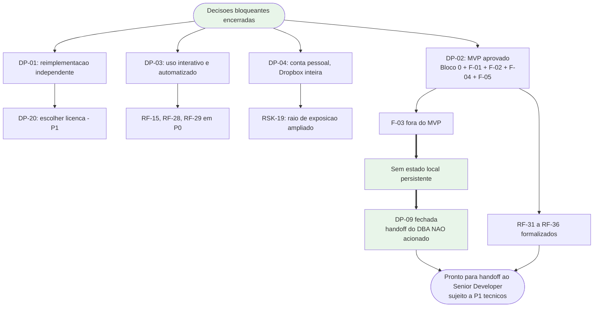
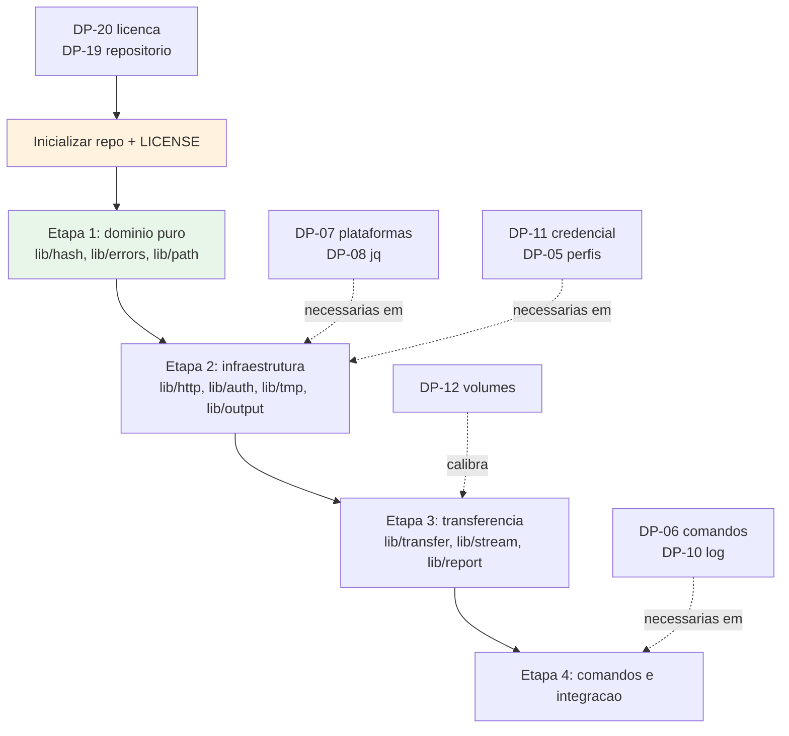

# Decisoes Pendentes do Solicitante

| Campo | Valor |
|---|---|
| Projeto | `dropbox_api` |
| Responsavel | Business Analyst |
| Data | 2026-08-17 |
| Versao | **v0.4 — pos-ciclo de QA da camada de dominio** |
| Status | ✅ **Nenhuma decisao bloqueante (P0) em aberto.** 4 resolvidas · 9 estruturantes (P1), com **DP-07 em urgencia elevada** · 6 de refinamento (P2) |
| Documentos relacionados | [Escopo e requisitos](escopo-requisitos-e-criterios-de-aceite.md) · [Funcionalidades candidatas](funcionalidades-candidatas.md) · [Riscos e licenciamento](riscos-restricoes-e-licenciamento.md) · [System Design](../arquitetura/system-design.md) |

> Este documento lista apenas o que **nao pode ser inferido com seguranca** a partir da demanda. Nada aqui foi decidido pelo Business Analyst.

---

## Como ler a priorizacao

| Nivel | Significado |
|---|---|
| **P0 — Bloqueante** | Impede o inicio da implementacao. Resposta necessaria antes de qualquer linha de codigo |
| **P1 — Estruturante** | Nao impede o inicio, mas define arquitetura e escopo do MVP. Mudar depois custa retrabalho relevante |
| **P2 — Refinamento** | Pode ser decidido durante a execucao sem retrabalho estrutural |
| **Resolvida** | Decisao registrada pelo solicitante. Mantida no documento para rastreabilidade |

---

## Painel de estado

| ID | Assunto | Estado | Prioridade atual |
|---|---|---|---|
| DP-01 | Licenciamento e forma de uso do modelo | ✅ **Resolvida** | — |
| DP-02 | Quais funcionalidades novas justificam o projeto | ✅ **Resolvida** | — |
| DP-03 | Modo de uso predominante | ✅ **Resolvida** | — |
| DP-04 | Tipo de conta e escopo de acesso | ✅ **Resolvida** | — |
| DP-05 | Multiplas contas ou perfis | ⬜ Em aberto | P1 |
| DP-06 | Conjunto de comandos de paridade no MVP | ⬜ Em aberto | P1 |
| DP-07 | Plataformas e shells suportados | ⚠️ **Em aberto — premissa antecipada pela implementacao (DIV-15)** | **P1, urgencia elevada** |
| DP-08 | Dependencias e interpretacao de JSON | ⬜ Em aberto | P1 |
| DP-09 | Semantica de sincronizacao e estado local | ✅ **Fechada sem impacto** | — |
| DP-10 | Auditoria, log e conformidade | ⬜ Em aberto | P1 |
| DP-11 | Armazenamento de credencial | ⬜ Em aberto | P1 *(peso elevado por DP-04)* |
| DP-12 | Volume, frequencia e dimensionamento | 🟡 Parcialmente calibrada por medicao | P1 |
| DP-13 | Shell interativo | ⬜ Em aberto | P2 |
| DP-14 | Empacotamento e distribuicao | ⬜ Em aberto | P2 |
| DP-15 | Idioma da interface | ⬜ Em aberto | P2 |
| DP-16 | Monitoramento de alteracoes | ⬜ Em aberto | P2 |
| DP-17 | Rede corporativa | ⬜ Em aberto | P2 |
| DP-18 | Compartilhamento | ⬜ Em aberto | P2 |
| DP-19 | Governanca do repositorio | ⬜ Em aberto | P2 |
| DP-20 | Licenca especifica a adotar | ⬜ Em aberto **(novo)** | P1 |

---

## P0 — Nenhuma decisao bloqueante em aberto

> ✅ Todas as decisoes P0 foram resolvidas. O escopo do MVP esta fechado e os requisitos correspondentes estao formalizados nas secoes 5.5 e 5.6 de [escopo-requisitos-e-criterios-de-aceite.md](escopo-requisitos-e-criterios-de-aceite.md).
>
> As pendencias restantes sao **estruturantes (P1)** e **de refinamento (P2)**. Elas condicionam decisoes tecnicas de implementacao, mas nao impedem o inicio do trabalho — ver a secao "O que o Senior Developer precisa para comecar" ao final deste documento.

---

## Decisoes resolvidas

### DP-02 — Quais funcionalidades novas justificam o projeto ✅

**Decisao do solicitante: escopo do MVP aprovado exatamente como recomendado pelo Business Analyst.**

| Item | Decisao |
|---|---|
| **Bloco 0 integral** — base endurecida | ✅ Aprovado como requisito de base nao negociavel |
| **F-01** — transferencia por fluxo `stdin`/`stdout` | ✅ Aprovada → **RF-31, RF-32** |
| **F-02** — transferencia incremental por `content_hash` | ✅ Aprovada → **RF-33, RF-34** |
| **F-04** — contrato de automacao | ✅ Aprovada → RF-15, RF-28, RF-29 + **RF-35** |
| **F-05** — relatorio de execucao | ✅ Aprovada → **RF-36** |
| **F-03** — retomada de transferencia interrompida | ❌ Fora do MVP, mantida como backlog |
| **Blocos 2 e 3** (F-06 a F-22) | ❌ Fora do escopo desta versao, backlog preservado |

**Consequencias registradas:**

1. **Premissa de valor consolidada.** O MVP entrega tres capacidades que o `Dropbox-Uploader` nao possui: envio de backup por fluxo sem disco intermediario, omissao de reenvio por comparacao de conteudo, e um contrato de automacao consumivel por orquestrador. RSK-02 e RSK-20 estao **encerrados**.
2. **O MVP nao introduz estado local persistente.** F-03 era a unica candidata aprovavel que o exigiria. Com o corte, `DP-09` **permanece fechada**, o handoff do DBA **nao** e acionado, e a secao de dimensionamento de banco do System Design permanece formalmente nao aplicavel por ausencia de mecanismo de persistencia — nao por omissao.
3. **Requisitos formalizados:** RF-31 a RF-36, com criterio de aceite verificavel cada um, integrados a matriz de rastreabilidade.
4. **Desbloqueio tecnico:** o algoritmo do `content_hash`, exigido por F-02, foi **confirmado** com vetor de teste oficial, liberando `lib/hash` (ver DIV-14).

> ⚠️ **Nao reabrir.** Qualquer proposta de introduzir estado local persistente nesta versao constitui mudanca de escopo e exige nova decisao do solicitante.

---

### DP-09 — Semantica de sincronizacao e estado local ✅ *(fechada sem impacto)*

**Fechada por consequencia de DP-02.** As quatro funcionalidades que exigiriam estado local persistente — F-03 (retomada), F-06 (espelhamento), F-12 (trava de concorrencia) e F-14 (deteccao por cursor) — ficaram todas fora do escopo.

**Estado no MVP:** envio aditivo, sem espelhamento e sem remocao de orfaos. A unica persistencia local e o arquivo de configuracao com a credencial. Nao ha cursor, catalogo, indice nem arquivo de trava.

**Consequencia:** nao ha handoff do DBA nesta versao. Reabre apenas se alguma das quatro candidatas for promovida do backlog.

---

## Demais decisoes resolvidas

### DP-01 — Regime de licenciamento e forma de uso do modelo ✅

**Decisao do solicitante: reimplementacao independente.** O `Dropbox-Uploader` sera usado como **referencia conceitual apenas**. Nenhum trecho de codigo GPLv3 sera copiado, adaptado ou traduzido.

**Consequencias registradas:**

1. **Nao ha obrigacao copyleft.** O projeto e livre para adotar qualquer licenca, inclusive permissiva ou proprietaria. O risco RSK-01 esta **mitigado**, remanescendo apenas o dever de disciplina na execucao.
2. **Salvaguardas operacionais obrigatorias**, agora vinculantes para o Senior Developer:
   - Nao copiar codigo, estrutura interna de funcoes, nomes internos de variaveis nem texto literal de mensagens do modelo.
   - Nao copiar o `README` nem a documentacao do modelo.
   - Tomar a **documentacao oficial da Dropbox** como fonte primaria dos contratos de integracao, e nao o codigo do modelo.
   - Registrar formalmente, no fechamento, que nenhum trecho de codigo do modelo foi incorporado.
3. **Ganho colateral confirmado:** a reimplementacao independente evita herdar os defeitos identificados no modelo (DIV-01 a DIV-06), que passam a compor o Bloco 0 de base endurecida.
4. **Pendencia derivada:** a escolha da licenca especifica permanece aberta e foi registrada como **DP-20**, em prioridade P1.

Requisito afetado: RNF-17.

---

### DP-03 — Modo de uso predominante ✅

**Decisao do solicitante: ambos.** A ferramenta sera usada de forma **interativa** por operador humano **e** de forma **automatizada** por `cron` e pipelines de CI.

**Consequencias registradas:**

| Exigencia decorrente | Requisito | Mudanca de status |
|---|---|---|
| Deteccao de terminal associado; comportamento distinto conforme a presenca de TTY | RNF-19 | Reforcado e promovido a estrutural |
| Ausencia de solicitacao de entrada bloqueante quando nao houver TTY; operacoes que exigiriam confirmacao falham com codigo dedicado | RNF-19, RF-21 | Reforcado |
| Saida estruturada parseavel por script, com diagnostico separado na saida de erro | RF-28 | **Promovido de P1 para P0** |
| Codigos de saida deterministicos e distintos por classe de falha | RF-29 | Ja era P0; agora e tambem diferencial declarado |
| Modo de simulacao | RF-15 | **Promovido de P1 para P0** |
| Saida legivel por humano com formatacao adequada quando houver TTY | RF-26, RF-27 | Mantido |

**Consequencia arquitetural:** a camada de saida deixa de ser um formatador simples e passa a ser um componente com **duas apresentacoes sobre o mesmo modelo de resultado**, selecionadas por deteccao de TTY e por sinalizador explicito. Registrado no System Design.

**Consequencia de escopo:** o conjunto F-04 (contrato de automacao) deixa de ser conveniencia e passa a ser requisito estrutural do produto.

---

### DP-04 — Tipo de conta e escopo de acesso ✅

**Decisao do solicitante:** conta **pessoal / individual**, com aplicativo registrado com acesso a **Dropbox inteira** (`Full Dropbox`), **nao** restrito a pasta do aplicativo.

**Consequencias registradas:**

1. **Simplificacao:** nao ha Dropbox Business ou Team no escopo. Nao ha impersonacao administrativa, nao ha selecao de membro, nao ha manipulacao de namespace de equipe. O requisito **RF-06 (suporte a Business/Team) fica formalmente fora do escopo** e deixa de ser condicional.
2. **Ampliacao de superficie de risco:** com acesso a Dropbox inteira, um comprometimento da credencial expoe **todo o conteudo da conta**, e nao apenas uma pasta isolada. Uma exclusao acidental ou um caminho remoto mal formado tambem alcancam qualquer area da conta. Registrado como **RSK-19** no documento de riscos.
3. **Escolha irreversivel consumada:** a alteracao do tipo de acesso exige recriar o aplicativo no Dropbox App Console e refazer a autorizacao. O risco RSK-12 esta **encerrado por decisao**, com a consequencia assumida.
4. **Mitigacoes agora obrigatorias:**
   - Conceder **apenas os escopos OAuth estritamente necessarios** aos comandos habilitados, mesmo com acesso amplo ao espaco de arquivos (o tipo de acesso e independente do conjunto de escopos).
   - Elevar o peso de DP-11 (armazenamento de credencial): a proteção do refresh token passa a ser o unico controle entre um usuario local e o conteudo integral da conta.
   - Reforcar RNF-03 e RNF-04, ja especificados.
   - Tratar como obrigatoria a confirmacao explicita em operacoes destrutivas (RF-21) e recomendar restricao de caminho raiz configuravel, para que uma rotina de automacao nao consiga operar fora da area pretendida.
5. **Recomendacao adicional do Business Analyst:** avaliar o uso de um aplicativo Dropbox distinto, com acesso restrito a pasta do aplicativo, para as rotinas nao assistidas que nao precisem alcancar toda a conta. Reduz o raio de exposicao sem alterar a decisao tomada.

Requisitos afetados: RF-06 (fora de escopo), RF-21, RNF-03, RNF-04.

---

## P1 — Estruturantes

### DP-20 — Licenca especifica a adotar *(novo, derivado de DP-01)*

Com DP-01 resolvida como reimplementacao independente, o projeto tem liberdade de escolha.

**Perguntas:**
1. Qual licenca adotar? (MIT, Apache-2.0, BSD, GPLv3 por opcao propria, proprietaria, ou sem licenca publica para uso estritamente interno)
2. O resultado sera publicado, distribuido a terceiros, ou permanecera de uso interno?
3. Havera aceitacao de contribuicoes externas? (implica politica de contribuicao)

**Bloqueia:** RNF-17, arquivo de licenca na raiz, cabecalhos de copyright.
**Observacao:** a licenca deve ser publicada **antes do primeiro commit de codigo**. Definir depois obriga a concordancia de todos os autores que ja tiverem contribuido.

### DP-05 — Multiplas contas ou perfis *(rebaixada de P0 para P1)*

Rebaixada porque, com DP-04 resolvida como conta pessoal unica, deixou de ser bloqueante para o inicio. Continua estruturante por definir o formato e a localizacao do arquivo de configuracao.

**Perguntas:**
1. Uma instalacao precisa atender mais de uma conta Dropbox simultaneamente?
2. Em caso positivo, a selecao deve ser por parametro, por variavel de ambiente, ou ambos?
3. Perfis diferentes serao usados por usuarios diferentes do mesmo host?

**Bloqueia:** RF-05, F-18, formato e localizacao do arquivo de configuracao.

### DP-06 — Conjunto de comandos do MVP

**Perguntas:**
1. Dos comandos de paridade com o modelo (envio, recebimento, importacao por URL, compartilhamento, informacoes de conta, espaco, exclusao, mover, copiar, criacao de pasta, busca, listagem, monitoramento, desvinculo), quais sao realmente necessarios na primeira entrega?
2. Paridade completa com o modelo e requisito, ou apenas referencia?

**Observacao:** esta decisao trata dos comandos **ja existentes no modelo**. As funcionalidades **novas** sao tratadas em DP-02.
**Bloqueia:** dimensionamento do MVP e priorizacao dos RF da secao 5 do documento de requisitos.

### DP-07 — Plataformas e shells suportados ⚠️ **EM ABERTO — nao fechar por inferencia**

> **Alerta de processo (DIV-15).** A implementacao da camada de dominio ja usa recursos que pressupoem um piso de `bash` moderno, e a justificativa registrada afirmava que "o solicitante fixou Linux com `bash` 4+". **Isso nao ocorreu.** O que existe e "stack detectada: `bash` 4+" na memoria de projeto, que e **observacao do ambiente de desenvolvimento, nao decisao de escopo**.
>
> Esta decisao **continua sendo do solicitante**. O Business Analyst nao a fecha, e `RNF-01` permanece congelado com a redacao original ate que ela seja respondida. Risco associado: `RSK-25`.

**Dado novo, apurado no ciclo — o piso real e `bash` 4.4, nao 4.0:**

| Recurso em uso | Versao minima que o suporta |
|---|---|
| `declare -A` (array associativo) | 4.0 |
| `${var,,}` (conversao para minusculas) | 4.0 |
| `declare -g` (variavel global em funcao) | **4.2** |
| `"${arr[@]}"` com array vazio sob `set -u`, usado na harness de teste | **4.4** |

**Consequencia material para a decisao:** com piso 4.4, **RHEL 6 fica fora** — sua versao de fabrica e `bash` 4.1. macOS de fabrica (`bash` 3.2) ja estava fora por larga margem.

**Perguntas:**
1. Quais sistemas devem ser suportados oficialmente? (Linux com glibc, Alpine/musl, macOS, *BSD, WSL, container, dispositivo embarcado)
2. `bash` e aceitavel como requisito, ou e necessario suporte a `sh` POSIX / BusyBox `ash`?
3. **RHEL 6 e derivados (`bash` 4.1) precisam ser suportados?** Se sim, a harness de teste e o uso de `declare -g` precisam ser reescritos.
4. Se macOS estiver no escopo, exige-se o `bash` 3.2 de fabrica ou pode-se depender de `bash` moderno instalado a parte?

**Bloqueia:** `RNF-01` (congelado), `lib/preflight`, camada de compatibilidade entre utilitarios GNU e BSD, e a reavaliacao de `RSK-24` (a mitigacao de TOCTOU por `/proc/self/fd` so seria admissivel se a resposta restringir o escopo a Linux — e adota-la antes da resposta **fecharia DP-07 a forca**).

### DP-08 — Politica de dependencias e interpretacao de JSON

| Opcao | Vantagem | Custo |
|---|---|---|
| **A** — Apenas `cURL` e utilitarios base, com interpretador JSON proprio em shell | Dependencia zero, maxima portabilidade | Complexidade alta, risco de defeito, mais codigo para testar |
| **B** — Exigir `jq` | Interpretacao correta e simples | Uma dependencia adicional a instalar |
| **C** — Usar `jq` quando presente, com recuo para interpretacao propria | Melhor dos dois | Dois caminhos de codigo para manter e testar |

**Perguntas:**
1. `jq` pode ser exigido como dependencia?
2. Ha ambiente alvo onde instalar pacote adicional e proibido?

**Bloqueia:** RNF-02, RNF-11 e o desenho do componente de interpretacao de resposta.
**Observacao adicional:** F-02 e F-11 exigem calculo local do `content_hash`, que depende de um utilitario de resumo SHA-256 disponivel no host. Esta decisao deve considerar tambem essa dependencia.

### DP-10 — Auditoria, log e conformidade

**Perguntas:**
1. Ha exigencia de trilha de auditoria persistente das operacoes executadas? Com qual retencao?
2. O log pode conter nomes e caminhos de arquivos, ou eles sao considerados dado sensivel?
3. Ha requisito regulatorio aplicavel ao conteudo transferido (LGPD, sigilo contratual, dados de cliente)?
4. E necessario integrar o log a `syslog`, `journald` ou coletor centralizado?

**Bloqueia:** RF-30, politica de retencao, eventual mascaramento de caminhos.
**Observacao:** com acesso a Dropbox inteira (DP-04), a trilha de auditoria ganha peso, pois qualquer operacao pode alcancar qualquer area da conta.

### DP-11 — Armazenamento de credencial *(peso elevado por DP-04)*

Com acesso a Dropbox inteira, o refresh token passa a ser o unico controle entre um usuario local e **todo** o conteudo da conta.

**Perguntas:**
1. Arquivo local com permissao `0600` e aceitavel, ou e exigido cofre de segredos (`pass`, `gpg`, keyring do sistema, Vault, cofre de nuvem)?
2. As credenciais podem ser fornecidas por variavel de ambiente para uso em container e CI?
3. Ha politica de rotacao periodica de credencial?
4. Faz sentido restringir por configuracao o caminho raiz que as rotinas automatizadas podem alcancar, limitando o raio de acao mesmo com acesso amplo concedido?

**Bloqueia:** RNF-03, RNF-04 e o desenho do componente de configuracao.

### DP-12 — Volume, frequencia e dimensionamento

**Perguntas:**
1. Tamanho tipico e maximo dos arquivos transferidos?
2. Quantidade de arquivos por execucao e frequencia de execucao?
3. Numero de hosts que usarao o mesmo aplicativo Dropbox registrado? (a cota de chamadas e por aplicativo e por usuario)
4. Ha janela de tempo maxima para conclusao de uma rotina?
5. Banda disponivel e espaco livre na area temporaria dos hosts?

**Bloqueia:** secao de dimensionamento do System Design, tamanho padrao de parte, politica de retentativa.
**Nao bloqueia o inicio da implementacao:** valores padrao conservadores permitem comecar. A resposta serve para calibrar, e tambem para reavaliar a promocao de F-03 do backlog caso surjam arquivos de varios gigabytes ou rede instavel.

**🟡 Parcialmente calibrada na v0.4 por medicao real da camada de dominio:**

| Grandeza | Medido | Efeito na decisao |
|---|---|---|
| `content_hash` | ~320 MB/s, memoria plana em ~8 MiB | 100 GiB em ~5,4 min. **Deixa de ser gargalo.** O custo de RF-33 e administravel mesmo em arquivos muito grandes, e nao ha teto de tamanho imposto por memoria |
| `lib/path` | Profundidade 5.000 em 0,88 s | Confinamento nao e gargalo em arvores realistas |
| Redacao de erro | ~n^1.5; 256 KiB em 4,56 s | Unico ponto de atencao; irrelevante em mensagens de erro reais |

**O que ainda falta:** os volumes de negocio — tamanhos e quantidades reais, frequencia, numero de hosts, janela de tempo, banda e espaco em `$TMPDIR`. A medicao acima informa o **custo unitario**; falta o **volume** para dimensionar.

---

## P2 — Refinamento

### DP-13 — Shell interativo

Com DP-03 confirmando uso interativo, esta decisao ganhou relevancia. E desejado um modo interativo de navegacao com estado de sessao (equivalente ao `dropShell.sh` do modelo), ou a CLI por comando e suficiente para o uso interativo pretendido? Reabre integralmente a secao de Design System do System Design se aprovado.

### DP-14 — Empacotamento e distribuicao

Arquivo unico autocontido, repositorio com instalador, imagem de container, pacote de distribuicao (`deb`/`rpm`), ou formula de gerenciador? Ha exigencia de assinatura ou verificacao de integridade do artefato distribuido?
**Observacao:** a decisao de modularizacao (RNF-16) e compativel com distribuicao em arquivo unico, mas isso exige uma etapa de composicao no processo de publicacao.

### DP-15 — Idioma da interface

Mensagens, ajuda e documentacao de uso em portugues do Brasil, ingles, ou ambos? A documentacao de governanca permanece em portugues do Brasil por definicao do protocolo, independentemente desta resposta.

### DP-16 — Monitoramento de alteracoes

O comando de monitoramento por espera longa e necessario? Em caso positivo, o resultado deve apenas reportar o evento ou disparar acao configuravel? Relaciona-se com F-14 (deteccao de mudancas por cursor).

### DP-17 — Rede corporativa

Ha proxy HTTP obrigatorio, inspecao TLS corporativa com autoridade certificadora propria, ou restricao de saida por lista de dominios permitidos? Impacta a configuracao do cliente HTTP e RNF-06.

### DP-18 — Compartilhamento

Links compartilhados precisam de controle de expiracao, senha ou restricao de audiencia (F-16)? Esses recursos dependem do plano Dropbox contratado.

### DP-19 — Governanca do repositorio

O projeto sera versionado em git com o fluxo Gitflow e a governanca de Pull Request previstos no protocolo do pacote? Em qual origem remota? O diretorio alvo ainda nao e repositorio git.

---

## O que o Senior Developer precisa para comecar

Resposta a pergunta operacional: o que ja esta destravado e o que continua dependente de decisao.

### A — Destravado: pode comecar agora

Trabalho com escopo, contrato e criterio de aceite definidos, sem dependencia de decisao pendente.

| # | Item | Base |
|---|---|---|
| 1 | **Estrutura modular do projeto** — `bin/dbx`, `lib/*`, `commands/*`, `tests/`, com dependencia unidirecional entre camadas | RNF-16, System Design |
| 2 | **`lib/hash`** — calculo do `content_hash`: blocos de 4 MiB, SHA-256 por bloco, concatenacao **binaria** dos resumos, SHA-256 final, saida hexadecimal. Vetor de teste oficial disponivel como criterio de aceite | RF-34 ✅ **contrato confirmado** |
| 3 | **`lib/errors`** — taxonomia de erro, correspondencia por **prefixo** do `error_summary`, tabela de codigos de saida | RF-29, RNF-08 |
| 4 | ⚠️ **`lib/output`** — modelo de resultado unico com duas apresentacoes; deteccao de terminal; sobreposicao por sinalizador; versionamento do contrato. **Movido para o bloco B na v0.4** — ver item 10 do bloco B | RF-28, RF-35, RNF-19, RNF-22 |
| 5 | **`lib/http`** — ponto unico de saida de rede, segredo fora do `argv`, recuo exponencial com `Retry-After`, sem retentativa em `400` | RNF-03, RNF-07, RNF-12 |
| 6 | **`lib/auth`** — fluxo de refresh token, `expires_in`, revogacao com advertencia de cascata | RF-02, RF-06a, RES-04, RES-12 |
| 7 | **`lib/tmp`, `lib/path`** — temporarios com `mktemp` e limpeza por `trap`; normalizacao e confinamento de raiz | RNF-05, RNF-10, RNF-20 |
| 8 | **`lib/transfer` e `lib/stream`** — selecao entre requisicao unica e sessao; envio e recebimento por fluxo; omissao por conteudo identico | RF-07 a RF-11, RF-31 a RF-33 |
| 9 | **`lib/report`** — relatorio de execucao nas duas apresentacoes | RF-36 |
| 10 | **Suite de testes e analise estatica** — duplo de teste HTTP, execucao sem rede e sem credencial real, `shellcheck` limpo | RNF-13, RNF-14 |
| 11 | **Verificacao residual de escopos OAuth** — confirmar o escopo exigido por `files/search_v2`, `sharing/create_shared_link_with_settings`, `users/get_current_account` e `users/get_space_usage` na pagina de cada endpoint. Baixo risco: ausencia produz `401` explicito | DIV-14 |

### B — Dependente de decisao: nao comecar antes

| # | Item bloqueado | Decisao | Por que bloqueia |
|---|---|---|---|
| 1 | **Primeiro commit de codigo** | **DP-20** | O arquivo de licenca deve estar publicado antes. Definir depois obriga a concordancia de todos os autores que ja tiverem contribuido |
| 2 | **`lib/json`** — estrategia de interpretacao de resposta | **DP-08** | Exigir `jq`, implementar interpretador proprio ou manter os dois caminhos sao desenhos incompativeis entre si. O contrato interno do componente ja esta definido, o que permite programar contra ele; a implementacao, nao |
| 3 | **`lib/preflight`** — versao minima de shell e utilitarios obrigatorios | **DP-07** | Suportar `bash` 3.2 do macOS proibe arrays associativos, `mapfile` e expansoes modernas; suportar apenas Linux moderno libera tudo. Decidir depois implica reescrita ampla |
| 4 | **Camada de compatibilidade de utilitarios** (`stat`, `sed`, `date`, `base64`) | **DP-07** | GNU e BSD divergem em sintaxe. O conjunto de plataformas define se essa camada precisa existir |
| 5 | **`lib/config`** — formato e localizacao do arquivo de credencial | **DP-11**, DP-05 | Arquivo `0600`, variavel de ambiente ou cofre de segredos produzem desenhos distintos. DP-05 define se ha perfis nomeados |
| 6 | **Valores padrao de dimensionamento** — tamanho de parte, limite de retentativas | **DP-12** | Nao impede comecar com padroes conservadores, mas os valores finais dependem dos volumes reais |
| 7 | **Comandos de paridade com o modelo** | **DP-06** | Define quais dos comandos existentes (`saveurl`, `monitor`, `share`, `search`) entram na primeira entrega |
| 8 | **Politica de log e retencao** | **DP-10** | Define se caminhos de arquivo podem ser registrados e se ha integracao com coletor centralizado |
| 9 | **Inicializacao do repositorio git e Gitflow** | **DP-19** | Precede o item 1 do bloco B |
| 10 | **`lib/output`** — formato da saida estruturada | **DIV-16** *(decisao de desenho, nao do solicitante)* | **Novo na v0.4.** O formato orientado a linha de RF-28 e RF-35 nao representa sem ambiguidade um nome de arquivo que contenha quebra de linha (RNF-10). E preciso decidir antes de implementar: delimitador alternativo, sequencia de escape ou terminador nulo. Decidir depois implica quebrar o contrato publico que RF-35 promete estabilizar |
| 11 | **`lib/output`** — disposicao dos campos de diagnostico | **RNF-22** *(requisito, ja definido)* | **Novo na v0.4.** A redacao de cabecalho sensivel consome o restante da linha. Concatenar diagnostico na mesma linha de um cabecalho sensivel destroi o identificador de correlacao que RF-30 existe para preservar. Nao e decisao pendente — e restricao a respeitar desde a primeira linha de `lib/output` |

### Sequencia recomendada

**Leitura:** a Etapa 1 e inteiramente destravada e contem o componente de maior risco tecnico (`lib/hash`), cujo contrato acabou de ser confirmado e que possui vetor de teste oficial. Comecar por ela produz valor verificavel sem depender de nenhuma decisao pendente, enquanto DP-07, DP-08, DP-11 e DP-20 sao respondidas em paralelo.

---

## Resumo das pendencias

### Bloqueantes

**Nenhuma.**

### Estruturantes (P1) — em ordem de urgencia para a implementacao

| ID | Pergunta em uma linha | Bloqueia |
|---|---|---|
| DP-20 | Qual licenca adotar? Havera publicacao ou distribuicao? | Primeiro commit de codigo |
| **DP-07** | **Quais sistemas e shells? RHEL 6 (`bash` 4.1) precisa ser suportado?** Urgencia elevada: a implementacao ja pressupoe piso 4.4 sem que a decisao tenha sido tomada (DIV-15) | `RNF-01` congelado, `lib/preflight`, compatibilidade de utilitarios, reavaliacao de `RSK-24` |
| DP-08 | `jq` pode ser exigido como dependencia? | `lib/json` |
| DP-11 | Arquivo `0600` basta para a credencial, ou e exigido cofre de segredos? | `lib/config` |
| DP-05 | Precisa atender mais de uma conta na mesma instalacao? | Formato de configuracao |
| DP-06 | Quais comandos de paridade com o modelo entram no MVP? | Escopo da camada de comandos |
| DP-10 | Ha exigencia de auditoria, retencao de log ou conformidade regulatoria? | Politica de log |
| DP-12 | Tamanhos, quantidades, frequencia e numero de hosts? | Calibragem de dimensionamento |
| DP-19 | Repositorio git com Gitflow? Qual origem remota? | Inicializacao do repositorio |

### Refinamento (P2)

DP-13 shell interativo · DP-14 empacotamento · DP-15 idioma · DP-16 monitoramento · DP-17 rede corporativa · DP-18 compartilhamento.
