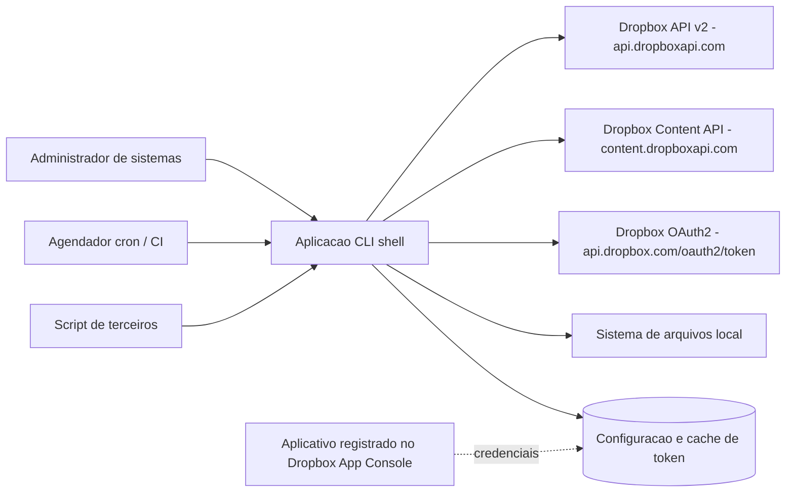

# Escopo, Requisitos e Criterios de Aceite — Aplicacao Shell de Integracao com Dropbox

| Campo | Valor |
|---|---|
| Projeto | `dropbox_api` — aplicacao CLI em shell script para integracao com Dropbox |
| Responsavel Business Analyst | Business Analyst (pacote de agents) |
| Data da versao | 2026-08-17 |
| Versao | **v0.6** |
| Status | ✅ **Escopo aprovado. Nenhuma decisao bloqueante.** Dominio aprovado com ressalva; `lib/json` e `lib/output` entregues. Pendencia de maior urgencia: `DP-20` (titular do copyright), com custo crescente |
| Documentos relacionados | [System Design](../arquitetura/system-design.md) · [Decisoes pendentes](decisoes-pendentes.md) · [Funcionalidades candidatas](funcionalidades-candidatas.md) · [Riscos e licenciamento](riscos-restricoes-e-licenciamento.md) |

> **Aviso de maturidade.** Este documento separa deliberadamente o que e **derivavel com seguranca** a partir da demanda do que **depende de decisao do solicitante**. Requisitos marcados como `Condicional` nao devem entrar em planejamento de implementacao antes da resposta a decisao pendente correspondente. Nenhum requisito foi inventado para preencher lacuna de escopo.

## Registro de versao

| Versao | Mudanca |
|---|---|
| v0.1 | Especificacao inicial |
| v0.2 | DP-01 resolvida (reimplementacao independente); DP-03 resolvida (uso interativo **e** automatizado), promovendo RF-15 e RF-28 a P0 e reforcando RNF-19; DP-04 resolvida (conta pessoal com acesso a Dropbox inteira), movendo RF-06 para fora de escopo e criando RNF-20; contratos da Dropbox API revalidados via Context7, corrigindo unidades, o requisito de multiplo de 4 MiB, a paginacao de busca e as afirmacoes sobre endpoints depreciados; DIV-10 removida por erro factual; DIV-11 a DIV-14 acrescentadas |
| **v0.6** | **`DP-05` resolvida** — uma conta so, sem nocao de perfil: `RF-05` e `F-18` saem para o backlog como incremento **aditivo**, e o desenho de `lib/config` fica fechado (um arquivo, um caminho, sem multiplexacao). **`RNF-23` criado** a partir de medicao real: teto de entrada de 256 KiB em `lib/json` torna **obrigatorio o `limit`/`max_results` explicito** em toda chamada de colecao — `RF-16` e `RF-22` emendados. **`RSK-24` encerrado** com aceite reconfirmado, agora fundamentado apenas nos dois argumentos tecnicos validos |
| **v0.5** | **Correcao de registro e tres decisoes novas.** `DP-07` e `DP-08` **ja estavam decididas** pelo solicitante ("so cURL, `bash` 4+, Linux") e nunca haviam sido propagadas: `RNF-01` **descongelado** com piso `bash` **4.4**, `RNF-02` fixado sem `jq`, `RNF-11` elevado a criticidade maxima, `DIV-15` **retirada** e `RSK-25` **encerrado**. `DP-11` resolvida — credencial `0600` sob XDG, sem sobrescrita por ambiente (`RNF-04`). `DIV-16b` resolvida — `--null` com terminador nulo, destravando `lib/output` (`RF-28`, `RNF-22` ampliado aos dois modos). `DP-19` encerrada com desvios consumados registrados. `RES-15` a `RES-17` criadas. Novo risco `RSK-26` (falha de propagacao de decisao) e `RSK-24` reaberto para reavaliacao |
| **v0.4** | **Correcoes devolvidas pelo ciclo de QA da camada de dominio (aprovado com ressalva).** `RNF-20` ampliado para os **dois espacos de nomes**, remoto e local, com resolucao fisica de symlinks, oito vetores de ataque cobertos, raiz `/` sob opt-in e TOCTOU aceito como risco residual (`RSK-24`); `RNF-07` ajustado para a dimensao de idempotencia em `5xx` e `http=0`; `RNF-10` emendado para exigir quebra de linha no conjunto de teste; **`RNF-22` criado** (restricao de entrada de `lib/output` decorrente da redacao de cabecalho sensivel); `RF-31` corrigido quanto ao transito por `$TMPDIR` em blocos; `RF-35` fixa a faixa de codigos de saida em 0..15 e registra a rejeicao do codigo 16; **`RNF-01` congelado** e `DIV-15` aberta por antecipacao de decisao do solicitante; `DIV-16` reclassificada |
| **v0.3** | **DP-02 resolvida — escopo do MVP aprovado.** Secao 5.5 criada com RF-31 a RF-36, formalizando F-01, F-02, F-04 e F-05; secao 5.6 formaliza o Bloco 0 como requisito de base; F-03 e os Blocos 2 e 3 registrados como fora de escopo, o que mantem o MVP **sem estado local persistente** e nao aciona o handoff do DBA; **algoritmo do `content_hash` confirmado**, desbloqueando `lib/hash` e RF-33/RF-34; DIV-14 reduzida a uma pendencia residual; matriz de rastreabilidade estendida |

> ✅ **Escopo do MVP aprovado (`PRJ-DEC-04`).** Bloco 0 integral + F-01 (fluxo `stdin`/`stdout`) + F-02 (incremental por `content_hash`) + F-04 (contrato de automacao) + F-05 (relatorio de execucao). Formalizados nas secoes 5.5 e 5.6. Fundamentacao e backlog em [funcionalidades-candidatas.md](funcionalidades-candidatas.md).
>
> ⚠️ **O MVP nao introduz estado local persistente.** F-03, F-06, F-12 e F-14 — as unicas candidatas que o exigiriam — ficaram fora do escopo. `DP-09` permanece fechada e o handoff do DBA **nao** e acionado nesta versao. Reintroduzir persistencia constitui mudanca de escopo.

---

## 1. Especificacao de caso de uso

### 1.1 Problema de negocio

Operacoes de transferencia e gestao de arquivos no Dropbox precisam ser executadas a partir de ambientes onde **nao ha cliente grafico de sincronizacao nem runtime de aplicacao instalado** — servidores headless, containers, dispositivos embarcados, jobs de backup e pipelines de automacao. Nesses ambientes, o denominador comum disponivel e um shell POSIX e o `cURL`.

A demanda solicita uma aplicacao em shell script que exponha as capacidades da Dropbox API v2 como comandos de linha de comando, tomando como modelo o projeto `Dropbox-Uploader`.

> **Justificativa do investimento (DP-02, parcialmente resolvida).** O solicitante confirmou que a demanda se justifica por **funcionalidades que o `Dropbox-Uploader` nao possui**. O projeto, portanto, **nao** e uma reimplementacao equivalente: e uma ferramenta com escopo funcional maior. O risco de "clone sem valor incremental" esta encerrado.
>
> Permanece em aberto **quais** funcionalidades. A proposta de 22 candidatas, com valor, esforco e dependencias, esta em [funcionalidades-candidatas.md](funcionalidades-candidatas.md), aguardando confirmacao, corte ou acrescimo. Enquanto isso nao for respondido, o MVP nao e definivel.

### 1.2 Usuarios primarios

| Persona | Contexto de uso | Necessidade dominante |
|---|---|---|
| Administrador de sistemas | Servidor Linux headless, sessao SSH | Transferir arquivos sob demanda sem instalar runtime adicional |
| Engenheiro de automacao | `cron`, `systemd timer`, pipeline de CI | Execucao nao assistida, previsivel, com codigo de saida confiavel e sem prompt interativo |
| Operador de rotina de backup | Job agendado noturno | Envio recorrente de artefatos volumosos com retomada e verificacao de integridade |
| Desenvolvedor integrador | Estacao de trabalho | Consultar, publicar e compartilhar arquivos a partir de scripts proprios |

> Personas derivadas do contexto tecnico da demanda e dos ambientes testados declarados pelo projeto de referencia. **Requerem confirmacao do solicitante** (DP-03).

### 1.3 Criterios de sucesso mensuraveis

| ID | Criterio de sucesso | Metrica | Meta proposta |
|---|---|---|---|
| CS-01 | Instalacao e primeiro uso sem dependencia alem de shell e `cURL` | Numero de pacotes adicionais exigidos em instalacao minima de distribuicao suportada | 0 (ou 1, se `jq` for aprovado em DP-08) |
| CS-02 | Execucao nao assistida confiavel | Taxa de sucesso de execucoes agendadas em 30 dias, sem intervencao humana | >= 99% |
| CS-03 | Diagnostico de falha sem inspecao de codigo | Percentual de falhas em que a mensagem de erro identifica causa e acao corretiva | 100% dos codigos de erro mapeados |
| CS-04 | Nao exposicao de segredos | Ocorrencias de credencial em `argv`, log, variavel exportada ou arquivo com permissao ampla | 0 |
| CS-05 | Aderencia a contratos vigentes da Dropbox API v2 | Endpoints depreciados ou retirados em uso | 0 |
| CS-06 | Verificabilidade | Percentual de requisitos com criterio de aceite automatizavel | 100% |

---

## 2. Fronteiras de escopo

### 2.1 Dentro do escopo (derivavel com seguranca)

- Aplicacao de linha de comando escrita em shell script.
- Autenticacao OAuth2 contra a Dropbox API v2 com refresh token e access token de curta duracao.
- Operacoes de arquivos e pastas: envio, recebimento, listagem, metadados, criacao de pasta, mover, copiar, excluir.
- Consulta de informacoes de conta e uso de espaco.
- Tratamento de erro, retentativa e codigos de saida adequados a automacao.
- Documentacao de uso e de implantacao.

### 2.2 Fora do escopo (nesta versao)

- Interface grafica, web ou TUI.
- Sincronizacao bidirecional continua com resolucao de conflito.
- Daemon residente em memoria.
- Servidor de callback OAuth em `localhost` (o fluxo previsto e por codigo de autorizacao colado manualmente).
- Suporte a provedores de armazenamento alem do Dropbox.
- Criptografia de conteudo do lado do cliente antes do envio. A composicao com ferramentas externas por fluxo continua possivel.
- **Dropbox Business e Team em qualquer forma** — administracao de equipe, impersonacao de membro, espaco de equipe e manipulacao de namespace por `Dropbox-API-Path-Root`. **Definitivo por DP-04**, que fixou conta pessoal.

### 2.3 Escopo condicional

| Capacidade | Depende de |
|---|---|
| Funcionalidades novas propostas (F-01 a F-22) | **DP-02** — bloqueante |
| Perfis e multiplas contas | DP-05 |
| Shell interativo equivalente ao `dropShell.sh` | DP-13 |
| Sincronizacao unidirecional com espelhamento e exclusao remota | DP-09, acoplada a DP-02 |
| Monitoramento de mudancas via longpoll | DP-16 |
| Empacotamento em container e distribuicao | DP-14 |

### 2.3.1 Escopo desbloqueado na v0.2

| Item | Situacao anterior | Situacao atual |
|---|---|---|
| Regime de licenciamento | Bloqueava o inicio do trabalho | **Resolvido.** Reimplementacao independente; sem obrigacao copyleft. Licenca especifica pendente em DP-20 |
| Modo de uso | Indefinido entre interativo e automatizado | **Resolvido.** Ambos. RF-15 e RF-28 promovidos a P0; RNF-19 reforcado |
| Tipo de conta e escopo de acesso | Indefinido | **Resolvido.** Conta pessoal com acesso a Dropbox inteira. RF-06 movido para fora de escopo; RNF-20 criado |

### 2.4 Atores e sistemas externos

---

## 3. Premissas

| ID | Premissa | Consequencia se falsa |
|---|---|---|
| PRE-01 | O solicitante possui ou pode criar um aplicativo no Dropbox App Console com acesso `Scoped Access` | Sem app key/secret nao ha autenticacao possivel; o projeto nao inicia |
| PRE-02 | O ambiente de execucao tem `cURL` com suporte a TLS e cadeia de certificados valida | Toda a integracao falha |
| PRE-03 | O ambiente de execucao dispone de sistema de arquivos gravavel para configuracao e area temporaria | Upload em partes e cache de token ficam inviaveis |
| PRE-04 | A conta Dropbox alvo tem espaco e cota de API compativeis com o volume pretendido | Falhas por `insufficient_space` e HTTP 429 |
| PRE-05 | Nao ha requisito de persistencia em banco de dados | Handoff do DBA passa a ser obrigatorio e o System Design precisa de revisao |
| PRE-06 | Nao ha interface grafica; portanto nao ha Design System aplicavel | A secao obrigatoria de Design System do System Design precisa de handoff do UX Expert |
| PRE-07 | O conteudo transferido nao contem dado pessoal sensivel sujeito a controle regulatorio adicional | Exige requisitos de LGPD, criptografia em repouso e trilha de auditoria (ver DP-10) |

---

## 4. Restricoes

| ID | Restricao | Origem |
|---|---|---|
| RES-01 | A implementacao deve ser em shell script | Imposicao explicita do solicitante |
| RES-02 | **Nao derivar codigo do projeto de referencia.** Por decisao registrada em DP-01, o `Dropbox-Uploader` e referencia conceitual apenas; nenhum trecho de codigo, estrutura interna de funcoes, nome interno de variavel ou texto literal de mensagem pode ser copiado ou adaptado | Decisao do solicitante. Afasta o copyleft GPLv3. Ver [riscos](riscos-restricoes-e-licenciamento.md) |
| RES-03 | O contrato de integracao e definido pela Dropbox e nao e negociavel | Dropbox API v2 |
| RES-04 | Access token de curta duracao; acesso nao assistido exige refresh token obtido com `token_access_type=offline` na URL de autorizacao. A resposta do endpoint de token informa a validade em `expires_in` (exemplo documentado: `14400`, equivalente a 4 horas) | Documentacao Dropbox, revalidada via Context7 |
| RES-05 | `POST /2/files/upload` nao deve ser usado para arquivos maiores que **150 MiB**; acima disso e obrigatorio o fluxo de `upload_session`. Cada requisicao isolada de `append_v2` e de `finish` tambem esta limitada a 150 MiB. O tamanho maximo por sessao e de 2^41 − 2^22 bytes | Documentacao Dropbox, revalidada via Context7 |
| RES-06 | O endpoint vigente de busca e `/2/files/search_v2`, paginado por `/2/files/search/continue_v2`, com teto de **10.000 correspondencias**. A documentacao atual **nao apresenta mais** o endpoint `/2/files/search` sem sufixo | Documentacao Dropbox, revalidada via Context7. O projeto de referencia ainda aponta para o endpoint sem sufixo |
| RES-07 | As operacoes vigentes sao `copy_v2`, `move_v2`, `delete_v2` e `create_folder_v2`, todas retornando envelope com campo `metadata`. A documentacao atual **nao apresenta mais** as variantes sem sufixo | Documentacao Dropbox, revalidada via Context7 |
| RES-08 | Shell nao oferece parser JSON nativo. **Decidido em DP-08: interpretador proprio em shell, sem `jq`.** A unica dependencia externa e `cURL` | Limitacao da linguagem imposta em RES-01; decisao do solicitante |
| RES-15 | **Plataforma Linux e `bash` 4.4 ou superior.** macOS, *BSD, BusyBox `ash` e `sh` POSIX estao fora de escopo; RHEL 6 (`bash` 4.1) fica fora | Decisao do solicitante em DP-07, com o piso refinado tecnicamente |
| RES-16 | **Credencial exclusivamente em arquivo `0600` sob convencao XDG**, sem sobrescrita por variavel de ambiente | Decisao do solicitante em DP-11 |
| RES-17 | O repositorio ja foi publicado em `github.com:salesadriano/dropbox_sync` com o `LICENSE` contendo **titular do copyright em espaco reservado**. O historico publico nao sera reescrito | Situacao consumada; ver DP-20 e DIV-E |
| RES-09 | O projeto alvo nao e repositorio git e nao possui stack instalada | Estado observado em `/home/sales/dropbox_api` |
| RES-10 | Em sessao de envio do tipo **concorrente**, o deslocamento e o tamanho de cada parte **devem** ser multiplos de 4.194.304 bytes (2^22). Em sessao **sequencial** nao ha essa exigencia | Documentacao Dropbox, revalidada via Context7. **Corrige a v0.1**, que tratava o multiplo de 4 MiB como recomendacao geral |
| RES-11 | Chamadas simultaneas de `list_folder` ou `list_folder/continue` para o mesmo usuario pelo mesmo aplicativo produzem erro de limite de taxa; a orientacao e aguardar as requisicoes pendentes antes de iniciar nova chamada | Documentacao Dropbox, revalidada via Context7. Restringe diretamente qualquer estrategia de paralelismo (F-09) |
| RES-12 | A revogacao de token desabilita tambem o refresh token correspondente e todos os demais access tokens derivados dele | Documentacao Dropbox, revalidada via Context7 |
| RES-13 | O acesso concedido ao aplicativo e amplo (`Full Dropbox`), por decisao registrada em DP-04. A limitacao de alcance passa a depender de escopos OAuth minimos e de controles da propria aplicacao | Decisao do solicitante |
| RES-14 | A busca pode retornar resultados duplicados entre paginas ou omitir resultados, por atraso de indexacao. A deduplicacao e responsabilidade do cliente | Documentacao Dropbox, revalidada via Context7 |

---

## 5. Requisitos funcionais

Legenda de prioridade: **P0** essencial ao MVP · **P1** importante · **P2** desejavel.
Legenda de status: **Derivavel** = seguro a partir da demanda · **Condicional** = depende de decisao pendente.

### 5.1 Autenticacao e configuracao

| ID | Requisito | Prior. | Status | Criterio de aceite |
|---|---|---|---|---|
| RF-01 | Assistente de configuracao inicial que orienta o registro do aplicativo, coleta app key, app secret e codigo de autorizacao, troca o codigo por refresh token e persiste a configuracao | P0 | Derivavel | Dado ambiente sem configuracao previa, quando o comando de configuracao e executado e os dados validos sao informados, entao o arquivo de configuracao e criado com permissao `0600`, contendo refresh token, e um comando subsequente de leitura (`info`) retorna codigo de saida `0` |
| RF-02 | Obtencao automatica de access token de curta duracao a partir do refresh token, com cache em memoria durante a execucao e renovacao antes da expiracao | P0 | Derivavel | Dado refresh token valido, quando qualquer comando autenticado e executado, entao ocorre no maximo uma chamada a `oauth2/token` por execucao e o comando conclui com sucesso; dado access token expirado durante a execucao, quando a API responde `401`, entao o token e renovado uma vez e a operacao e repetida com sucesso |
| RF-03 | Validacao da configuracao com mensagem acionavel quando ausente, incompleta ou em formato legado | P0 | Derivavel | Dado arquivo de configuracao ausente ou sem refresh token, quando um comando autenticado e executado, entao a saida indica a causa e o comando corretivo, e o codigo de saida e `3` (erro de configuracao) |
| RF-04 | Desvinculo (`unlink`) que revoga o token junto a Dropbox e remove as credenciais locais | P1 | Derivavel | Dado configuracao valida, quando o desvinculo e executado, entao `POST /2/auth/token/revoke` retorna sucesso, o arquivo de configuracao e removido ou invalidado, e um comando autenticado subsequente falha com codigo `3` |
| ~~RF-05~~ | ~~Suporte a multiplos perfis de credencial na mesma instalacao~~ | — | ❌ **Fora de escopo desta versao (DP-05)** | Removido na v0.6. O solicitante fixou **uma conta so, sem nocao de perfil**: um unico arquivo de credencial, sem `--profile`, sem arquivo por perfil, sem selecao por ambiente. **Justificativa:** acrescentar perfis depois e mudanca **aditiva** — um sinalizador e um caminho alternativo — que nao quebra o contrato publico congelado por RF-35. Custo de adiar baixo; custo de antecipar real (multiplexacao em `lib/config`, mais estados, mais superficie de teste). Mantido no backlog junto com F-18 |
| ~~RF-06~~ | ~~Suporte a contas Dropbox Business/Team, com selecao de namespace e execucao em nome de membro~~ | — | ❌ **Fora de escopo (DP-04)** | Removido na v0.2. O solicitante fixou conta pessoal. Nao havera uso de `Dropbox-API-Path-Root`, de selecao de membro nem de endpoints de equipe |
| RF-06a | Revogacao consciente: a operacao de desvinculo deve advertir que a revogacao invalida tambem o refresh token e todos os access tokens derivados | P1 | Derivavel | Dado modo interativo, quando o desvinculo e solicitado, entao a advertencia e exibida e a confirmacao e exigida; dado modo automatizado, entao a operacao so prossegue com sinalizador explicito de confirmacao (RES-12) |

### 5.2 Transferencia de arquivos

| ID | Requisito | Prior. | Status | Criterio de aceite |
|---|---|---|---|---|
| RF-07 | Envio de arquivo local para caminho remoto usando requisicao unica quando o arquivo nao ultrapassar 150 MiB | P0 | Derivavel | Dado arquivo local de 1 MiB, quando o envio e executado, entao o arquivo existe no destino remoto com tamanho identico, o `content_hash` retornado corresponde ao calculado localmente e o codigo de saida e `0` |
| RF-08 | Envio em partes (`upload_session/start`, `append_v2`, `finish`) para arquivos acima de 150 MiB, com tamanho de parte configuravel e nunca superior a 150 MiB por requisicao | P0 | Derivavel | Dado arquivo de 200 MiB, quando o envio e executado, entao sao emitidas as chamadas de sessao na ordem correta, nenhuma requisicao isolada excede 150 MiB, o arquivo remoto tem o tamanho original e o `content_hash` confere. Dado que a sessao seja do tipo concorrente, entao o deslocamento e o tamanho de cada parte sao multiplos de 4.194.304 bytes (RES-10) |
| RF-09 | Retentativa por parte em falha transitoria durante o envio em partes, sem reiniciar o arquivo inteiro | P0 | Derivavel | Dada falha transitoria simulada em uma parte, quando o envio prossegue, entao apenas a parte afetada e reenviada (ate 3 tentativas) e o resultado final e integro |
| RF-10 | Politica explicita de colisao no destino: sobrescrever, ignorar existente ou renomear automaticamente | P0 | Derivavel | Dado arquivo ja existente no destino, quando o envio e executado com cada politica, entao o resultado corresponde a politica escolhida e e reportado na saida |
| RF-11 | Recebimento de arquivo remoto para caminho local, com verificacao de integridade | P0 | Derivavel | Dado arquivo remoto conhecido, quando o recebimento e executado, entao o arquivo local tem o mesmo tamanho e o `content_hash` calculado localmente corresponde ao valor retornado pela API |
| RF-12 | Envio recursivo de diretorio, preservando a hierarquia, com padroes de exclusao | P1 | Derivavel | Dada arvore local com 3 niveis e um padrao de exclusao, quando o envio recursivo e executado, entao a hierarquia e replicada no destino, os itens excluidos nao sao enviados e a contagem de itens enviados e reportada |
| RF-13 | Recebimento recursivo de pasta remota, preservando a hierarquia | P1 | Derivavel | Dada pasta remota com subpastas, quando o recebimento recursivo e executado, entao a arvore local reproduz a estrutura remota e todos os arquivos passam na verificacao de integridade |
| RF-14 | Envio direto de conteudo a partir de URL (`save_url`), sem transito pelo disco local, com acompanhamento do job assincrono | P2 | **Condicional (DP-06)** | Dada URL publica valida, quando o comando e executado, entao o job e iniciado, o estado e consultado ate a conclusao e o arquivo aparece no destino remoto |
| RF-15 | Modo de simulacao (`dry-run`) que descreve as operacoes sem executar escrita remota ou local | **P0** *(promovido por DP-03)* | Derivavel | Dado qualquer comando de escrita executado em modo de simulacao, quando concluido, entao nenhuma chamada de escrita e emitida a API, o plano de acao e impresso e o codigo de saida e `0` |

### 5.3 Gestao de conteudo remoto

| ID | Requisito | Prior. | Status | Criterio de aceite |
|---|---|---|---|---|
| RF-16 | Listagem de pasta remota com paginacao completa via cursor **e `limit` explicito** | P0 | Derivavel | Dada pasta com mais itens do que uma pagina retorna, quando a listagem e executada, entao todos os itens sao apresentados por meio de `list_folder` e `list_folder/continue`, sem truncamento silencioso. **Acrescentado na v0.6 (RNF-23):** a chamada envia `limit` explicito, dimensionado para manter cada resposta abaixo do teto de 256 KiB do analisador; dada pasta grande o bastante para ultrapassar esse teto em uma unica resposta, entao a operacao conclui por paginacao, e **nao** falha por recusa de analise |
| RF-17 | Consulta de metadados de arquivo ou pasta (tipo, tamanho, data de modificacao, `content_hash`, `rev`) | P0 | Derivavel | Dado caminho remoto existente, quando os metadados sao consultados, entao os campos previstos sao exibidos; dado caminho inexistente, entao a saida indica `path_not_found` e o codigo de saida e `4` |
| RF-18 | Criacao de pasta remota, incluindo caminhos intermediarios | P0 | Derivavel | Dado caminho remoto de 3 niveis inexistente, quando a criacao e executada, entao a pasta final existe e a operacao e idempotente em nova execucao |
| RF-19 | Mover e renomear item remoto | P0 | Derivavel | Dado item remoto existente, quando movido para novo caminho, entao o item passa a existir no destino, deixa de existir na origem e o retorno confirma o novo caminho |
| RF-20 | Copiar item remoto | P1 | Derivavel | Dado item remoto existente, quando copiado, entao origem e destino existem com o mesmo `content_hash` |
| RF-21 | Excluir item remoto, com confirmacao obrigatoria em modo interativo e supressao explicita em modo automatizado | P0 | Derivavel | Dado item remoto existente, quando a exclusao e executada com confirmacao, entao o item deixa de existir; dado modo automatizado sem sinalizador de confirmacao, entao a operacao e recusada com codigo de saida `2` |
| RF-22 | Busca de itens por termo, com paginacao por cursor, **`max_results` explicito** e deduplicacao de resultados | P1 | Derivavel | Dado termo com correspondencias conhecidas, quando a busca e executada, entao os resultados sao obtidos via `/2/files/search_v2` e paginados por `/2/files/search/continue_v2`, nenhuma chamada e feita ao endpoint sem sufixo, itens repetidos entre paginas sao apresentados uma unica vez (RES-14) e o teto de 10.000 correspondencias e comunicado ao usuario quando atingido. **Acrescentado na v0.6 (RNF-23):** a chamada envia `max_results` explicito, dimensionado para manter cada resposta abaixo do teto de 256 KiB do analisador |
| RF-23 | Criacao e consulta de link compartilhado para arquivo ou pasta | P1 | Derivavel | Dado item remoto existente sem link, quando o compartilhamento e solicitado, entao um link e criado e exibido; dado item que ja possui link, entao o link existente e reaproveitado sem erro |
| RF-24 | Monitoramento de alteracoes em pasta remota com espera longa (`longpoll`) e tempo limite configuravel | P2 | **Condicional (DP-16)** | Dada pasta monitorada, quando ocorre alteracao remota, entao o evento e reportado em ate 30 segundos; dado tempo limite atingido sem alteracao, entao o comando encerra com codigo de saida dedicado |

### 5.4 Conta e diagnostico

| ID | Requisito | Prior. | Status | Criterio de aceite |
|---|---|---|---|---|
| RF-25 | Exibicao de informacoes da conta autenticada | P1 | Derivavel | Dado token valido, quando o comando e executado, entao nome, identificador e tipo de conta sao exibidos e o codigo de saida e `0` |
| RF-26 | Exibicao de uso e cota de espaco, com opcao de formato legivel por humano | P1 | Derivavel | Dado token valido, quando o comando e executado, entao espaco usado e alocado sao exibidos em bytes e, sob sinalizador, em unidades legiveis |
| RF-27 | Ajuda de uso por comando e exibicao de versao da aplicacao | P0 | Derivavel | Quando a ajuda e solicitada sem argumentos ou com argumento invalido, entao a sintaxe e a lista de comandos sao exibidas; quando a versao e solicitada, entao a versao semantica e impressa e o codigo de saida e `0` |
| RF-28 | Saida com duas apresentacoes sobre o mesmo modelo de resultado: legivel por humano quando houver terminal associado, e estruturada legivel por maquina quando nao houver ou quando solicitada por sinalizador explicito. **Dois modos de terminador de registro** (v0.5, DIV-16b) | **P0** *(promovido por DP-03)* | Derivavel | Dado comando de consulta executado com terminal associado, quando concluido, entao a saida e formatada para leitura humana; dado o mesmo comando executado sem terminal associado ou com o sinalizador de saida estruturada, entao a saida padrao contem apenas registros parseaveis por script, sem texto decorativo, e todo diagnostico e escrito na saida de erro. O sinalizador explicito prevalece sobre a deteccao automatica em ambos os sentidos. **Terminador:** por padrao, um registro por linha; **com `--null`, o terminador e o byte nulo (`\0`)**, no padrao de `find -print0` e `xargs -0`. Dado nome de arquivo contendo quebra de linha, quando a saida e emitida em modo `--null`, entao o registro e integro e delimitado sem ambiguidade; quando emitida no modo padrao, entao a ambiguidade e sinalizada em vez de produzir registro corrompido silenciosamente (RNF-10) |
| RF-29 | Codigos de saida deterministicos e documentados, distintos por classe de falha | P0 | Derivavel | Dado cada classe de falha (uso invalido, configuracao, nao encontrado, autenticacao, limite de taxa, rede, erro remoto), quando reproduzida, entao o codigo de saida corresponde ao valor documentado e e estavel entre execucoes |
| RF-30 | Registro de diagnostico com niveis de verbosidade, contendo contexto suficiente para abrir chamado junto ao suporte da Dropbox | P1 | Derivavel | Dado nivel de diagnostico elevado, quando ocorre falha de API, entao o log contem endpoint, codigo HTTP, `error_summary` integral e, **quando presente na resposta**, o cabecalho de identificacao de requisicao retornado pela Dropbox; em nenhuma hipotese o log contem segredo. **Nota v0.2:** a existencia do cabecalho `X-Dropbox-Request-Id` nao foi confirmada na documentacao indexada; o requisito foi reescrito para registrar o cabecalho de correlacao caso ele exista, sem depender do nome exato |

### 5.5 Funcionalidades novas aprovadas no MVP

Formalizacao das candidatas aprovadas em `PRJ-DEC-04`. Todas com status **Aprovado** — nenhuma e condicional.

| ID | Requisito | Prior. | Origem | Criterio de aceite |
|---|---|---|---|---|
| RF-31 | Envio de conteudo recebido pela entrada padrao para um caminho remoto, sem exigir arquivo intermediario **do tamanho do conteudo**. Como o tamanho total e desconhecido no inicio, a operacao usa obrigatoriamente sessao em partes, bufferizando uma parte por vez | P0 | F-01 | Dado `tar czf - /dados \| dbx upload - /destino.tgz`, quando o comando conclui, entao o arquivo remoto existe, seu tamanho corresponde ao total de bytes lidos da entrada padrao e seu `content_hash` corresponde ao calculado sobre o fluxo consumido; **o conteudo transita por `$TMPDIR` em blocos de 4 MiB**, com arquivo de bloco em modo `0600` sob area `0700`, e a ocupacao maxima em disco e a de **um bloco**, nunca a do conteudo integral; dado que a origem do fluxo falhe no meio, entao nenhum arquivo parcial e publicado no destino, nenhum residuo permanece em `$TMPDIR` e o codigo de saida indica operacao nao concluida. **Ajustado na v0.4:** a redacao da v0.3 dizia "sem materializar em disco", o que era impreciso; o transito por area temporaria em blocos foi aceito sem ressalva pelo solicitante, revertendo a decisao de desenho anterior. O invariante que importa e o **teto de ocupacao**, nao a ausencia de disco |
| RF-32 | Recebimento de conteudo remoto diretamente para a saida padrao, permitindo composicao com outros processos | P0 | F-01 | Dado `dbx download /origem.tgz - \| tar xzf - -C /restauracao`, quando o comando conclui, entao os bytes escritos na saida padrao correspondem integralmente ao conteudo remoto e o `content_hash` calculado sobre o fluxo emitido confere com o dos metadados remotos; nenhum diagnostico, mensagem ou indicacao de progresso e escrito na saida padrao durante a operacao; dado que o processo consumidor encerre antes do fim, entao a aplicacao termina sem erro nao tratado e com codigo de saida especifico |
| RF-33 | Omissao de transferencia quando o conteudo de origem e destino for identico, decidida por comparacao de `content_hash` e nao por nome, data ou existencia | P0 | F-02 | Dado arquivo local cujo `content_hash` e igual ao do arquivo remoto de mesmo caminho, quando o envio e executado, entao nenhuma chamada de escrita e emitida a API, o item e contabilizado como omitido no relatorio e o codigo de saida e `0`; dado arquivo local com mesmo nome, mesmo tamanho e mesma data de modificacao mas conteudo diferente, entao a transferencia **ocorre**; dado que o item nao exista no destino, entao a transferencia ocorre sem consulta redundante. O comportamento e desativavel por sinalizador explicito que forca a transferencia |
| RF-34 | Calculo local do `content_hash` conforme o algoritmo publicado pela Dropbox | P0 | F-02 | Dado o arquivo de teste oficial publicado pela Dropbox, quando o resumo e calculado localmente, entao o resultado e exatamente `485291fa0ee50c016982abbfa943957bcd231aae0492ccbaa22c58e3997b35e0`; dado arquivo vazio, arquivo menor que um bloco, arquivo de exatamente um bloco e arquivo com multiplos blocos mais resto, entao o valor calculado coincide com o `content_hash` retornado pela API apos o envio de cada um; o resultado tem 64 caracteres hexadecimais |
| RF-35 | Estabilidade e versionamento do contrato de saida estruturada, para que consumidores automatizados nao quebrem em atualizacoes | P0 | F-04 | A saida estruturada declara a versao do contrato; dentro de uma mesma versao principal, campos existentes nao mudam de nome, tipo ou semantica, e apenas acrescimo de campo e permitido; dado consumidor escrito contra a versao corrente, quando uma atualizacao compativel e aplicada, entao o consumidor continua funcionando sem alteracao. **Contrato de codigos de saida fixado na v0.4:** a faixa e **0..15**, aceita como contrato publico; cada codigo esta publicado na documentacao e coberto por teste que reprova se mudar de significado; a coerencia entre classe de erro e politica de retentativa e verificada. **Proposta de codigo 16 (`dependencia_ausente`) rejeitada pelo solicitante:** o problema diagnosticado era precisao de mensagem, nao escassez de codigo, e foi resolvido reescrevendo a mensagem da classe `configuracao` e mapeando falha de area temporaria para ela. Ampliar a faixa sem necessidade real degradaria o contrato publico |
| RF-36 | Relatorio de execucao ao final de operacoes em lote, disponivel nas duas apresentacoes de saida | P1 | F-05 | Dada operacao sobre multiplos itens, quando ela conclui, entao o relatorio informa quantidade de itens transferidos, omitidos por conteudo identico, falhados, total de bytes transferidos, duracao e numero de chamadas emitidas a API; os mesmos dados estao disponiveis na apresentacao estruturada, permitindo que um orquestrador decida alertar por limiar sem analisar texto livre; dado que ao menos um item falhe, entao o codigo de saida reflete a falha ainda que outros itens tenham sido concluidos |

### 5.6 Bloco 0 — requisitos de base aprovados

Correcoes de defeitos confirmados no modelo de referencia, aprovadas como base nao negociavel. **Nao sao funcionalidades novas** e nao constituem justificativa do projeto; sao a condicao para que a reimplementacao nao nasca com os mesmos defeitos.

| ID do bloco | Correcao | Requisito que a implementa | Divergencia de origem |
|---|---|---|---|
| B0-01 | Uso exclusivo de endpoints vigentes | RNF-12 | DIV-01, DIV-02 |
| B0-02 | Segredo nunca em `argv` | RNF-03 | DIV-03 |
| B0-03 | Interpretacao robusta de resposta | RNF-11 | DIV-04 |
| B0-04 | Area temporaria segura | RNF-05 | DIV-05 |
| B0-05 | Modularizacao e suite de testes | RNF-13, RNF-14, RNF-16 | DIV-06 |
| B0-06 | Nomes com espacos, acentos e caracteres especiais | RNF-10 | — |

### 5.7 Fora do escopo desta versao

Registrado para impedir reabertura por engano.

| Item | Situacao | Consequencia |
|---|---|---|
| F-03 — retomada de transferencia interrompida | ❌ Backlog | **Unico corte que preserva o MVP sem estado local.** A mitigacao disponivel no escopo e a retentativa por parte dentro da mesma execucao (RF-09), que cobre falha transitoria mas nao queda do processo |
| F-06, F-12, F-14 | ❌ Backlog | Exigiriam estado local persistente. Promover qualquer uma reabre DP-09 e aciona o handoff do DBA |
| F-07 a F-11, F-13, F-15 a F-22 | ❌ Backlog | Sem impacto arquitetural; podem ser incorporadas em versoes futuras |
| RF-06 — Dropbox Business/Team | ❌ Fora de escopo definitivo | Decidido em DP-04 |

---

## 6. Requisitos nao funcionais

| ID | Requisito | Categoria | Criterio de aceite |
|---|---|---|---|
| RNF-01 | ✅ **Descongelado na v0.5.** A aplicacao executa em **Linux** com **`bash` 4.4 ou superior**, com a versao minima verificada em tempo de execucao | Portabilidade | Dado shell abaixo de `bash` 4.4, quando a aplicacao e iniciada, entao ela recusa a execucao com mensagem explicita nomeando a versao encontrada e a exigida; dado `bash` 4.4 ou superior em Linux, entao a suite executa integralmente. **Base:** decisao do solicitante em DP-07 — "so cURL, `bash` 4+, Linux". O numero **4.4 e refinamento tecnico dessa decisao, nao decisao nova**: `declare -A` e `${var,,}` pedem 4.0, `declare -g` pede 4.2, e a harness de teste pede 4.4 por expandir `"${casos[@]}"` com array vazio sob `set -u`. **Consequencia material mantida em registro: RHEL 6 (`bash` 4.1) fica fora.** macOS, *BSD, BusyBox `ash` e `sh` POSIX estao fora de escopo por decorrencia |
| RNF-02 | ✅ **Fixado na v0.5 por DP-08.** A **unica** dependencia externa e `cURL`, alem dos utilitarios de instalacao base. **`jq` nao e dependencia**, e nao ha caminho alternativo condicional que o utilize | Portabilidade | Dado ambiente com apenas `bash` 4.4, `cURL` e coreutils, quando os comandos essenciais sao executados, entao todos concluem com sucesso; dado utilitario obrigatorio ausente, entao a aplicacao falha com mensagem nomeando o utilitario. **Auditoria estatica nao encontra invocacao de `jq` em nenhum ponto do codigo.** O utilitario de resumo SHA-256 exigido por `lib/hash` integra os coreutils e nao constitui dependencia adicional |
| RNF-03 | Nenhum segredo pode trafegar em `argv`, ficar visivel na tabela de processos, ser escrito em log ou exportado para o ambiente de processos filhos | Seguranca | Dado um comando autenticado em execucao, quando a tabela de processos e inspecionada por outro usuario do host, entao nenhum token, senha ou app secret e visivel; a inspecao dos logs em verbosidade maxima nao revela segredos. **Divergencia conhecida: o projeto de referencia viola este requisito** (ver secao 9) |
| RNF-04 | ✅ **Fixado na v0.5 por DP-11.** Credencial persistida em arquivo com permissao `0600`, localizado sob `$XDG_CONFIG_HOME` com recuo para `~/.config`, com `umask` restritivo durante a execucao. **A credencial nao pode ser fornecida por variavel de ambiente** | Seguranca | Dado arquivo de configuracao criado pela aplicacao, quando as permissoes sao verificadas, entao o modo e `0600` e o caminho respeita a convencao XDG; **dado arquivo com permissao mais ampla, entao o preflight recusa a execucao** — nao apenas alerta; dado `$XDG_CONFIG_HOME` definido, entao ele prevalece sobre `~/.config`; dado que a credencial seja oferecida por variavel de ambiente, entao ela **e ignorada**, e nenhum caminho de codigo a le do ambiente. **Contrapartida operacional registrada:** uso em container efemero e em CI exige montagem de arquivo com permissao correta, e nao injecao de variavel |
| RNF-05 | Arquivos temporarios criados com nome imprevisivel, em diretorio controlado, removidos deterministicamente inclusive em interrupcao | Seguranca | Dada interrupcao por sinal durante um envio em partes, quando o processo encerra, entao nenhum arquivo temporario permanece; a criacao usa `mktemp` e nao nome derivado de valor previsivel |
| RNF-06 | Comunicacao exclusivamente por TLS com verificacao de certificado; desativacao da verificacao, se existir, deve ser opcional, nao padrao e emitir alerta | Seguranca | Dado ambiente com certificado invalido, quando um comando e executado sem sinalizador de excecao, entao a operacao falha; com o sinalizador, um alerta e emitido na saida de erro |
| RNF-07 | Politica de retentativa condicionada a **duas dimensoes**: a classe do erro **e** a idempotencia da operacao. Recuo exponencial com variacao aleatoria, respeitando `Retry-After` | Confiabilidade | Dada resposta `429` com `Retry-After: 5`, quando a operacao e repetida, entao a espera e de ao menos 5 segundos; dada resposta `400`, entao nao ha retentativa; dada resposta `401`, entao ha uma renovacao de token e uma repeticao; **dada resposta `5xx` ou falha de transporte (`http=0`) em operacao idempotente, entao ha recuo exponencial e repeticao; dada a mesma condicao em operacao NAO idempotente, entao o resultado e `indeterminado` e nao ha repeticao automatica**; o numero maximo de tentativas e configuravel e documentado. **Ajustado na v0.4:** a redacao original tratava `5xx` como retentavel de forma incondicional, porque foi escrita antes de a dimensao de idempotencia existir. Repetir cegamente uma escrita nao idempotente apos `5xx` pode duplicar efeito ja aplicado no servidor |
| RNF-08 | Mapeamento explicito da semantica de erro da Dropbox para mensagens e codigos de saida da aplicacao | Confiabilidade | Para cada classe (`400`, `401`, `403`, `409`, `429`, `5xx`) existe teste que verifica mensagem e codigo de saida correspondentes, com correspondencia por prefixo do `error_summary` |
| RNF-09 | Operacoes de escrita nao podem deixar estado parcial silencioso no destino | Confiabilidade | Dada interrupcao durante um envio em partes, quando o processo encerra, entao nenhum arquivo truncado e visivel no destino remoto e a saida indica que a operacao nao foi concluida |
| RNF-10 | Tratamento correto de nomes de arquivo com espacos, caracteres unicode, acentuacao, caracteres especiais de shell **e quebra de linha** | Corretude | Dado conjunto de nomes de teste incluindo espacos, acentos, aspas, cifrao e **caractere de nova linha**, quando envio, listagem e recebimento sao executados, entao todos os nomes sao preservados sem corrupcao ou expansao indevida, e nenhum caminho contendo nova linha e silenciosamente truncado ou aceito como valido. Ver DIV-16 quanto a interacao com RF-28 e RF-35 |
| RNF-11 | ⬆️ **Criticidade elevada na v0.5 por DP-08.** O tratamento de resposta JSON — feito por **interpretador proprio em shell** — deve ser resistente a variacao de formatacao, ordem de campos e valores contendo delimitadores | Corretude | Dado corpo JSON com espacamento alterado, ordem de campos diferente, campos aninhados, e valor de texto contendo `"`, `:`, `\`, `{`, `}` e sequencias de escape, quando a resposta e interpretada, entao os campos extraidos permanecem corretos; dado JSON malformado, entao a falha e explicita e nao produz valor errado com status de sucesso. **Divergencia conhecida: extracao por expressao regular, como no projeto de referencia (DIV-04), nao satisfaz este criterio.** DP-08 escolheu a opcao de dependencia zero, que e justamente aquela com maior risco de defeito silencioso — este conjunto de teste deixa de ser desejavel e passa a ser **a principal defesa do componente** |
| RNF-12 | Somente endpoints vigentes da Dropbox API v2 podem ser utilizados; endpoints retirados ou depreciados sao proibidos | Conformidade | Auditoria estatica do codigo nao encontra referencia a `/2/files/search`, `/2/files/copy`, `/2/files/move`, `/2/files/delete` ou `/2/files/create_folder` sem sufixo `_v2` |
| RNF-13 | Analise estatica de shell sem alertas nao suprimidos, com supressoes justificadas individualmente | Qualidade | Execucao de `shellcheck` em todos os arquivos retorna codigo `0`; cada diretiva de supressao possui comentario com justificativa |
| RNF-14 | Suite de testes automatizados cobrindo comandos, tratamento de erro e casos de borda, executavel sem credencial real | Qualidade | A suite executa em ambiente sem rede usando duplo de teste do servico HTTP; a cobertura dos caminhos de erro mapeados em RNF-08 e integral |
| RNF-15 | Documentacao de instalacao, configuracao, comandos, codigos de saida e operacao em ambiente automatizado | Manutenibilidade | Existe `README` cobrindo instalacao, primeiro uso e todos os comandos; a tabela de codigos de saida de RF-29 esta publicada |
| RNF-16 | Estrutura modular com responsabilidades separadas, evitando arquivo unico monolitico | Manutenibilidade | Nenhuma unidade de codigo excede o limite acordado de linhas; autenticacao, transporte HTTP, interpretacao de resposta e comandos residem em unidades distintas com dependencia unidirecional |
| RNF-17 | Licenca definida, coerente com a decisao de licenciamento, com cabecalho de copyright e arquivo de licenca no repositorio | Conformidade legal | Existe arquivo de licenca na raiz; a licenca escolhida e compativel com a decisao registrada em DP-01; nenhuma reclamacao de terceiros pendente |
| RNF-18 | Idioma das mensagens de interface e da documentacao definido e consistente | Usabilidade | Todas as mensagens seguem o idioma definido em DP-15, sem mistura de idiomas na mesma saida |
| RNF-19 | Adaptacao explicita ao contexto de execucao pela deteccao de terminal associado, cobrindo os dois modos de uso confirmados em DP-03 | Operacao | Dado execucao **sem** terminal associado, quando qualquer comando e executado, entao nenhuma solicitacao de entrada bloqueia o processo, nenhuma barra de progresso ou sequencia de controle de terminal e emitida, a saida assume o formato estruturado e operacoes que exigiriam confirmacao falham com codigo `2`; dado execucao **com** terminal associado, entao confirmacoes interativas e indicacao de progresso ficam disponiveis. O comportamento deve ser sobreponivel por sinalizador explicito em ambos os sentidos, para permitir teste automatizado dos dois caminhos |
| RNF-20 | **Menor privilegio e confinamento nos dois espacos de nomes — remoto e local.** Ampliado na v0.4, com a ampliacao aceita pelo solicitante | Seguranca | **(a) Escopos:** o assistente de configuracao orienta a conceder **apenas** os escopos OAuth exigidos pelos comandos habilitados, e o conjunto solicitado e documentado. **(b) Confinamento remoto:** existe opcao de configuracao que restringe o caminho remoto raiz alcancavel, e operacao dirigida a caminho fora dessa raiz e recusada **antes de qualquer chamada a API**. **(c) Confinamento local:** existe raiz local configuravel, e caminho fora dela e recusado **antes de qualquer acesso a disco**; a verificacao usa **resolucao fisica de symlinks**, nao comparacao textual de prefixo. **(d)** Dado symlink absoluto, symlink relativo, symlink para arquivo de sistema, ciclo de symlinks, travessia `..` acima da raiz, caminho absoluto externo, raiz que e ela propria um symlink, e prefixo semelhante porem distinto (`/backups2` contra `/backups`), entao **todos os oito vetores sao recusados**. **(e) Raiz `/`:** so e aceita mediante opt-in explicito; sem ele a operacao **falha fechado**. **(f)** Toda operacao destrutiva exige confirmacao explicita, sem excecao em modo automatizado |
| RNF-21 | Concorrencia segura em relacao aos limites da Dropbox | Confiabilidade | Nao ha chamadas simultaneas de `list_folder` ou `list_folder/continue` para o mesmo usuario dentro de uma execucao (RES-11); caso paralelismo venha a ser habilitado, o limite e configuravel, o valor padrao e `1` e a documentacao registra a relacao entre paralelismo e incidencia de limite de taxa |
| RNF-23 | **Teto de entrada do analisador de resposta e paginacao obrigatoria com `limit` explicito.** Novo na v0.6, derivado de medicao real | Confiabilidade / Desempenho | `lib/json` tem **teto de entrada de 256 KiB** — reduzido de 4 MiB por medicao, ja que 4 MiB extrapolava para ~86 s de analise. Consequencia vinculante: **toda chamada que retorne colecao deve enviar `limit` explicito**, dimensionado para manter a resposta abaixo do teto, e paginar por cursor. Dado diretorio remoto com numero de itens suficiente para ultrapassar 256 KiB de resposta, quando a listagem e executada, entao a operacao **conclui com sucesso por paginacao**, e nao falha por recusa de analise; dado que uma chamada de colecao seja emitida **sem** `limit`, entao a auditoria estatica reprova. **Razao de ser:** sem isso, uma pasta grande produziria falha em `lib/json` — um erro de analise interno, sem relacao aparente com o tamanho da pasta — em vez de erro do servico ou de paginacao correta. O modo de falha seria confuso e o diagnostico, enganoso |
| RNF-22 | **Restricao de entrada de `lib/output` decorrente da politica de redacao de segredo.** Novo na v0.4, **ampliado na v0.5 para os dois modos de terminador** | Seguranca / Corretude | A redacao de cabecalho sensivel consome **o restante da linha** — comportamento deliberado, por ser o lado correto do erro em RNF-03. Consequencia vinculante: `lib/output` **nao pode** concatenar campos de diagnostico na mesma linha de um cabecalho sensivel. Dado registro de diagnostico contendo cabecalho sensivel **e** identificador de correlacao de requisicao, quando a saida e emitida, entao o identificador aparece em **linha propria** e sobrevive a redacao; dado que a implementacao os coloque na mesma linha, entao o teste reprova. Preserva RF-30, cuja unica razao de existir e reter esse identificador. **⚠️ Vale nos dois modos de terminador (DIV-16b):** a politica de redacao opera sobre **quebras de linha**, nao sobre terminadores de registro. No modo `--null`, varios registros podem compartilhar a mesma linha fisica, de modo que a concatenacao indevida pode destruir **mais** conteudo do que destruiria no modo padrao. **Exige caso de teste dedicado em cada modo** |

---

## 7. Matriz de rastreabilidade

Rastreabilidade prospectiva: requisito → componente previsto no [System Design](../arquitetura/system-design.md) → tipo de evidencia de teste esperada. Os identificadores de teste serao substituidos por referencias reais quando a suite existir.

| Requisito | Componente previsto | Evidencia de teste esperada |
|---|---|---|
| RF-01, RF-03, RF-04 | `cmd/config`, `lib/config`, `lib/auth` | TC-AUTH-01..03 — configuracao, validacao e revogacao |
| RF-02 | `lib/auth`, `lib/http` | TC-AUTH-04 — renovacao de token e repeticao apos `401` |
| RF-05 | `lib/config` | TC-PROF-01 — isolamento entre perfis |
| ~~RF-06~~ | — | Removido: fora de escopo por DP-04 |
| RF-06a | `cmd/unlink`, `lib/auth` | TC-AUTH-05 — advertencia de revogacao em cascata e exigencia de confirmacao |
| RF-07, RF-10 | `cmd/upload`, `lib/http` | TC-UP-01..03 — envio simples e politicas de colisao |
| RF-08, RF-09 | `cmd/upload`, `lib/transfer` | TC-UP-04..06 — sessao em partes, retentativa e integridade |
| RF-11 | `cmd/download`, `lib/transfer` | TC-DL-01..02 — recebimento e verificacao de `content_hash` |
| RF-12, RF-13 | `cmd/upload`, `cmd/download`, `lib/walk` | TC-REC-01..03 — recursao, hierarquia e exclusoes |
| RF-14 | `cmd/saveurl` | TC-URL-01 — job assincrono ate conclusao |
| RF-15 | `lib/cli`, todos os `cmd/*` de escrita | TC-DRY-01 — ausencia de chamada de escrita |
| RF-16, RF-17 | `cmd/list`, `cmd/stat`, `lib/json` | TC-LS-01..03 — paginacao por cursor e metadados |
| RF-18..RF-21 | `cmd/mkdir`, `cmd/move`, `cmd/copy`, `cmd/delete` | TC-FS-01..05 — operacoes remotas e idempotencia |
| RF-22 | `cmd/search` | TC-SRC-01 — uso de `search_v2` e paginacao |
| RF-23 | `cmd/share` | TC-SHR-01..02 — criacao e reaproveitamento de link |
| RF-24 | `cmd/monitor` | TC-MON-01 — deteccao de alteracao e tempo limite |
| RF-25, RF-26 | `cmd/account` | TC-ACC-01..02 — informacoes de conta e espaco |
| RF-27, RF-28, RF-29 | `lib/cli`, `lib/output`, `lib/errors` | TC-CLI-01..04 — ajuda, saida estruturada e codigos de saida |
| RF-30 | `lib/log` | TC-LOG-01..02 — verbosidade e ausencia de segredo |
| RNF-01, RNF-02 | `bin/dbx`, `lib/preflight` | TC-ENV-01..02 — versao de shell e dependencias |
| RNF-03, RNF-04, RNF-05, RNF-06 | `lib/auth`, `lib/config`, `lib/http`, `lib/tmp` | TC-SEC-01..05 — tabela de processos, permissoes, temporarios e TLS |
| RNF-07, RNF-08, RNF-09 | `lib/http`, `lib/errors`, `lib/transfer` | TC-ERR-01..07 — uma verificacao por classe de erro HTTP |
| RNF-10, RNF-11 | `lib/json`, `lib/path` | TC-ENC-01..02 — nomes especiais e variacao de JSON |
| RNF-12 | Auditoria estatica do repositorio | TC-API-01 — ausencia de endpoint retirado ou depreciado |
| RNF-13, RNF-14, RNF-16 | Pipeline de qualidade | TC-QA-01..03 — analise estatica, suite e limites estruturais |
| RNF-15, RNF-17, RNF-18 | Documentacao e licenca | Revisao documental na aprovacao final |
| RF-31 | `cmd/upload`, `lib/transfer`, `lib/stream` | TC-STR-01..03 — envio por fluxo, ausencia de materializacao em disco, falha da origem no meio |
| RF-32 | `cmd/download`, `lib/transfer`, `lib/stream` | TC-STR-04..06 — recebimento por fluxo, integridade, consumidor encerrando antes do fim |
| RF-33 | `lib/transfer`, `lib/hash` | TC-INC-01..04 — omissao por conteudo identico, transferencia quando o conteudo difere com metadados iguais, ausencia no destino, sinalizador de forcar |
| RF-34 | `lib/hash` | TC-HSH-01..05 — vetor de teste oficial, arquivo vazio, sub-bloco, bloco exato, multiplos blocos com resto |
| RF-35 | `lib/output`, documentacao | TC-CON-01..02 — versao do contrato declarada, estabilidade de campos e codigos entre versoes compativeis |
| RF-36 | `lib/report`, `lib/output` | TC-REP-01..03 — contagens, disponibilidade na apresentacao estruturada, codigo de saida com falha parcial |
| RNF-19 | `lib/cli`, `lib/output` | TC-CLI-05..07 — execucao com e sem terminal associado, e sobreposicao por sinalizador explicito |
| RNF-20 | `lib/config`, `lib/path`, `cmd/config` | TC-SEC-06..08 — escopos minimos documentados, confirmacao obrigatoria em operacao destrutiva; **TC-SEC-09..17 — os oito vetores de confinamento** (symlink absoluto, relativo, para arquivo de sistema, ciclo, `..` acima da raiz, absoluto externo, raiz que e symlink, prefixo semelhante) **e o opt-in da raiz `/`** |
| RNF-22 | `lib/output`, `lib/log` | TC-RED-01..02 — identificador de correlacao em linha propria sobrevive a redacao; reprovacao se concatenado a cabecalho sensivel; **um caso por modo de terminador** |
| RNF-23 | `lib/json`, `lib/http`, `cmd/list`, `cmd/search` | TC-PAG-01..03 — pasta que ultrapassa 256 KiB em resposta unica conclui por paginacao; auditoria estatica reprova chamada de colecao sem `limit`/`max_results` explicito |
| RNF-21 | `lib/http`, `lib/walk` | TC-ERR-08 — ausencia de chamadas simultaneas de listagem para o mesmo usuario |

---

## 8. Historias de usuario prioritarias

Amostra representativa para refinamento. As demais historias derivam diretamente da secao 5.

### HU-01 — Configurar acesso a conta Dropbox

**Como** administrador de sistemas
**Quero** configurar o acesso a minha conta Dropbox em um servidor sem navegador local
**Para que** eu possa automatizar transferencias sem digitar credenciais a cada execucao

Criterios de aceite:
1. **Dado** um servidor sem configuracao previa, **quando** eu executo o comando de configuracao, **entao** recebo instrucoes numeradas para registrar o aplicativo e uma URL de autorizacao para abrir em outra maquina.
2. **Dado** que informei app key, app secret e o codigo de autorizacao, **quando** a troca por refresh token e concluida, **entao** a configuracao e gravada com permissao `0600` e a operacao confirma sucesso.
3. **Dado** que informei um codigo de autorizacao invalido, **quando** a troca e tentada, **entao** recebo mensagem indicando codigo invalido, nenhum arquivo de configuracao e criado e o codigo de saida e diferente de `0`.
4. **Dado** que a configuracao ja existe, **quando** executo o comando de configuracao novamente, **entao** sou avisado e a configuracao existente nao e sobrescrita sem confirmacao explicita.

Rastreabilidade: RF-01, RF-03, RNF-03, RNF-04, RNF-19.

### HU-02 — Enviar arquivo volumoso em rotina noturna

**Como** operador de rotina de backup
**Quero** enviar arquivos maiores que 150 MB de forma nao assistida
**Para que** o backup diario conclua sem intervencao e sem corromper o destino

Criterios de aceite:
1. **Dado** um arquivo de 2 GB, **quando** o envio e executado, **entao** o fluxo de sessao em partes e utilizado e o arquivo remoto tem tamanho e `content_hash` identicos ao local.
2. **Dado** que uma parte falha por erro transitorio, **quando** a retentativa ocorre, **entao** apenas a parte afetada e reenviada e o resultado final permanece integro.
3. **Dado** que a Dropbox responde `429` com `Retry-After`, **quando** o envio prossegue, **entao** a aplicacao aguarda ao menos o intervalo indicado antes de repetir.
4. **Dado** que o processo e interrompido por sinal, **quando** ele encerra, **entao** nenhum arquivo temporario permanece e o codigo de saida indica operacao nao concluida.
5. **Dado** execucao agendada sem terminal, **quando** o comando roda, **entao** nenhuma solicitacao de entrada bloqueia o processo.

Rastreabilidade: RF-08, RF-09, RNF-05, RNF-07, RNF-09, RNF-19.

### HU-03 — Diagnosticar falha de execucao agendada

**Como** engenheiro de automacao
**Quero** que falhas produzam codigo de saida e mensagem especificos
**Para que** meu orquestrador decida entre repetir, alertar ou abortar sem analisar texto livre

Criterios de aceite:
1. **Dado** refresh token revogado, **quando** um comando autenticado e executado, **entao** a saida indica necessidade de reautenticacao e o codigo de saida corresponde a classe de autenticacao.
2. **Dado** caminho remoto inexistente, **quando** metadados sao consultados, **entao** a saida indica `path_not_found` e o codigo de saida corresponde a classe de recurso nao encontrado.
3. **Dado** limite de taxa atingido apos esgotadas as retentativas, **quando** o comando encerra, **entao** o codigo de saida corresponde a classe de limite de taxa.
4. **Dado** qualquer falha de API em verbosidade elevada, **quando** o log e inspecionado, **entao** ele contem `X-Dropbox-Request-Id` e nenhum segredo.

Rastreabilidade: RF-29, RF-30, RNF-03, RNF-07, RNF-08.

---

## 9. Divergencias identificadas

Registro exigido pelo item 22 do protocolo comum. Divergencias entre a demanda, o modelo de referencia, o contrato vigente da Dropbox e o estado do projeto alvo.

| ID | Divergencia | Evidencia | Impacto | Recomendacao |
|---|---|---|---|---|
| DIV-01 | O modelo de referencia usa `/2/files/search`, endpoint que **nao consta mais** da documentacao vigente da Dropbox; o endpoint atual e `/2/files/search_v2` com paginacao por `/2/files/search/continue_v2` | `dropbox_uploader.sh:65`; revalidacao via Context7 | O comando de busca do modelo aponta para endpoint nao documentado; reproduzir o comportamento herda o defeito | Especificar `search_v2` com paginacao e deduplicacao (RF-22, RES-06, RES-14, RNF-12). **Ajuste de precisao na v0.2:** a v0.1 afirmava retirada em 28/02/2021 com base em fonte secundaria; a documentacao indexada nao traz marcacao de retirada, apenas deixou de documentar o endpoint. A conclusao operacional nao muda |
| DIV-02 | O modelo usa `files/copy`, `files/move`, `files/delete` e `files/create_folder`; as operacoes vigentes sao `copy_v2`, `move_v2`, `delete_v2` e `create_folder_v2` | `dropbox_uploader.sh:52-60`; revalidacao via Context7 | Risco de descontinuidade sem aviso operacional; formatos de retorno distintos | Adotar exclusivamente as variantes `_v2`, que retornam envelope com campo `metadata` (RES-07, RNF-12). **Ajuste de precisao na v0.2:** a documentacao indexada marca explicitamente outros endpoints como depreciados (por exemplo `sharing/create_shared_link` e `sharing/get_shared_links`), mas simplesmente nao documenta mais as variantes de `files` sem sufixo. Portanto a afirmacao correta e "nao documentadas", nao "marcadas como depreciadas" |
| DIV-03 | O modelo passa app secret e refresh token como argumentos de linha de comando ao `cURL`, tornando-os visiveis na tabela de processos do host | `dropbox_uploader.sh:370` e `dropbox_uploader.sh:1619` | Exposicao de credencial a qualquer usuario local do mesmo host; risco alto em servidor multiusuario | Especificar RNF-03 como requisito de seguranca obrigatorio e usar entrada por `stdin` ou arquivo de configuracao do `cURL` |
| DIV-04 | O modelo interpreta respostas JSON por expressao regular com `sed` | `dropbox_uploader.sh:1621` e demais extracoes | Fragilidade diante de variacao de formatacao, ordem de campos e valores contendo delimitadores; fonte provavel de defeito silencioso | Definir estrategia de interpretacao em DP-08 e cobrir com RNF-11 |
| DIV-05 | O modelo cria arquivos temporarios em `/tmp` com sufixo `$RANDOM`, previsivel e sem `mktemp` | `dropbox_uploader.sh:67-69` | Exposicao a corrida e a ataque por link simbolico em diretorio compartilhado | Especificar RNF-05 |
| DIV-06 | O modelo concentra ~35 funcoes em um unico arquivo de 1834 linhas | `dropbox_uploader.sh` | Custo de manutencao e de teste elevado; dificulta cobertura por unidade | Especificar RNF-16 e a decomposicao proposta no System Design |
| DIV-07 | ✅ **Encerrada na v0.2.** O modelo esta sob GNU GPL v3 e o regime de licenciamento do novo projeto era indefinido | `LICENSE` do projeto de referencia | Obrigacao copyleft caso houvesse derivacao de codigo | **Resolvida por DP-01:** reimplementacao independente. Permanece a obrigacao de disciplina de execucao registrada em RES-02, e a escolha da licenca especifica migrou para DP-20 |
| DIV-08 | 🟡 **Parcialmente encerrada na v0.2.** A demanda nao declarava o delta funcional em relacao ao modelo | Prompt original; resposta do solicitante a DP-02 | Sem diferencial, o resultado seria um clone de menor maturidade | **Premissa de valor resolvida:** o solicitante confirmou que ha funcionalidade nova. **Permanece em aberto quais.** Proposta de 22 candidatas em [funcionalidades-candidatas.md](funcionalidades-candidatas.md), aguardando confirmacao |
| DIV-09 | `MEMORIA-PROJETO.md` descreve o pacote de agents de origem, nao este projeto | `.claude/agents-protocol/memoria/MEMORIA-PROJETO.md` | Decisoes herdadas (`PRJ-DEC-01` a `PRJ-DEC-04`) podem ser lidas como historico deste projeto e induzir conclusoes erradas | Nao acumular registros sobre o conteudo herdado; solicitar ao Tech Lead a decisao de reinicializar ou segregar a memoria de projeto. **Em aberto** |
| ~~DIV-10~~ | ❌ **Removida na v0.2 por erro factual do proprio Business Analyst.** A v0.1 registrava que o Context7 MCP nao estaria disponivel no workspace | — | A conclusao estava incorreta: o servidor esta ativo e funcional; as ferramentas MCP sao de carregamento diferido e exigem chamada previa de descoberta antes da invocacao | Os contratos foram revalidados via Context7 sobre `/websites/dropbox_developers_http` e as correcoes estao refletidas em RES-04 a RES-14 e em DIV-11 a DIV-14 |
| DIV-11 | A propria documentacao da Dropbox e internamente inconsistente quanto ao host do endpoint de token: o bloco de referencia indica `api.dropboxapi.com/oauth2/token`, enquanto todos os exemplos executaveis usam `api.dropbox.com/oauth2/token` | Revalidacao via Context7 | Escolha errada pode gerar falha de autenticacao dificil de diagnosticar | Adotar `https://api.dropbox.com/oauth2/token`, que e o host dos exemplos executaveis e coincide com o do modelo de referencia; registrar a inconsistencia no codigo e cobrir por teste de contrato. Observar que a **autorizacao** usa host distinto: `https://www.dropbox.com/oauth2/authorize` |
| DIV-12 | A busca pode retornar resultados duplicados entre paginas ou omitir resultados, por atraso de indexacao, e tem teto de 10.000 correspondencias | Revalidacao via Context7 | Listagem de busca sem deduplicacao produz resultado incorreto; teto silencioso induz o usuario a crer que viu tudo | Especificado em RF-22, RES-06 e RES-14 |
| DIV-13 | **Correcao do proprio artefato.** A v0.1 tratava o tamanho de parte multiplo de 4 MiB como recomendacao geral de desempenho | Revalidacao via Context7 | Premissa de dimensionamento incorreta | O multiplo de 4.194.304 bytes e **obrigatorio apenas em sessao concorrente**; em sessao sequencial nao ha exigencia alem do teto de 150 MiB por requisicao. Corrigido em RES-10, RF-08 e na secao de dimensionamento do System Design |
| ~~DIV-15~~ | ❌ **RETIRADA na v0.5 — a divergencia nao existia.** A v0.4 acusou a implementacao de antecipar uma decisao do solicitante ao adotar recursos de `bash` 4+. **A acusacao era infundada:** o solicitante **havia decidido** DP-07 e DP-08, respondendo "so cURL, `bash` 4+, Linux" a uma pergunta explicitamente rotulada com essas duas decisoes | Registro da resposta do solicitante | Nenhum sobre o produto. A premissa do Senior Developer estava **correta** desde o inicio, e o codigo escrito era legitimo | **A falha foi do documento, nao da implementacao.** A decisao existia e nunca foi propagada aos artefatos de requisitos; o documento desatualizado passou a ser lido como prova de que nao havia decisao, e sobre essa leitura falsa foram construidos `DIV-15`, o congelamento de `RNF-01` e o risco `RSK-25`. Tudo isso foi desfeito na v0.5. **A retirada e registrada em vez de apagada**, porque a acusacao chegou a constar de artefato versionado. A falha real esta em `RSK-26` |
| **DIV-16** | ✅ **Encerrada na v0.5.** O conflito entre RNF-10 (nomes com quebra de linha) e RF-28/RF-35 (saida orientada a linha) | Ciclo de QA da camada de dominio; decisao do solicitante | Eram **duas coisas distintas sob um rotulo so** | **(a) Defeito de implementacao ativo** — `lib/path` retornava valor errado **com status 0** para caminho contendo nova linha, falha silenciosa, a pior classe. **Corrigido em C2-01/D1 e verificado.** **(b) Divergencia de requisito — ✅ RESOLVIDA por DIV-16b:** saida orientada a linha por padrao, com opcao **`--null`** usando o byte nulo como terminador, no padrao de `find -print0` e `xargs -0`. E o unico byte que nao pode ocorrer em nome de arquivo POSIX, portanto resolve a ambiguidade sem inventar escape proprio, e preserva a legibilidade do modo padrao para uso interativo. **`lib/output` esta destravado.** Atencao registrada em RNF-22: o modo `--null` **nao** dispensa a restricao de nao concatenar diagnostico em linha de cabecalho sensivel |
| DIV-14 | 🟡 **Em grande parte encerrada na v0.3.** Tres contratos nao haviam sido confirmados na v0.2: o algoritmo do `content_hash`, a existencia do cabecalho `X-Dropbox-Request-Id` e os escopos OAuth de quatro endpoints | Verificacao na documentacao oficial da Dropbox | `lib/hash` estava bloqueado, e com ele RF-33, RF-34 e a funcionalidade F-02 | **1. `content_hash` — ✅ CONFIRMADO.** Algoritmo publicado em `dropbox.com/developers/reference/content-hash`: dividir o arquivo em blocos de 4 MiB (4.194.304 bytes); aplicar SHA-256 a cada bloco; concatenar os resumos **em formato binario**, nao hexadecimal; aplicar SHA-256 a concatenacao; emitir em hexadecimal (64 caracteres). Ha vetor de teste oficial, adotado como criterio de aceite em RF-34. **`lib/hash` esta desbloqueado.** **2. `X-Dropbox-Request-Id` — ✅ corroborado**, porem por fonte secundaria (referencia do SDK oficial e orientacao de suporte da Dropbox), nao pela referencia HTTP primaria. RF-30 permanece redigido para nao depender do nome exato, o que torna a diferenca inocua. **3. Escopos OAuth — 🟡 pendencia residual.** Os nomes dos escopos estao confirmados; o mapeamento por endpoint de `files/search_v2`, `sharing/create_shared_link_with_settings`, `users/get_current_account` e `users/get_space_usage` continua nao confirmado. A documentacao declara que o escopo exigido consta da pagina de cada endpoint. **Verificacao residual do Senior Developer, de baixo risco:** um escopo faltante produz `401` explicito na primeira execucao, nao defeito silencioso |

---

## 10. Dependencias de fechamento

| Dependencia | Situacao | Justificativa |
|---|---|---|
| Validacao QA de frontend (`qa-validacao-frontend-template.md`) | **Nao aplicavel** | Nao ha interface grafica no escopo. Reavaliar se DP-13 aprovar shell interativo com requisitos de experiencia relevantes |
| Design System do UX Expert | **Nao aplicavel na forma padrao, porem recomendado** | Nao ha componentes visuais. Com DP-03 confirmando uso interativo por operador humano, a recomendacao de acionar o UX Expert **ganhou peso**: padrao de experiencia de linha de comando cobrindo texto de ajuda, gramatica de comandos, formato das duas apresentacoes de saida exigidas por RF-28, redacao de mensagens de erro com acao corretiva e roteiro do assistente de configuracao |
| Plano de dimensionamento do DBA | ❌ **Nao aplicavel — confirmado na v0.3** | Nao ha banco de dados **nem qualquer estado local persistente**. As quatro candidatas que o exigiriam (F-03, F-06, F-12, F-14) ficaram fora do escopo. `DP-09` permanece fechada. **Nao reabrir sem mudanca formal de escopo** |
| Aprovacao final do Tech Lead (`aprovacao-final-tech-lead-template.md`) | **Aplicavel** | Requerida no fechamento formal da entrega |
| Aprovacao explicita do solicitante sobre os testes de QA | **Aplicavel** | Item 12 do protocolo comum |
| Resposta a DP-02 (quais funcionalidades novas) | ✅ **Resolvida** | Escopo do MVP aprovado. **Nenhuma decisao bloqueante em aberto** |
| Confirmacao dos contratos nao verificados (DIV-14) | 🟡 **Pendencia residual de baixo risco** | `content_hash` **confirmado** com vetor de teste oficial; cabecalho de correlacao corroborado; resta apenas o mapeamento escopo-por-endpoint de quatro chamadas, cuja ausencia produz `401` explicito e nao defeito silencioso |
| Declaracao formal de nao derivacao de codigo | **Aplicavel no fechamento** | Decorre de DP-01 e RES-02. Deve constar da aprovacao final do Tech Lead |
