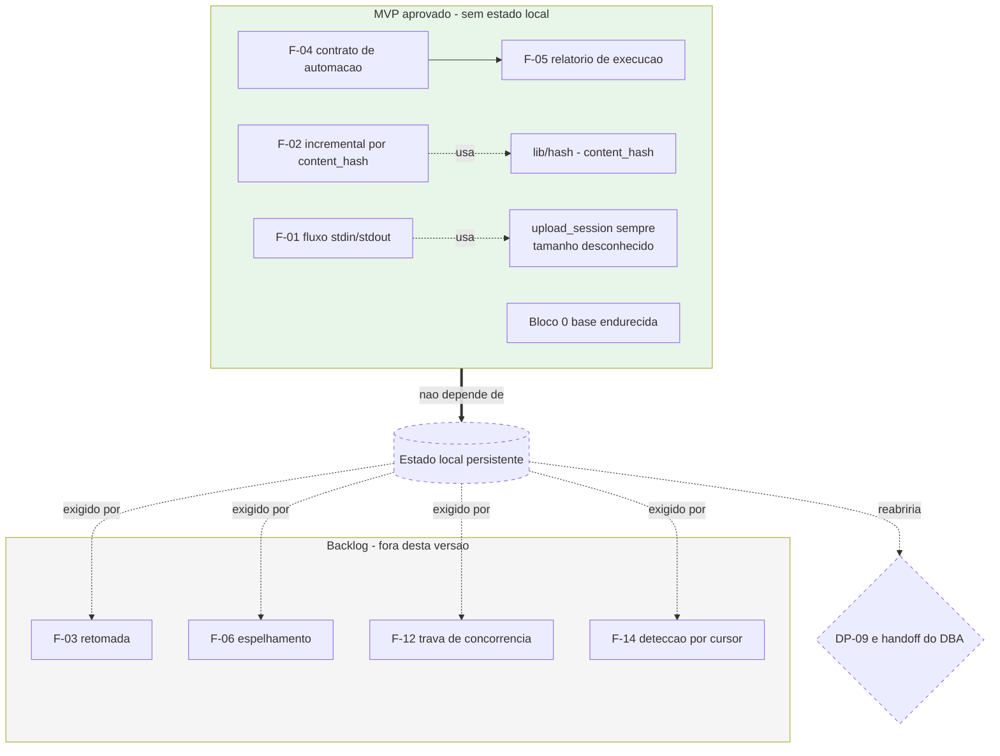

# Funcionalidades Candidatas — Proposta para Confirmacao do Solicitante

| Campo | Valor |
|---|---|
| Projeto | `dropbox_api` |
| Responsavel | Business Analyst |
| Data | 2026-08-17 |
| Versao | **v0.2 — DECIDIDO** |
| Status | ✅ **DP-02 resolvida.** Escopo do MVP aprovado pelo solicitante. Este documento passa de proposta a **registro da decisao e do backlog** |
| Origem | Resposta a DP-02 |
| Documentos relacionados | [Escopo e requisitos](escopo-requisitos-e-criterios-de-aceite.md) · [Decisoes pendentes](decisoes-pendentes.md) · [System Design](../arquitetura/system-design.md) |

---

## ESCOPO APROVADO DO MVP

> **Decisao do solicitante, registrada como `PRJ-DEC-04`.** O escopo do MVP foi aprovado exatamente conforme a recomendacao do Business Analyst.

| Item | Decisao | Requisitos formais gerados |
|---|---|---|
| **Bloco 0 integral** — base endurecida | ✅ **Aprovado** como requisito de base nao negociavel | RNF-03, RNF-05, RNF-10, RNF-11, RNF-12, RNF-13, RNF-14, RNF-16 |
| **F-01** — transferencia por fluxo `stdin`/`stdout` | ✅ **Aprovada** | **RF-31**, **RF-32** |
| **F-02** — transferencia incremental por `content_hash` | ✅ **Aprovada** | **RF-33**, **RF-34** |
| **F-04** — contrato de automacao | ✅ **Aprovada** | RF-15, RF-28, RF-29 (ja existentes, promovidos a P0) + **RF-35** |
| **F-05** — relatorio de execucao | ✅ **Aprovada** | **RF-36** |
| **F-03** — retomada de transferencia interrompida | ❌ **Fora do MVP** | — |
| **Bloco 2 completo** (F-06 a F-14) | ❌ Fora do escopo desta versao | Backlog |
| **Bloco 3 completo** (F-15 a F-22) | ❌ Fora do escopo desta versao | Backlog |

### Consequencia arquitetural decisiva — nao reabrir

> **Nenhuma funcionalidade aprovada exige estado local persistente.**
>
> As quatro candidatas que exigiriam estado entre execucoes eram F-03 (retomada), F-06 (espelhamento), F-12 (trava de concorrencia) e F-14 (deteccao por cursor). **Todas ficaram fora do MVP.**
>
> Portanto, nesta versao:
> - **`DP-09` permanece fechada.** Nao ha decisao pendente sobre semantica de sincronizacao ou estado local.
> - **O handoff do DBA NAO e acionado.** A secao "Plano de dimensionamento e expansao do banco" do System Design permanece formalmente **nao aplicavel**, e nao por omissao: por ausencia de qualquer mecanismo de persistencia alem do arquivo de configuracao.
> - **Nao existe componente de estado local no System Design.** Qualquer proposta futura de introduzi-lo constitui **mudanca de escopo** e exige nova decisao do solicitante.
>
> Este bloco existe para impedir que o tema seja reaberto por engano em revisoes posteriores.

---

## Como usar este documento

Na v0.1 este era um instrumento de decisao. Com DP-02 resolvida, ele passa a cumprir duas funcoes: **registrar a fundamentacao do escopo aprovado** e **preservar o backlog** de candidatas nao selecionadas, com a analise ja feita, para que uma eventual segunda fase nao precise refazer o trabalho.

A analise original de cada candidata foi mantida integralmente abaixo, com a marcacao de decisao acrescentada.

### Distincao fundamental: novo versus correcao

| Categoria | Definicao | Entra no escopo? |
|---|---|---|
| **Bloco 0 — Base endurecida** | Coisas que o `Dropbox-Uploader` **ja faz, mas faz mal ou de forma quebrada**. Nao sao funcionalidades novas. | **Sim, como requisito de base nao negociavel.** Nao contam como justificativa do projeto, mas sem elas a reimplementacao nasce com os mesmos defeitos do modelo. Ja estao especificadas como RF/RNF |
| **Blocos 1 a 3 — Funcionalidade nova** | Capacidades que o `Dropbox-Uploader` **nao entrega de forma alguma**. | **A confirmar pelo solicitante.** Sao a resposta candidata a DP-02 |

> Endurecimento **nao foi** o motivo declarado pelo solicitante. Ele esta no Bloco 0 porque e consequencia inevitavel de reimplementar, nao porque justifique o projeto.

### Legenda

| Campo | Valores |
|---|---|
| **Valor** | Alto · Medio · Baixo — beneficio percebido pelo usuario final |
| **Esforco** | P (pequeno, ate ~1 unidade de trabalho) · M (medio) · G (grande, exige componente proprio e estado persistente) |
| **Estado local** | Sim = exige persistir estado entre execucoes; reativa DP-09 e pode exigir handoff do DBA |

---

## Bloco 0 — Base endurecida ✅ APROVADO INTEGRALMENTE

Correcoes de defeitos confirmados no modelo de referencia. **Aprovadas como requisito de base nao negociavel**, e nao como diferencial: o solicitante nao declarou endurecimento como motivacao, mas estas correcoes sao consequencia inevitavel de reimplementar sem herdar os defeitos do modelo.

| ID | Correcao | Defeito no modelo | Requisito |
|---|---|---|---|
| B0-01 | Uso exclusivo de endpoints vigentes da Dropbox API v2 | O comando de busca do modelo aponta para endpoint retirado e esta quebrado; quatro operacoes usam variantes depreciadas (DIV-01, DIV-02) | RNF-12 |
| B0-02 | Segredo nunca em `argv` | App secret e refresh token visiveis na tabela de processos a qualquer usuario local (DIV-03) | RNF-03 |
| B0-03 | Interpretacao robusta de resposta | Extracao por expressao regular, fragil a variacao de formatacao e a valores com delimitadores (DIV-04) | RNF-11 |
| B0-04 | Area temporaria segura | Nome previsivel em diretorio compartilhado, sem `mktemp` (DIV-05) | RNF-05 |
| B0-05 | Modularizacao e suite de testes | 1834 linhas em arquivo unico, praticamente nao testavel por unidade (DIV-06) | RNF-13, RNF-14, RNF-16 |
| B0-06 | Tratamento correto de nomes com espacos, acentos e caracteres especiais | Fonte recorrente de defeito em scripts shell | RNF-10 |

**Decisao:** ✅ aceito integralmente. E o piso de qualidade da reimplementacao.

---

## Bloco 1 — Nucleo do diferencial ✅ APROVADO, EXCETO F-03

Estas cinco candidatas foram escolhidas porque, juntas, mudam a **classe** da ferramenta: de "cliente de comandos avulsos" para "componente confiavel de automacao". Elas respondem diretamente a DP-03 (uso interativo **e** automatizado) e sao as que o `Dropbox-Uploader` mais claramente nao entrega.

### F-01 — Transferencia por fluxo (`stdin` / `stdout`) ✅ **APROVADA — RF-31, RF-32**

**O que e:** enviar conteudo recebido pela entrada padrao e receber conteudo na saida padrao, sem exigir arquivo intermediario em disco.

```
tar czf - /var/lib/app | dbx upload - /backups/app-$(date +%F).tgz
dbx download /backups/app-2026-08-17.tgz - | tar xzf - -C /restore
tar czf - /dados | gpg -c | dbx upload - /backups/dados.tgz.gpg
```

**Por que importa:** hoje, para enviar um backup comprimido, e obrigatorio materializar o arquivo em disco antes. Em host com pouco espaco livre, ou com backup maior que a area disponivel, isso simplesmente inviabiliza a rotina. A transferencia por fluxo tambem permite compor com compressao e criptografia sem que a ferramenta precise implementar nenhuma das duas.

| Aspecto | Avaliacao |
|---|---|
| Valor | **Alto** — remove uma restricao dura de infraestrutura |
| Esforco | **M** — o tamanho e desconhecido de antemao, portanto exige sempre sessao em partes com bufferizacao por parte |
| Estado local | Nao |
| Desbloqueia | Backup sem disco intermediario; composicao com `tar`, `gzip`, `gpg`, `mysqldump`, `pg_dump`; uso em container efemero |
| Existe no modelo? | **Nao.** O modelo exige caminho de arquivo local |

---

### F-02 — Transferencia incremental por `content_hash` ✅ **APROVADA — RF-33, RF-34**

**O que e:** antes de transferir, comparar o resumo de conteudo do arquivo local com o do arquivo remoto; se forem identicos, ignorar. A comparacao e por **conteudo**, nao por nome nem por data.

**Por que importa:** o modelo oferece apenas "ignorar se ja existe", decidido por presenca de nome. Isso e insuficiente em dois sentidos opostos: ignora arquivos que mudaram (perda de dado) e reenvia arquivos identicos quando a opcao nao e usada (desperdicio de banda e de cota de API). Em uma rotina diaria sobre uma arvore estavel, a diferenca e de ordem de grandeza no tempo e no numero de chamadas.

| Aspecto | Avaliacao |
|---|---|
| Valor | **Alto** — reduz banda, tempo de janela e risco de limite de taxa |
| Esforco | **M** — depende do calculo local do `content_hash`, que e um algoritmo definido pela Dropbox |
| Estado local | Nao na forma basica (consulta os metadados remotos). Sim, se houver cache local de resumos para evitar releitura dos arquivos |
| Desbloqueia | F-06, F-11, F-14; viabiliza rotinas frequentes sobre arvores grandes |
| Existe no modelo? | **Nao.** O modelo nao calcula nem compara resumo de conteudo |

---

### F-03 — Retomada de transferencia interrompida ❌ **FORA DO MVP — backlog**

> **Decisao do solicitante.** Mantida como backlog. Foi a unica candidata do Bloco 1 nao aprovada, e a decisao tem consequencia arquitetural direta: **era a unica funcionalidade aprovavel do MVP que exigiria estado local persistente**. Com ela fora, o MVP nao introduz persistencia alguma e o handoff do DBA nao e acionado.
>
> Reavaliar se DP-12 revelar arquivos de varios gigabytes ou rede instavel. Enquanto isso, a mitigacao disponivel e a retentativa por parte dentro de uma mesma execucao (RF-09), que ja esta no escopo e cobre falha transitoria sem cobrir queda do processo.

**O que e:** persistir o identificador de sessao e o deslocamento ja enviado, de modo que uma nova execucao continue de onde parou em vez de reiniciar o arquivo.

**Por que importa:** em arquivo de vários gigabytes sobre link instavel, uma queda proxima do fim hoje custa o reenvio integral. Se a janela de rotina for menor que o tempo de reenvio, a rotina nunca converge.

| Aspecto | Avaliacao |
|---|---|
| Valor | **Alto** em ambientes com arquivos grandes ou rede instavel; **Baixo** se os arquivos forem pequenos |
| Esforco | **M** — a Dropbox suporta a retomada da sessao; o custo esta no arquivo de estado e na validacao de coerencia (arquivo local nao pode ter mudado desde a interrupcao) |
| Estado local | **Sim** |
| Desbloqueia | Transferencia confiavel de arquivos muito grandes; rotinas com janela apertada |
| Existe no modelo? | **Nao.** O modelo repete a parte que falhou, mas perde a sessao inteira se o processo terminar |
| Pergunta ao solicitante | Qual o tamanho tipico e maximo dos arquivos? Se forem todos pequenos, esta candidata pode ser cortada (relacionado a DP-12) |

---

### F-04 — Contrato de automacao: saida estruturada, codigos de saida semanticos e simulacao ✅ **APROVADA — RF-15, RF-28, RF-29, RF-35**

**O que e:** tres capacidades que so fazem sentido juntas.

1. **Saida estruturada** (`--json` ou formato tabular estavel) para comandos de consulta, sem texto decorativo, com diagnostico separado na saida de erro.
2. **Codigos de saida distintos por classe de falha** — uso invalido, configuracao ausente, recurso nao encontrado, falha de autenticacao, limite de taxa, falha de rede, erro remoto.
3. **Modo de simulacao** (`--dry-run`), que descreve o que seria feito sem executar escrita.

**Por que importa:** o modelo imprime texto voltado a leitura humana e praticamente nao diferencia codigos de saida. Um orquestrador nao consegue distinguir "token revogado, avise um humano" de "limite de taxa, tente de novo em uma hora" sem recorrer a analise de texto livre, que quebra a cada mudanca de mensagem. Com DP-03 resolvida como **uso interativo e automatizado**, este item deixa de ser conveniencia e passa a ser requisito estrutural.

| Aspecto | Avaliacao |
|---|---|
| Valor | **Alto** — e a diferenca entre "roda no cron" e "e operavel no cron" |
| Esforco | **P a M** — barato se decidido no inicio; caro se adaptado depois |
| Estado local | Nao |
| Desbloqueia | Integracao com qualquer orquestrador; alertas confiaveis; uso em CI; F-05 |
| Existe no modelo? | **Nao.** Ha apenas modo silencioso |
| Observacao | Ja especificado como RF-15, RF-28 e RF-29. Listado aqui porque, com DP-03 resolvida, ele deixa de ser suporte e passa a ser diferencial declarado |

---

### F-05 — Relatorio de execucao ✅ **APROVADA — RF-36**

**O que e:** ao final de uma operacao em lote, emitir um sumario: itens enviados, ignorados por já estarem identicos, falhados, bytes transferidos, duracao e numero de chamadas a API. Disponivel em formato legivel e em formato estruturado.

**Por que importa:** hoje, saber se a rotina noturna funcionou exige ler o log inteiro. Com o sumario, o orquestrador decide alertar com base em um numero, e o operador tem evidencia objetiva do que aconteceu.

| Aspecto | Avaliacao |
|---|---|
| Valor | **Medio a Alto** — baixo custo, alto ganho operacional |
| Esforco | **P** |
| Estado local | Nao |
| Desbloqueia | Alertas por limiar; auditoria de execucao; medicao para o dimensionamento |
| Existe no modelo? | **Nao** |

---

### Resumo do Bloco 1

| ID | Funcionalidade | Valor | Esforco | Estado local |
|---|---|---|---|---|
| F-01 | Transferencia por fluxo (`stdin`/`stdout`) | Alto | M | Nao |
| F-02 | Transferencia incremental por `content_hash` | Alto | M | Nao (basica) |
| F-03 | Retomada de transferencia interrompida | Alto* | M | **Sim** |
| F-04 | Contrato de automacao (saida, codigos, simulacao) | Alto | P–M | Nao |
| F-05 | Relatorio de execucao | Medio–Alto | P | Nao |

\* condicionado ao tamanho real dos arquivos (DP-12), ainda em aberto.

**Decisao final do Bloco 1:** F-01, F-02, F-04 e F-05 aprovadas (RF-31 a RF-36); **F-03 fora do MVP**, mantida como backlog.

---

## Bloco 2 — ❌ FORA DO ESCOPO DESTA VERSAO — backlog preservado

> **Decisao do solicitante: nenhuma candidata do Bloco 2 entra no MVP.** A analise e preservada integralmente para que uma eventual segunda fase nao precise refaze-la.
>
> **Atencao para F-06, F-12 e F-14:** as tres exigem estado local persistente. Promover qualquer uma delas em versao futura reabre `DP-09` e aciona o handoff do DBA. Isso **nao** se aplica a esta versao.

| ID | Funcionalidade | O que e | Valor | Esforco | Estado local | Existe no modelo? |
|---|---|---|---|---|---|---|
| F-06 | **Espelhamento com remocao de orfaos** | Fazer o destino refletir exatamente a origem, inclusive removendo no remoto o que foi apagado localmente. Com protecao obrigatoria: simulacao previa e confirmacao explicita para exclusoes | Alto | G | Sim | **Nao.** O modelo so faz envio aditivo; nao e sincronizacao |
| F-07 | **Revisoes e restauracao** | Listar versoes anteriores de um arquivo e restaurar uma versao especifica | Alto | P | Nao | **Nao.** Capacidade da API totalmente inexplorada pelo modelo |
| F-08 | **Operacoes em lote** | Usar os endpoints de lote da Dropbox para excluir, mover e copiar muitos itens em poucas chamadas, em vez de uma chamada por item | Medio–Alto | M | Nao | **Nao.** O modelo opera item a item |
| F-09 | **Paralelismo controlado** | Executar N transferencias simultaneas, com limite configuravel | Medio | M | Nao | **Nao.** O modelo e estritamente sequencial |
| F-10 | **Retencao e rotacao de backup** | Politica declarativa no destino: manter os ultimos N artefatos ou os dos ultimos D dias, purgando o excedente | Alto | M | Nao | **Nao.** Hoje exige script proprio em volta da ferramenta |
| F-11 | **Comando de verificacao** | Comparar arvore local e remota por `content_hash` e reportar divergencias **sem transferir nada** | Medio–Alto | P | Nao | **Nao** |
| F-12 | **Trava de execucao concorrente** | Impedir que duas execucoes da mesma rotina se sobreponham | Medio | P | Sim (arquivo de trava) | **Nao** |
| F-13 | **Filtros avancados** | Selecionar por data de modificacao, faixa de tamanho e padroes de inclusao, alem da exclusao ja existente | Medio | P–M | Nao | **Parcial.** O modelo tem apenas exclusao por padrao |
| F-14 | **Deteccao de mudancas por cursor** | Guardar o cursor de listagem e, na execucao seguinte, obter apenas o que mudou no remoto, sem varrer a arvore inteira | Alto em arvores grandes | M | Sim | **Nao.** O modelo usa o cursor apenas dentro de uma execucao |

---

## Bloco 3 — ❌ FORA DO ESCOPO DESTA VERSAO — backlog preservado

> **Decisao do solicitante: nenhuma candidata do Bloco 3 entra no MVP.** Nenhuma delas exige estado local persistente, portanto podem ser incorporadas em versoes futuras sem impacto arquitetural relevante.

| ID | Funcionalidade | Valor | Esforco | Observacao |
|---|---|---|---|---|
| F-15 | Link temporario de download direto | Medio | P | Gera URL de acesso direto para consumo por outra ferramenta ou outra maquina, sem passar pela CLI |
| F-16 | Link compartilhado com expiracao, senha ou restricao de audiencia | Medio | P | Recursos dependem do plano Dropbox contratado (DP-18) |
| F-17 | Limitacao de banda | Medio | P | Evita saturar o enlace em horario comercial |
| F-18 | Perfis nomeados de credencial | Medio | P | Ja especificado como RF-05. Ergonomia superior ao caminho de arquivo do modelo |
| F-19 | Autocompletar de shell | Baixo | P | Melhora o uso interativo, agora confirmado em DP-03 |
| F-20 | Lixeira: listar, restaurar e excluir permanentemente | Medio | P–M | Capacidade da API inexplorada pelo modelo |
| F-21 | Verificacao previa de espaco disponivel | Baixo–Medio | P | Falha cedo em vez de no meio de uma transferencia longa |
| F-22 | Comando de diagnostico de ambiente | Baixo | P | Verifica dependencias, credencial, conectividade e escopos concedidos, e reporta o que falta |

---

## Analise de dependencias — situacao apos a decisao

Quatro candidatas exigiam **estado local persistente entre execucoes**: F-03, F-06, F-12 e F-14. **Nenhuma delas entrou no MVP.**



**Conclusao registrada:** o MVP nao possui componente de persistencia alem do arquivo de configuracao. `DP-09` permanece fechada e o handoff do DBA nao e acionado. Reintroduzir estado local em qualquer momento constitui mudanca de escopo.

Duas dependencias tecnicas do MVP merecem destaque:

| Dependencia | Origem | Situacao |
|---|---|---|
| `lib/hash` — algoritmo do `content_hash` | F-02 (RF-33, RF-34) | ✅ **Confirmado.** Ver DIV-14 no documento de requisitos |
| Sessao de envio em partes obrigatoria, mesmo para conteudo pequeno | F-01 (RF-31) — o tamanho e desconhecido de antemao em um fluxo | Especificado em RF-31 |

---

## Fundamentacao da recomendacao — acatada integralmente

**Proposta apresentada:** Bloco 0 integral + F-01, F-02, F-04 e F-05. **Decisao do solicitante: aprovada exatamente como proposta.**

Justificativa registrada: as quatro nao exigem estado local persistente, o que mantem a arquitetura simples e o risco baixo, e juntas produzem uma afirmacao de valor defensavel — *"envia backups por fluxo sem disco intermediario, nao reenvia o que ja esta identico, e reporta o resultado de forma que um orquestrador consiga agir"*. Nenhuma dessas tres coisas o `Dropbox-Uploader` faz.

**Sobre F-03:** a recomendacao era decidir por dado, nao por opiniao, uma vez que o valor depende do tamanho real dos arquivos (DP-12, ainda em aberto). O solicitante optou por deixa-la fora do MVP. A consequencia positiva e relevante: **e o unico corte que preserva o MVP livre de persistencia local**.

**Gatilhos de reavaliacao do backlog**, preservados para uso futuro:

| Se o caso de uso evoluir para... | Promover | Reabre DP-09? |
|---|---|---|
| Arquivos de varios gigabytes ou rede instavel | F-03 | **Sim** |
| Backup com politica de retencao | F-10 | Nao |
| Manter uma arvore remota espelhada | F-06 + F-14 | **Sim** |
| Recuperacao de arquivos sobrescritos ou apagados | F-07 + F-20 | Nao |
| Muitos arquivos pequenos com janela apertada | F-08 (+ F-09 com cautela, ver RES-11) | Nao |
| Auditoria periodica sem transferir | F-11 | Nao |

---

## Registro da decisao

| ID | Funcionalidade | Decisao | Requisitos gerados |
|---|---|:--:|---|
| Bloco 0 | Base endurecida | ✅ Aprovado | RNF-03, 05, 10, 11, 12, 13, 14, 16 |
| F-01 | Transferencia por fluxo (`stdin`/`stdout`) | ✅ Aprovada | RF-31, RF-32 |
| F-02 | Transferencia incremental por `content_hash` | ✅ Aprovada | RF-33, RF-34 |
| F-03 | Retomada de transferencia interrompida | ❌ Backlog | — |
| F-04 | Contrato de automacao | ✅ Aprovada | RF-15, RF-28, RF-29, RF-35 |
| F-05 | Relatorio de execucao | ✅ Aprovada | RF-36 |
| F-06 | Espelhamento com remocao de orfaos | ❌ Backlog | — |
| F-07 | Revisoes e restauracao | ❌ Backlog | — |
| F-08 | Operacoes em lote | ❌ Backlog | — |
| F-09 | Paralelismo controlado | ❌ Backlog | — |
| F-10 | Retencao e rotacao de backup | ❌ Backlog | — |
| F-11 | Comando de verificacao | ❌ Backlog | — |
| F-12 | Trava de execucao concorrente | ❌ Backlog | — |
| F-13 | Filtros avancados | ❌ Backlog | — |
| F-14 | Deteccao de mudancas por cursor | ❌ Backlog | — |
| F-15 | Link temporario de download | ❌ Backlog | — |
| F-16 | Link compartilhado com expiracao ou senha | ❌ Backlog | — |
| F-17 | Limitacao de banda | ❌ Backlog | — |
| F-18 | Perfis nomeados de credencial | ❌ Backlog | — |
| F-19 | Autocompletar de shell | ❌ Backlog | — |
| F-20 | Lixeira: listar, restaurar, excluir permanentemente | ❌ Backlog | — |
| F-21 | Verificacao previa de espaco | ❌ Backlog | — |
| F-22 | Comando de diagnostico de ambiente | ❌ Backlog | — |

**Nenhum acrescimo foi solicitado alem das candidatas propostas.**

**Pergunta que permanece aberta e independente desta decisao:** qual o tamanho tipico e maximo dos arquivos transferidos, quantos arquivos por execucao e com que frequencia (DP-12)? Necessaria para o dimensionamento e para eventual reavaliacao de F-03.
