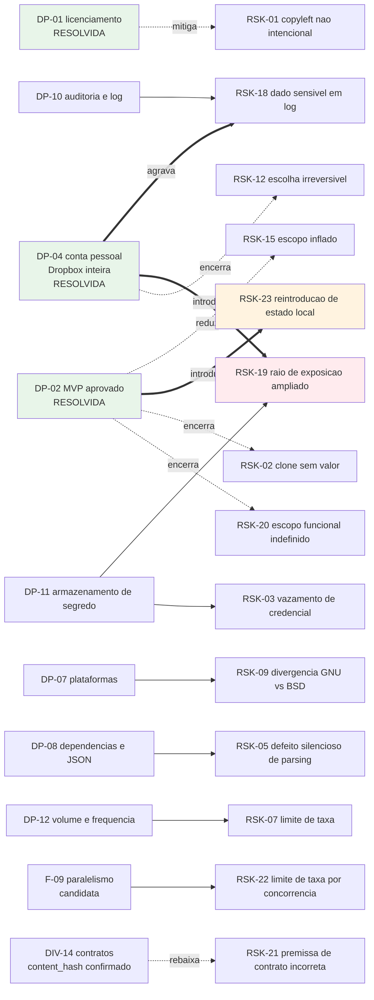

# Riscos, Restricoes e Licenciamento

| Campo | Valor |
|---|---|
| Projeto | `dropbox_api` |
| Responsavel | Business Analyst |
| Data | 2026-08-17 |
| Versao | v0.2 — atualizada apos as decisoes do solicitante e a revalidacao de contratos via Context7 |
| Status | **DP-01 resolvida.** Risco de licenciamento mitigado por decisao; novos riscos decorrentes de DP-04 registrados |
| Documentos relacionados | [Escopo e requisitos](escopo-requisitos-e-criterios-de-aceite.md) · [Decisoes pendentes](decisoes-pendentes.md) · [Funcionalidades candidatas](funcionalidades-candidatas.md) · [System Design](../arquitetura/system-design.md) |

> **Aviso.** Este documento apresenta analise de risco para apoiar decisao. Nao constitui parecer juridico. Se houver distribuicao a terceiros, recomenda-se validacao juridica formal.

---

## 0. Decisao de licenciamento — RESOLVIDA

> **O solicitante decidiu pela reimplementacao independente (cenario B da analise abaixo).** O `Dropbox-Uploader` sera usado como **referencia conceitual apenas**. Nenhum trecho de codigo GPLv3 sera copiado, adaptado ou traduzido.
>
> **Consequencia:** nao ha obrigacao copyleft. O projeto e livre para adotar qualquer licenca. A escolha da licenca especifica permanece aberta como **DP-20**, em prioridade P1, e deve ser publicada **antes do primeiro commit de codigo**.
>
> A analise das secoes 1.1 a 1.5 e mantida como registro da fundamentacao da decisao e como fonte das salvaguardas operacionais que continuam vinculantes (RES-02).

---

## 1. Analise de licenciamento (registro da fundamentacao)

### 1.1 Fato observado

O projeto de referencia `/home/sales/Dropbox-Uploader` esta licenciado sob **GNU General Public License v3**. O cabecalho do arquivo principal declara:

- `Copyright (C) 2010-2021 Andrea Fabrizi <andrea.fabrizi@gmail.com>`
- "This program is free software; you can redistribute it and/or modify it under the terms of the GNU General Public License as published by the Free Software Foundation; either version 3 of the License, or (at your option) any later version."

Referencia: `/home/sales/Dropbox-Uploader/dropbox_uploader.sh`, linhas 5 a 19, e `/home/sales/Dropbox-Uploader/LICENSE`.

### 1.2 Consequencia

A GPLv3 e uma licenca **copyleft forte**. Uma obra que incorpore, adapte ou traduza codigo licenciado sob GPLv3 e considerada trabalho derivado e, quando distribuida, deve ser distribuida sob a mesma licenca, com disponibilizacao do codigo-fonte completo e preservacao dos avisos de copyright originais.

Em shell script o limite entre "inspiracao" e "derivacao" e mais tenue do que em outras linguagens, porque a estrutura de um script frequentemente sobrevive a renomeacao de variaveis. Copiar funcoes e adaptar nomes **nao** descaracteriza derivacao.

### 1.3 Fronteira do que nao gera obrigacao

Os elementos abaixo nao sao protegidos pelo copyright do projeto de referencia e podem ser usados livremente:

- Os endpoints, parametros e contratos da **Dropbox API v2**, que sao documentacao publica da Dropbox e nao do autor do modelo.
- A **lista de funcionalidades** e os nomes de comando de uso comum (`upload`, `download`, `list`, `delete`).
- O **conceito** de assistente de configuracao passo a passo, de envio em partes ou de expansao de curinga.
- Conhecimento adquirido pela leitura do codigo, aplicado em implementacao propria.

### 1.4 Cenarios e impacto

| Cenario | Descricao | Licenca resultante | Impacto |
|---|---|---|---|
| **A — Derivacao** | Trechos do `dropbox_uploader.sh` sao copiados ou adaptados | GPLv3 obrigatoria na distribuicao | Impede distribuicao sob licenca proprietaria ou permissiva; exige aviso de copyright do autor original; exige disponibilizar o fonte a quem receber o binario/script |
| **B — Reimplementacao independente** | O modelo e lido como referencia funcional; todo o codigo e escrito do zero | Livre escolha do solicitante | Sem obrigacao copyleft; permite MIT, Apache-2.0, proprietaria ou uso interno fechado |
| **C — Uso interno sem distribuicao** | Mesmo derivando codigo, o resultado nunca sai da organizacao | GPLv3 aplicavel apenas na distribuicao | A GPLv3 nao obriga publicacao quando nao ha distribuicao a terceiros; porem qualquer distribuicao futura, inclusive a fornecedor ou cliente, reativa a obrigacao. Cenario fragil no medio prazo |

### 1.5 Recomendacao — **acatada pelo solicitante**

**Cenario B — reimplementacao independente.** Salvaguardas operacionais, agora vinculantes por RES-02:

1. Registrar explicitamente que nenhum trecho de codigo do `Dropbox-Uploader` foi copiado para este projeto.
2. Tomar a **documentacao oficial da Dropbox** como fonte primaria dos contratos de integracao, e nao o codigo do modelo.
3. Nao replicar a estrutura interna de funcoes, os nomes internos de variaveis nem o texto literal de mensagens do modelo.
4. Nao copiar o `README` nem a documentacao do modelo.
5. Declarar a licenca escolhida na raiz do repositorio antes do primeiro commit de codigo (RNF-17).

Ganho colateral confirmado: a reimplementacao independente **evita herdar os defeitos ja identificados no modelo** (endpoint de busca fora da documentacao vigente, variantes de endpoint superadas, exposicao de credencial na tabela de processos, interpretacao fragil de JSON, arquivos temporarios previsiveis). Esses itens compoem o Bloco 0 de base endurecida em [funcionalidades-candidatas.md](funcionalidades-candidatas.md).

---

## 2. Matriz de riscos

Escala de impacto e probabilidade: Baixa | Media | Alta.

| ID | Risco | Impacto | Probab. | Mitigacao | Owner |
|---|---|---|---|---|---|
| RSK-01 | ✅ **Mitigado por decisao.** Obrigacao copyleft nao intencional por derivacao de codigo GPLv3 | Alto | **Baixa** (era Alta) | DP-01 resolvida: reimplementacao independente. Risco residual e apenas de disciplina de execucao, endereçado por RES-02 e pela declaracao formal de nao derivacao no fechamento | Senior Developer (execucao), Tech Lead (verificacao) |
| RSK-02 | ✅ **Encerrado.** Projeto entregar um clone sem valor incremental | Alto | — | DP-02 resolvida com escopo aprovado. O MVP entrega tres capacidades ausentes no modelo: envio por fluxo sem disco intermediario, omissao de reenvio por comparacao de conteudo e contrato de automacao consumivel por orquestrador | Solicitante |
| RSK-03 | Vazamento de credencial pela tabela de processos ao passar segredo em `argv` | Alto | Alta se o padrao do modelo for replicado | RNF-03: entrada de segredo por `stdin` ou arquivo de configuracao do cliente HTTP; verificacao explicita em teste | Senior Developer |
| RSK-04 | Uso de endpoints ausentes da documentacao vigente da Dropbox API | Alto | Alta se o modelo for tomado como fonte de contrato | RNF-12: auditoria estatica proibindo `search`, `copy`, `move`, `delete` e `create_folder` sem sufixo `_v2`; RES-02 obriga a tomar a documentacao oficial como fonte primaria, e nao o codigo do modelo | Senior Developer, verificado por QA |
| RSK-05 | Defeito silencioso na interpretacao de resposta JSON por expressao regular | Alto | Media | DP-08 e RNF-11: definir estrategia de interpretacao; testes com JSON de formatacao variada e valores contendo delimitadores | Senior Developer |
| RSK-06 | Corrupcao ou truncamento de arquivo em envio interrompido | Alto | Media | RNF-09 e RF-09: sessao em partes com retentativa por parte e verificacao de `content_hash` no fechamento | Senior Developer, verificado por QA |
| RSK-07 | Bloqueio por limite de taxa da Dropbox em rotinas de alto volume | Medio | Media | RNF-07: recuo exponencial com variacao aleatoria respeitando `Retry-After`; DP-12 para dimensionar concorrencia | Senior Developer |
| RSK-08 | Revogacao de refresh token interrompendo rotinas nao assistidas sem alerta | Alto | Media | RF-29 e RF-30: codigo de saida dedicado a falha de autenticacao e mensagem acionavel; recomendacao de alerta no orquestrador | Engenheiro de automacao do solicitante |
| RSK-09 | Divergencia de comportamento entre utilitarios GNU e BSD (`stat`, `sed`, `date`, `base64`) quebrando o suporte multiplataforma | Medio | Media se macOS/BSD entrarem no escopo | DP-07 e RNF-01: declarar plataformas suportadas e cobrir cada uma na suite de testes | Senior Developer |
| RSK-10 | Corrupcao de nomes de arquivo com espacos, acentos ou caracteres especiais por expansao de shell | Medio | Media | RNF-10: conjunto de nomes adversariais na suite de testes; citacao rigorosa de variaveis; analise estatica obrigatoria | Senior Developer |
| RSK-11 | Ataque por link simbolico ou corrida em area temporaria compartilhada | Medio | Baixa | RNF-05: `mktemp` e limpeza deterministica por `trap` | Senior Developer |
| RSK-12 | ✅ **Encerrado por decisao.** Escolha irreversivel de tipo de acesso do aplicativo Dropbox | Medio | — | DP-04 resolvida: acesso a Dropbox inteira. A consequencia foi assumida e desdobrada em RSK-19 | Solicitante |
| RSK-13 | Mudanca unilateral de contrato ou politica pela Dropbox durante o ciclo de vida | Medio | Baixa por evento, certa no longo prazo | Isolar o acesso a API em componente unico (`lib/http`); acompanhar avisos de descontinuidade; cobertura de teste de contrato | Senior Developer |
| RSK-14 | Manutencao a longo prazo de codigo shell extenso e pouco testavel | Medio | Alta se o padrao monolitico do modelo for reproduzido | RNF-13, RNF-14 e RNF-16: modularizacao, analise estatica e suite automatizada desde o inicio | Tech Lead |
| RSK-15 | Escopo inflado por busca de paridade completa com o modelo sem necessidade declarada | Medio | Media | DP-06: fixar o conjunto de comandos do MVP; secao de escopo fora no documento de requisitos | Business Analyst |
| RSK-16 | Contaminacao de contexto pela memoria de projeto herdada do pacote de origem | Baixo | Alta ja materializada | DIV-09: nao acumular registros sobre o conteudo herdado; solicitar decisao do Tech Lead sobre reinicializacao ou segregacao da memoria | Tech Lead |
| ~~RSK-17~~ | ❌ **Removido na v0.2 por erro factual.** Registrava indisponibilidade do Context7 MCP | — | — | O Context7 estava ativo; as ferramentas exigem descoberta previa por serem de carregamento diferido. Os contratos foram revalidados e as correcoes constam de RES-04 a RES-14 e DIV-11 a DIV-14 | Business Analyst |
| RSK-18 | Exposicao de dado sensivel em log por registro de nomes e caminhos de arquivos | Medio | Media *(elevada por DP-04)* | Definir politica de log em DP-10; mascaramento de caminho se aplicavel. Com acesso amplo a conta, o log pode revelar a estrutura integral do Dropbox do usuario | Business Analyst e Solicitante |
| **RSK-19** | **Raio de exposicao ampliado pelo acesso a Dropbox inteira (DP-04).** Comprometimento da credencial expoe todo o conteudo da conta; caminho remoto mal formado ou exclusao acidental alcancam qualquer area | **Alto** | Media | RNF-20: escopos OAuth minimos, confinamento configuravel do caminho raiz e confirmacao obrigatoria em operacao destrutiva. DP-11 ganha peso: o refresh token passa a ser o unico controle entre um usuario local e a conta inteira. Recomendacao adicional: aplicativo separado com acesso restrito a pasta do aplicativo para rotinas nao assistidas que nao precisem de alcance total | Solicitante e Senior Developer |
| ~~RSK-20~~ | ✅ **Encerrado na v0.3.** Escopo funcional indefinido | Alto | — | DP-02 resolvida. Escopo do MVP aprovado e formalizado em RF-31 a RF-36, com criterio de aceite verificavel cada um. Ha MVP definido, estimavel e com criterio de pronto | Solicitante |
| **RSK-24** | ✅ **DEIXA DE SER RISCO ACEITO — mitigacao estrutural adotada em `DP-26`.** TOCTOU no confinamento de caminho local | **Alto** | **Baixa** *(era Media)* | **O solicitante seguiu a recomendacao do QA e nao manteve o aceite.** Mitigacao adotada: **travessia por descida** — descer um nivel por vez mantendo o diretorio aberto e operar sempre com **nome relativo**. Em `bash`, `cd` referencia o **inode**, nao o texto do caminho; e o equivalente em shell de `openat` com `O_NOFOLLOW` por componente. **Verificado experimentalmente pelo QA:** com caminho absoluto reconstruido, a troca por symlink em componente intermediario **apaga fora da raiz**; com descida e nome relativo, **na mesma janela de ataque, o alvo sobrevive**. ⚠️ **Limite honesto, do proprio QA:** protege os componentes **ja percorridos**, e nao a troca imediatamente antes de descer. E **reducao de superficie, nao eliminacao** — o risco permanece no registro com probabilidade reduzida, nao encerrado. Requisito: `RNF-28` | Senior Developer, verificado por QA |
| **RSK-34** | **Risco composto `RSK-32` × `RSK-24`: escape gravado na linha de base vira exclusao diferida.** Uma travessia que escapou da raiz grava na linha de base caminhos de **fora** dela; na execucao seguinte esses caminhos aparecem como orfaos e sao apagados — **com o atacante ja ausente**. A janela de ataque e transitoria; a consequencia, persistente | **Critico** | Baixa | **Regra fixada:** a linha de base **so registra o que a propria descida verificou**, nunca por re-resolucao de caminho a partir de texto. `RF-50`. O que torna este risco grave e o **diferimento**: a exclusao nao ocorre durante o ataque, e sim depois, o que desacopla causa e efeito e torna o diagnostico praticamente impossivel. Sem a regra, a mitigacao de `RNF-28` protegeria a execucao corrente e deixaria o dano para a seguinte | Senior Developer, verificado por QA |
| ~~RSK-24 (aceite anterior)~~ | ✅ **ACEITE RECONFIRMADO na v0.6 — reabertura encerrada.** TOCTOU no confinamento de caminho local: entre a resolucao fisica do caminho e o uso efetivo, um `rename` concorrente pode trocar o alvo, permitindo escapar da raiz confinada | Medio | Baixa | **A reavaliacao ocorreu COM `DP-07` ja resolvida** — este registro existe para que o aceite nao volte a parecer apoiado no argumento que caiu. O argumento de portabilidade (`/proc/self/fd` ser exclusivo de Linux) **nao vale mais e nao integra a fundamentacao**: a plataforma e Linux por decisao. O solicitante reconfirmou o aceite com base **exclusivamente** nos dois argumentos remanescentes, ambos verificados: **(a)** validar por `readlink` compara **texto de caminho**, mutavel por `rename` entre a verificacao e o uso — a mitigacao correta exigiria comparacao por **dispositivo e inode**, e nao a que estava avaliada; **(b)** a mitigacao **nao cobre percurso recursivo**, que e justamente o caso real em operacao de lote. Ou seja: a mitigacao disponivel protegeria o caso menos frequente e deixaria descoberto o mais frequente. **Aceitar conscientemente e preferivel a mitigar mal.** Revisitar apenas se surgir mitigacao que cubra percurso recursivo e compare identidade de inode | Solicitante (aceite reconfirmado), Senior Developer (vigilancia) |
| ~~RSK-25~~ | ❌ **ENCERRADO na v0.5 — apoiava-se em evidencia falsa.** Registrava o padrao "premissa de escopo criada por conveniencia tecnica e registrada como se fosse decisao do solicitante" | — | — | **O unico caso citado nao sustentava o risco:** o solicitante **havia** decidido DP-07 e DP-08. A implementacao nao antecipou nada. Ver o julgamento completo na secao 6 | Business Analyst |
| **RSK-27** | **Garantia de auditoria estatica que cobre apenas a forma obvia da classe, produzindo falsa seguranca.** Uma verificacao declarada como defesa contra uma classe de defeito, mas que casa somente o padrao mais evidente, e pior que nenhuma: desliga a vigilancia humana sem entregar a protecao prometida | **Alto** | **Media — ja materializado** | **Evidencia:** a auditoria declarada como garantia contra a classe do `$( )` casava apenas `=[$]\(`, deixando passar `+=" ... $(...)"`, e **havia ocorrencia viva em `lib/errors.sh`**. Agravante: era a defesa declarada contra uma classe que **ja ocorrera tres vezes** no projeto. Padrao ampliado e ocorrencia corrigida. **Mitigacao permanente:** toda auditoria estatica declarada como garantia deve ser acompanhada de **teste de mutacao que introduza a forma nao obvia** da classe e confirme a reprovacao; auditoria sem esse par nao pode ser declarada como garantia, apenas como indicio | Senior Developer (construcao), QA (verificacao do par auditoria+mutacao) |
| **RSK-28** | **Instrumento de observacao interfere na propriedade observada.** Classe recorrente nomeada pelo QA. O mecanismo usado para medir, verificar ou transportar altera justamente aquilo que deveria apenas registrar | **Alto** | **Alta — quatro instancias em dois ciclos** | Tratamento completo, com as instancias e o criterio de projeto, na secao 7. **Mitigacao:** ao introduzir qualquer instrumento de verificacao, medicao ou transporte, perguntar explicitamente o que ele **altera** no objeto observado; preferir canal proprio a canal compartilhado; validar o instrumento com um caso cuja resposta correta seja conhecida de forma independente | Todos os papeis |
| **RSK-26** | **Falha de propagacao de decisao: decisao tomada pelo solicitante e nao refletida nos artefatos, com o documento desatualizado passando a ser tratado como fonte de verdade** | **Alto** | 🔴 **Alta — TRES ocorrencias** | Ver o registro detalhado das tres ocorrencias e a mitigacao reforcada na secao 8 | Tech Lead, coordenacao e Business Analyst |
| **RSK-29** | 🔴 **Exclusao em massa a partir de travessia local parcial ou defeituosa.** Ponto de montagem nao pronto, permissao negada ou ciclo de symlink fazem a arvore local parecer vazia ou truncada; com espelhamento ligado, isso e lido como "o usuario apagou tudo" e propagado ao remoto | **Critico** | **Media** | ⚠️ **`DP-24` dispensou o teto de exclusoes, entao `RF-41(a)` passou a ser a UNICA protecao estrutural contra este risco** — e foi por isso elevada a **bloqueante**. Criterio reforcado: a condicao e **"qualquer erro, em qualquer profundidade"**, e o efeito e **desabilitar a exclusao na execucao inteira**, nao apenas no ramo que falhou. Verificacao obrigatoria com subdiretorio ilegivel em profundidade 1 e N, e ponto de montagem removido durante a travessia; **mutacao que restrinja o efeito ao ramo com erro reprova a suite**. `RF-48` acrescenta reconhecimento obrigatorio na primeira execucao sobre par de raizes sem base. **Sem teto, nao ha segunda linha de defesa: se `RF-41(a)` falhar, nada mais impede a exclusao em massa** | Senior Developer, verificado por QA |
| **RSK-30** | ✅ **ACEITO por decisao em `DP-21` e `DP-22`.** Perda de dado na resolucao de conflito: a politica "ultimo a escrever vence" descarta a versao perdedora, e a eleicao por carimbo de tempo pode errar | **Critico** | **Media** | **Risco assumido com o custo apresentado.** A recomendacao contraria (recusar e reportar) e sua razao estao registradas na secao 5.8.3 dos requisitos. **Mitigacoes construidas dentro da decisao, sem contraria-la:** **(1)** a incerteza foi **confinada a ordenacao** — `RF-39` proibe carimbo de tempo na **deteccao**, que usa so `content_hash` contra a base, com mutacao que reprova se vazar; **(2)** a **qualidade do sinal** foi elevada por `RF-39a` e `RNF-27` — comparacao de diferencas contra a base cancela o offset entre relogios, e `client_modified` definido por esta aplicacao substitui `server_modified`; **(3)** `RF-40a` faz o desempate preferir o **lado recuperavel**; **(4)** `RF-47` torna cada perda **nominal e visivel depois da acao**, marcada como recuperavel ou permanente. **Mitigacao residual externa:** o historico de revisoes da Dropbox recupera as perdas em que o lado perdedor e o remoto — o que torna `F-07` do backlog materialmente mais valioso | Solicitante (aceite), Senior Developer (mitigacoes) |
| **RSK-33** | **Assimetria de recuperabilidade entre os dois lados.** Sob `DP-21` e `DP-22`, metade das perdas recai sobre o remoto — recuperavel pelo historico de revisoes da Dropbox — e metade sobre o local, onde e **permanente e sem rastro** | **Alto** | **Media** | `RF-40a` faz o desempate preferir o local, deslocando a perda para o lado recuperavel sempre que a ordenacao for indeterminada. `RF-47` marca cada perda como `recuperavel` ou `permanente`, de modo que o operador saiba **quais** exigem acao imediata. **Recomendacao registrada:** promover `F-07` (revisoes e restauracao) do backlog quando o `sync` estabilizar — e o unico caminho de recuperacao existente, e hoje ele nao esta no MVP | Business Analyst (recomendacao), Solicitante (decisao de promocao) |
| **RSK-31** | **Linha de base corrompida ou ausente tratada como vazia.** Interpretar "sem base" como "nada foi sincronizado" e seguro; interpretar como "tudo foi apagado" e catastrofico. A diferenca esta em uma linha de codigo | **Critico** | Baixa | `RF-38` e `RF-42`: base com versao de formato e verificacao de integridade; base ausente degrada obrigatoriamente para "novo nos dois lados" e **nunca** para exclusao; base corrompida **recusa a execucao** e exige consentimento explicito; reconstrucao forca desabilitar propagacao de exclusao naquela execucao. `RNF-25` exige escrita atomica, para que interrupcao nunca deixe base parcial | Senior Developer |
| **RSK-32** | **Conflacao entre o cursor de enumeracao da Dropbox e a linha de base de sincronizacao.** Sao dois artefatos com ciclos de vida distintos; a Dropbox invalida o primeiro com `reset`, e aplicar essa invalidacao ao segundo apagaria a memoria do que ja foi sincronizado | Alto | Media | `RF-43`: separacao estrita, com teste que reprova se a linha de base for substituida pelo cursor. A politica `reiniciar` da taxonomia vale **apenas** para a enumeracao. Este risco e sutil justamente porque ambos sao chamados de "cursor" na conversa corrente | Senior Developer |
| **RSK-23** | 🔄 **REESCRITO de novo por `DP-27b` (v1.1).** ~~Reintroducao inadvertida de estado local persistente~~ ~~Estado persistente alem do delimitado~~ **Estado persistente que volta a DECIDIR.** `DP-06` autorizou estado e `DP-27b` o rebaixou a memoria de desempenho. A vigilancia deixa de ser "nao exceder o estado autorizado" e passa a ser **"nenhum artefato persistente participa de decisao"** | Medio | Media | `RNF-26` delimita o autorizado. A verificacao que fecha o risco esta em `RF-37`: apagar a memoria entre duas execucoes **nao pode mudar o conjunto de operacoes decididas**. Se mudar, a memoria voltou a arbitrar e `DP-27b` foi violada — detectavel por caso, e nao por leitura de codigo. **O invariante original continua valendo integralmente para `upload`, `download`, `list`, `delete` e `info`** | Tech Lead |
| **RSK-35** | 🔴 **NOVO (`DP-27`). Perda da garantia estrutural de que a primeira execucao nunca apaga.** Na matriz de tres estados, exclusao exigia linha de base presente: um caminho nunca visto jamais podia ser apagado. No modelo direcional, "ausente na origem, presente no destino" e observavel sem historico algum, e com espelhamento ligado e ordem de exclusao integral. Uma raiz de origem apontada por engano — diretorio vazio, ponto de montagem que nao subiu, caminho remoto trocado — apaga o destino inteiro na primeira execucao | **Alto** | Media | Quatro barreiras que deixaram de ser redundantes e passaram a ser a defesa unica: `RF-40` (espelhamento desabilitado por padrao), `RF-41(a)` (origem ilegivel ou incompleta **aborta** em vez de virar exclusao), `RF-48` (reconhecimento obrigatorio na primeira execucao com espelhamento) e `RF-47` (registro nominal de toda perda). `DP-24` dispensou o teto de exclusoes, o que concentra a protecao em `RF-41(a)` | Tech Lead |
| ~~RSK-23 (redacao original)~~ | **Reintroducao inadvertida de estado local persistente.** O MVP foi deliberadamente desenhado sem persistencia; uma implementacao "conveniente" de cache de resumos, cursor ou arquivo de trava introduziria silenciosamente o que a decisao de escopo excluiu | Medio | Media | Registro explicito em quatro artefatos de que o MVP nao possui estado local; criterio de aceite arquitetural verificando ausencia de escrita persistente fora do arquivo de configuracao; qualquer proposta nesse sentido e tratada como mudanca de escopo, com nova decisao do solicitante e reabertura de DP-09 | Tech Lead |
| **RSK-21** | 🟢 **Rebaixado na v0.3.** Contratos nao confirmados tratados como certos | Medio | **Baixa** (era Media) | **`content_hash` CONFIRMADO** — algoritmo publicado e vetor de teste oficial adotado como criterio de aceite em RF-34; `lib/hash` desbloqueado. Cabecalho de correlacao corroborado por fonte secundaria, e RF-30 nao depende do nome exato. **Residual:** mapeamento escopo-por-endpoint de quatro chamadas, cuja ausencia produz `401` explicito na primeira execucao, e nao defeito silencioso | Senior Developer |
| **RSK-22** | **Paralelismo aumentando a incidencia de limite de taxa.** Chamadas simultaneas de listagem para o mesmo usuario produzem erro de limite de taxa por construcao (RES-11) | Medio | Alta se F-09 for confirmada sem cuidado | RNF-21: padrao sequencial, limite configuravel, e documentacao da relacao entre paralelismo e limite de taxa. Retentativa cega agrava o problema em vez de resolver | Senior Developer |

---

## 3. Mapa de risco por decisao pendente

**Risco dominante apos o fechamento do escopo:** `RSK-19`. Com DP-02 e RSK-20 encerrados, o unico risco de impacto Alto e probabilidade nao residual e o raio de exposicao decorrente do acesso amplo a conta. Ele **nao** mudou de peso com o fechamento do escopo — nenhuma funcionalidade aprovada o amplia nem o reduz — mas passou a ser o item de maior severidade da matriz, e sua mitigacao depende de `DP-11`, ainda em aberto.

---

## 4. Restricoes consolidadas

| ID | Restricao | Natureza | Verificavel por |
|---|---|---|---|
| RES-01 | Implementacao em shell script | Imposicao do solicitante | Inspecao do repositorio |
| RES-02 | **Nao derivar codigo do modelo.** Referencia conceitual apenas; nenhum trecho, estrutura de funcoes, nome interno ou mensagem literal pode ser copiado | Decisao (DP-01) | Declaracao formal de nao derivacao no fechamento; revisao de diff pelo Tech Lead |
| RES-03 | Contrato da Dropbox API v2 nao e negociavel | Externa | Testes de contrato |
| RES-04 | Access token de curta duracao; acesso nao assistido exige refresh token com `token_access_type=offline`; validade informada em `expires_in` | Externa | Teste de renovacao de token |
| RES-05 | Envio em requisicao unica limitado a **150 MiB**; limite por requisicao de sessao tambem de 150 MiB; maximo por sessao de 2^41 − 2^22 bytes | Externa | Teste com arquivo acima do limite |
| RES-06 | Busca por `search_v2` com paginacao por `search/continue_v2` e teto de 10.000 correspondencias; endpoint sem sufixo nao consta da documentacao vigente | Externa | Auditoria estatica e teste de paginacao |
| RES-07 | Operacoes vigentes sao `copy_v2`, `move_v2`, `delete_v2` e `create_folder_v2`; variantes sem sufixo nao constam da documentacao vigente | Externa | Auditoria estatica |
| RES-08 | Shell nao possui interpretador JSON nativo | Tecnica | Decisao em DP-08 |
| RES-09 | Projeto alvo sem git inicializado e sem stack instalada | Ambiente | Estado de `/home/sales/dropbox_api` |
| RES-10 | Multiplo de 4.194.304 bytes obrigatorio apenas em sessao concorrente | Externa | Teste dos dois tipos de sessao |
| RES-11 | Chamadas simultaneas de listagem para o mesmo usuario produzem erro de limite de taxa | Externa | Teste de ausencia de concorrencia em listagem |
| RES-12 | Revogacao de token invalida tambem o refresh token e todos os access tokens derivados | Externa | Teste de desvinculo |
| RES-13 | Acesso amplo (`Full Dropbox`) concedido ao aplicativo | Decisao (DP-04) | Verificacao de escopos minimos e de confinamento de raiz (RNF-20) |
| RES-14 | Busca pode duplicar resultados entre paginas ou omitir resultados | Externa | Teste de deduplicacao |

---

## 6. Julgamento sobre RSK-25 — encerrado, e por que

Registro do raciocinio, solicitado explicitamente, para que a decisao de encerrar possa ser contestada com base no criterio e nao apenas no resultado.

### O que RSK-25 afirmava

Que existia o padrao de **"premissa de escopo criada por conveniencia tecnica e registrada como se fosse decisao do solicitante"**, tendo como unica evidencia o caso de `DIV-15`: a adocao de recursos de `bash` 4+ na camada de dominio, supostamente sem decisao do solicitante sobre plataforma.

### Por que a evidencia caiu

O solicitante **havia decidido**. Respondeu "so cURL, `bash` 4+, Linux" a uma pergunta explicitamente rotulada como "Dependencias e plataforma (DP-07 e DP-08)". A implementacao seguiu uma decisao real. **Nao houve antecipacao, nem conveniencia tecnica travestida de decisao.**

### Decisao: encerrar, e nao manter "em tese"

Considerei manter o risco vivo em tese, apoiado em outra evidencia. **Nao encontrei outra evidencia neste projeto.** As demais decisoes de escopo foram tomadas pelo solicitante e registradas com rastreabilidade — DP-01 a DP-04, DP-02, DP-09, DP-11 e agora DP-07, DP-08 e DIV-16b.

Manter um risco cujo unico exemplo foi retratado teria dois efeitos ruins, ambos concretos:

1. **Dilui a atencao.** Um registro de riscos sustentado por hipoteses sem evidencia perde a capacidade de sinalizar o que de fato importa. `RSK-19` e `RSK-26` competem por atencao com um item vazio.
2. **Mantem uma acusacao infundada em artefato versionado.** O risco imputava ao Senior Developer um padrao de conduta que nao ocorreu. Preservar isso "por precaucao" seria injusto e factualmente errado.

> Um registro de riscos e um instrumento de evidencia, nao de suspeita. Risco sem evidencia e ruido, e ruido em registro de risco custa atencao onde ela e escassa.

### O que ficou no lugar: RSK-26

A falha real **existiu**, mas era outra: **falha de propagacao de decisao**. A decisao foi tomada, nao chegou ao artefato, e o artefato desatualizado passou a ser tratado como fonte de verdade.

Esse risco tem evidencia direta e custo mensurado: gerou uma divergencia falsa contra a implementacao, o congelamento indevido de um requisito, a criacao de um risco inexistente e a distorcao de uma recomendacao tecnica em `RSK-24`. Foi classificado como **impacto Alto e probabilidade Alta**, porque **ja se materializou uma vez** neste projeto.

A diferenca entre os dois nao e semantica. `RSK-25` apontava para a implementacao; `RSK-26` aponta para o fluxo documental — que e onde a falha de fato esteve, e onde o Business Analyst tem responsabilidade direta.

---

## 8. `RSK-26` — tres ocorrencias, e por que a mitigacao original nao bastava

### As tres ocorrencias

| # | Decisao | O que aconteceu | Sujeito | Custo incorrido |
|---|---|---|---|---|
| 1 | `DP-07` e `DP-08` | Solicitante respondeu "so cURL, `bash` 4+, Linux"; a resposta nunca chegou aos requisitos. Tres versoes registraram as decisoes como abertas | Coordenacao | `DIV-15` — **acusacao falsa contra a implementacao**; `RNF-01` congelado sem motivo; `RSK-25` criado sobre exemplo inexistente; `RSK-24` distorcido, recusando `/proc/self/fd` por invocar uma `DP-07` ja fechada |
| 2 | `DP-26` — mitigacao de `RSK-24` | Registro proprio afirmou que `RF-41(a)` seria mitigacao compensatoria do TOCTOU. O QA demonstrou que **nao e**: eixos ortogonais | Business Analyst | Afirmacao conceitualmente errada replicada em tres artefatos |
| 3 | `DP-20` — titular do copyright | Solicitante informou o titular; `LICENSE` corrigido, commitado e publicado em `develop` e `master`. Tech Lead registrou `DP-20` e `DIV-E` como encerradas no fechamento do incremento 1 da Etapa 3. **Este documento nunca soube** | Coordenacao | Reporte de "unica pendencia com custo crescente" repetido por **varias rodadas**, com urgencia falsa; atencao dirigida a uma pendencia inexistente |

### Por que a mitigacao original nao bastava

A mitigacao registrada era: *"toda decisao do solicitante deve ser propagada ao artefato correspondente na mesma rodada em que e recebida"*.

Ela **depende de alguem lembrar**. Nas tres ocorrencias, alguem nao lembrou. **Disciplina que depende de memoria nao e mitigacao — e intencao.** O proprio risco foi registrado para nao depender disso, e ainda assim sua mitigacao dependia.

Uma observacao ja havia sido feita em rodada anterior por este agente — *"enquanto isso depender de o coordenador lembrar de repassar, o risco permanece ativo mesmo com rodadas rapidas"* — e nao foi convertida em mecanismo. A terceira ocorrencia e a consequencia.

### Mitigacao reforcada — verificacao unilateral por evidencia observavel

**Nem toda decisao tem artefato observavel, mas as que tem podem ser verificadas sem depender de propagacao.**

`DP-20` tinha: bastava abrir o `LICENSE`. Este agente reportou a pendencia por varias rodadas **sem nunca abrir o arquivo que a responderia** — a informacao estava a uma leitura de distancia, num arquivo fora de qualquer area restrita.

**Regra adotada:** decisao com artefato observavel **nao pode ser reportada como pendente sem verificacao do artefato na mesma rodada**. O mapeamento decisao → evidencia esta mantido em [decisoes-pendentes.md](decisoes-pendentes.md).

| Camada | Mecanismo | Depende de |
|---|---|---|
| 1 — original | Propagar na mesma rodada em que a decisao e recebida | Alguem lembrar |
| 2 — **nova** | Verificar o artefato antes de reportar pendencia | **Ninguem. Executavel unilateralmente** |
| 3 | Ausencia em documento **nao** e evidencia de ausencia de decisao; divergencia contra a implementacao exige verificar a **origem** da decisao, nao o estado do registro | Disciplina de raciocinio |

**Limite honesto da camada 2:** cobre apenas decisoes com artefato observavel. `DP-10` (politica de log) e `DP-12` (volumes de negocio) sao informacao que so existe com o solicitante — para elas, a propagacao continua sendo o unico caminho, e o risco permanece ativo. **Isso e reducao de superficie, nao eliminacao** — a mesma distincao exigida em `RNF-28` e catalogada em `RSK-27`.

**Ganho verificavel imediato:** aplicada a regra a todas as decisoes do projeto, **nenhuma outra divergencia foi encontrada**. Nao ha hoje decisao ja tomada que os artefatos deixem de refletir sem perceber.

---

## 7. Classe recorrente — "instrumento de observacao interfere na propriedade observada"

**Julgamento: merece registro proprio. Sim.** Registrada como `RSK-28` e incorporada ao vocabulario do projeto.

### Criterio do julgamento

Diferentemente de `RSK-25`, que encerrei por falta de evidencia, esta classe tem **quatro instancias documentadas em dois ciclos**, oriundas de **tres papeis diferentes**. Nao e hipotese: e padrao observado com frequencia alta e custo real.

| # | Instancia | Instrumento | O que ele alterou |
|---|---|---|---|
| 1 | Subshell em `assert_status` | Verificacao de status | O subshell isolava o efeito que o teste deveria observar |
| 2 | Conversao de terminador antes da redacao | Transporte de saida | Alterava o texto antes de a politica de redacao agir sobre ele |
| 3 | Sondas do proprio QA | Medicao | A sonda influenciava o comportamento medido |
| 4 | Verificacao por `grep` cega por byte NUL | Verificacao documental | O documento continha `NUL`; o `grep` passou a trata-lo como binario e deixou de reportar — **falha silenciosa da propria verificacao** |

### Por que vale mais do que um risco isolado

A observacao mais util do QA e que esta classe **e a mesma familia do problema central do projeto: dado em banda com o canal que o transporta.** Isso nao e coincidencia — e a estrutura recorrente desta base de codigo:

| Manifestacao no produto | Dado | Canal |
|---|---|---|
| Segredo destruindo o identificador de correlacao (`RNF-22`) | Diagnostico | Linha de texto |
| Nome com quebra de linha em saida orientada a linha (`RNF-10`, `DIV-16b`) | Nome de arquivo | Registro delimitado por linha |
| Colisao de chave composta (`E2-01`) e nome de contexto de origem externa (`RNF-24`) | Identificador | Chave composta |
| `$( )` consumindo bytes de controle | Conteudo | Substituicao de comando |

Ou seja: **o projeto inteiro e um exercicio de separar dado de canal**, e as falhas de instrumentacao sao a mesma doenca aparecendo do lado de quem observa, em vez do lado de quem transporta. Nomear a classe da poder preditivo — permite antecipar onde procurar, em vez de descobrir por reprovacao.

### Criterio de projeto derivado

Ao introduzir qualquer instrumento de verificacao, medicao ou transporte:

1. **Perguntar o que o instrumento altera** no objeto observado, antes de confiar no que ele reporta.
2. **Preferir canal proprio a canal compartilhado** — foi a solucao adotada em `PRJ-DEC-14` (agregado da suite por `DBX_HARNESS_RESUMO`) e e a mesma logica do `--null` em `DIV-16b`.
3. **Validar o instrumento contra um caso de resposta conhecida** de forma independente. O `grep` cego por `NUL` teria sido pego por um unico caso cuja resposta era sabida.
4. **Desconfiar de silencio.** Nas instancias 1 e 4, o instrumento nao errou o valor: **deixou de reportar**. Ausencia de alerta nao e evidencia de ausencia de problema — o mesmo raciocinio de `RSK-26`.

---

## 5. Recomendacao de encaminhamento

0. 🔴 **`RF-41(a)` e agora bloqueante e sem segunda linha de defesa.** `DP-24` dispensou o teto de exclusoes, o que concentra toda a protecao contra exclusao em massa nessa unica salvaguarda. Ela precisa de verificacao adversarial — subdiretorio ilegivel em varias profundidades, ponto de montagem removido durante a travessia — e de mutacao que reprove se o efeito for restrito ao ramo com erro. **Se `RF-41(a)` falhar, nada mais impede a exclusao em massa.**
0.1. ⚠️ **Correcao conceitual — `RF-41(a)` NAO compensa `RSK-24`.** Versoes anteriores deste documento afirmaram que sim. **Estava errado, e o QA demonstrou por que:** `RF-41(a)` dispara diante de **erro** de travessia, e um TOCTOU bem-sucedido **nao gera erro algum** — a travessia conclui normalmente. Sao eixos **ortogonais**: `RF-41(a)` protege contra arvore **incompleta** (eixo de volume, `RSK-29`); `RSK-24` produz arvore **completa e errada** (eixo de identidade). Nenhuma das duas cobre a outra. `RF-41(a)` **continua valendo integralmente contra `RSK-29`**, e a mitigacao de `RSK-24` e `RNF-28`, adotada em `DP-26`.
1. **Os demais comandos podem prosseguir.** Nao ha decisao bloqueante para `upload`, `download`, `list`, `delete` e `info`. A sequencia recomendada, com o que esta destravado e o que depende de P1, esta em [decisoes-pendentes.md](decisoes-pendentes.md), secao "O que o Senior Developer precisa para comecar".
2. ⚠️ **Fechar `DP-20` com urgencia.** A recomendacao anterior — publicar a licenca antes do primeiro commit — **nao foi cumprida**: o repositorio foi publicado com o `LICENSE` contendo o titular do copyright em **espaco reservado**, e o placeholder esta no historico publico de `github.com:salesadriano/dropbox_sync`. Um arquivo de licenca sem titular identificado tem eficacia juridica duvidosa, e o custo de formalizar cresce a cada commit e a cada contribuidor. **E a unica pendencia do projeto com custo crescente.**
3. ✅ **`RSK-24` encerrado.** A reavaliacao ocorreu **com `DP-07` ja resolvida**, e o solicitante reconfirmou o aceite. A fundamentacao repousa agora apenas nos dois argumentos tecnicos verificados — `readlink` compara texto e falha sob `rename`; a mitigacao nao cobre percurso recursivo, que e o caso real em lote. O argumento de portabilidade foi retirado da fundamentacao.
4. **Vigiar `RNF-23` na implementacao de `lib/http`.** O teto de 256 KiB de `lib/json` e restricao de projeto entre componentes, nao detalhe interno do analisador. Uma chamada de colecao sem `limit` explicito produz falha de analise onde deveria haver paginacao.
3. Tratar **RSK-19 como o risco dominante do projeto**: com acesso a Dropbox inteira, o refresh token e o unico controle entre um usuario local e todo o conteudo da conta. Responder DP-11 com esse peso. O fechamento do escopo nao alterou este risco, apenas o tornou o mais severo da matriz.
4. Vigiar **RSK-23**: o MVP foi deliberadamente desenhado sem estado local persistente. Cache de resumos, cursor ou arquivo de trava introduzidos "por conveniencia" durante a implementacao reintroduzem o que a decisao de escopo excluiu, e reabrem DP-09 e o handoff do DBA.
5. Confirmar a pendencia residual de DIV-14 — escopo OAuth exigido por quatro endpoints — durante a implementacao. Baixo risco: a ausencia produz `401` explicito, e nao defeito silencioso.
6. Manter as divergencias DIV-01 a DIV-06 como Bloco 0 de base endurecida — piso de qualidade aprovado, nao diferencial.
