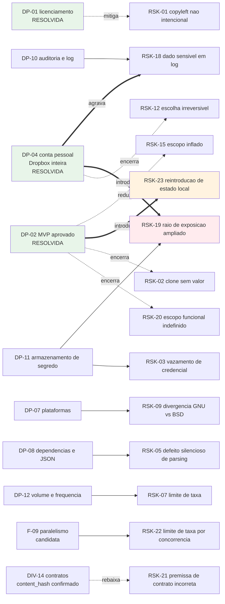

# Riscos, Restricoes e Licenciamento

| Campo | Valor |
|---|---|
| Projeto | `dropbox_api` |
| Responsavel | Business Analyst |
| Data | 2026-08-17 |
| Versao | v0.2 — atualizada apos as decisoes do solicitante e a revalidacao de contratos via Context7 |
| Status | **DP-01 resolvida.** Risco de licenciamento mitigado por decisao; novos riscos decorrentes de DP-04 registrados |
| Documentos relacionados | [Escopo e requisitos](escopo-requisitos-e-criterios-de-aceite.md) · [Decisoes pendentes](decisoes-pendentes.md) · [Funcionalidades candidatas](funcionalidades-candidatas.md) · [System Design](../arquitetura/system-design.md) |

> **Aviso.** Este documento apresenta analise de risco para apoiar decisao. Nao constitui parecer juridico. Se houver distribuicao a terceiros, recomenda-se validacao juridica formal.

---

## 0. Decisao de licenciamento — RESOLVIDA

> **O solicitante decidiu pela reimplementacao independente (cenario B da analise abaixo).** O `Dropbox-Uploader` sera usado como **referencia conceitual apenas**. Nenhum trecho de codigo GPLv3 sera copiado, adaptado ou traduzido.
>
> **Consequencia:** nao ha obrigacao copyleft. O projeto e livre para adotar qualquer licenca. A escolha da licenca especifica permanece aberta como **DP-20**, em prioridade P1, e deve ser publicada **antes do primeiro commit de codigo**.
>
> A analise das secoes 1.1 a 1.5 e mantida como registro da fundamentacao da decisao e como fonte das salvaguardas operacionais que continuam vinculantes (RES-02).

---

## 1. Analise de licenciamento (registro da fundamentacao)

### 1.1 Fato observado

O projeto de referencia `/home/sales/Dropbox-Uploader` esta licenciado sob **GNU General Public License v3**. O cabecalho do arquivo principal declara:

- `Copyright (C) 2010-2021 Andrea Fabrizi <andrea.fabrizi@gmail.com>`
- "This program is free software; you can redistribute it and/or modify it under the terms of the GNU General Public License as published by the Free Software Foundation; either version 3 of the License, or (at your option) any later version."

Referencia: `/home/sales/Dropbox-Uploader/dropbox_uploader.sh`, linhas 5 a 19, e `/home/sales/Dropbox-Uploader/LICENSE`.

### 1.2 Consequencia

A GPLv3 e uma licenca **copyleft forte**. Uma obra que incorpore, adapte ou traduza codigo licenciado sob GPLv3 e considerada trabalho derivado e, quando distribuida, deve ser distribuida sob a mesma licenca, com disponibilizacao do codigo-fonte completo e preservacao dos avisos de copyright originais.

Em shell script o limite entre "inspiracao" e "derivacao" e mais tenue do que em outras linguagens, porque a estrutura de um script frequentemente sobrevive a renomeacao de variaveis. Copiar funcoes e adaptar nomes **nao** descaracteriza derivacao.

### 1.3 Fronteira do que nao gera obrigacao

Os elementos abaixo nao sao protegidos pelo copyright do projeto de referencia e podem ser usados livremente:

- Os endpoints, parametros e contratos da **Dropbox API v2**, que sao documentacao publica da Dropbox e nao do autor do modelo.
- A **lista de funcionalidades** e os nomes de comando de uso comum (`upload`, `download`, `list`, `delete`).
- O **conceito** de assistente de configuracao passo a passo, de envio em partes ou de expansao de curinga.
- Conhecimento adquirido pela leitura do codigo, aplicado em implementacao propria.

### 1.4 Cenarios e impacto

| Cenario | Descricao | Licenca resultante | Impacto |
|---|---|---|---|
| **A — Derivacao** | Trechos do `dropbox_uploader.sh` sao copiados ou adaptados | GPLv3 obrigatoria na distribuicao | Impede distribuicao sob licenca proprietaria ou permissiva; exige aviso de copyright do autor original; exige disponibilizar o fonte a quem receber o binario/script |
| **B — Reimplementacao independente** | O modelo e lido como referencia funcional; todo o codigo e escrito do zero | Livre escolha do solicitante | Sem obrigacao copyleft; permite MIT, Apache-2.0, proprietaria ou uso interno fechado |
| **C — Uso interno sem distribuicao** | Mesmo derivando codigo, o resultado nunca sai da organizacao | GPLv3 aplicavel apenas na distribuicao | A GPLv3 nao obriga publicacao quando nao ha distribuicao a terceiros; porem qualquer distribuicao futura, inclusive a fornecedor ou cliente, reativa a obrigacao. Cenario fragil no medio prazo |

### 1.5 Recomendacao — **acatada pelo solicitante**

**Cenario B — reimplementacao independente.** Salvaguardas operacionais, agora vinculantes por RES-02:

1. Registrar explicitamente que nenhum trecho de codigo do `Dropbox-Uploader` foi copiado para este projeto.
2. Tomar a **documentacao oficial da Dropbox** como fonte primaria dos contratos de integracao, e nao o codigo do modelo.
3. Nao replicar a estrutura interna de funcoes, os nomes internos de variaveis nem o texto literal de mensagens do modelo.
4. Nao copiar o `README` nem a documentacao do modelo.
5. Declarar a licenca escolhida na raiz do repositorio antes do primeiro commit de codigo (RNF-17).

Ganho colateral confirmado: a reimplementacao independente **evita herdar os defeitos ja identificados no modelo** (endpoint de busca fora da documentacao vigente, variantes de endpoint superadas, exposicao de credencial na tabela de processos, interpretacao fragil de JSON, arquivos temporarios previsiveis). Esses itens compoem o Bloco 0 de base endurecida em [funcionalidades-candidatas.md](funcionalidades-candidatas.md).

---

## 2. Matriz de riscos

Escala de impacto e probabilidade: Baixa | Media | Alta.

| ID | Risco | Impacto | Probab. | Mitigacao | Owner |
|---|---|---|---|---|---|
| RSK-01 | ✅ **Mitigado por decisao.** Obrigacao copyleft nao intencional por derivacao de codigo GPLv3 | Alto | **Baixa** (era Alta) | DP-01 resolvida: reimplementacao independente. Risco residual e apenas de disciplina de execucao, endereçado por RES-02 e pela declaracao formal de nao derivacao no fechamento | Senior Developer (execucao), Tech Lead (verificacao) |
| RSK-02 | ✅ **Encerrado.** Projeto entregar um clone sem valor incremental | Alto | — | DP-02 resolvida com escopo aprovado. O MVP entrega tres capacidades ausentes no modelo: envio por fluxo sem disco intermediario, omissao de reenvio por comparacao de conteudo e contrato de automacao consumivel por orquestrador | Solicitante |
| RSK-03 | Vazamento de credencial pela tabela de processos ao passar segredo em `argv` | Alto | Alta se o padrao do modelo for replicado | RNF-03: entrada de segredo por `stdin` ou arquivo de configuracao do cliente HTTP; verificacao explicita em teste | Senior Developer |
| RSK-04 | Uso de endpoints ausentes da documentacao vigente da Dropbox API | Alto | Alta se o modelo for tomado como fonte de contrato | RNF-12: auditoria estatica proibindo `search`, `copy`, `move`, `delete` e `create_folder` sem sufixo `_v2`; RES-02 obriga a tomar a documentacao oficial como fonte primaria, e nao o codigo do modelo | Senior Developer, verificado por QA |
| RSK-05 | Defeito silencioso na interpretacao de resposta JSON por expressao regular | Alto | Media | DP-08 e RNF-11: definir estrategia de interpretacao; testes com JSON de formatacao variada e valores contendo delimitadores | Senior Developer |
| RSK-06 | Corrupcao ou truncamento de arquivo em envio interrompido | Alto | Media | RNF-09 e RF-09: sessao em partes com retentativa por parte e verificacao de `content_hash` no fechamento | Senior Developer, verificado por QA |
| RSK-07 | Bloqueio por limite de taxa da Dropbox em rotinas de alto volume | Medio | Media | RNF-07: recuo exponencial com variacao aleatoria respeitando `Retry-After`; DP-12 para dimensionar concorrencia | Senior Developer |
| RSK-08 | Revogacao de refresh token interrompendo rotinas nao assistidas sem alerta | Alto | Media | RF-29 e RF-30: codigo de saida dedicado a falha de autenticacao e mensagem acionavel; recomendacao de alerta no orquestrador | Engenheiro de automacao do solicitante |
| RSK-09 | Divergencia de comportamento entre utilitarios GNU e BSD (`stat`, `sed`, `date`, `base64`) quebrando o suporte multiplataforma | Medio | Media se macOS/BSD entrarem no escopo | DP-07 e RNF-01: declarar plataformas suportadas e cobrir cada uma na suite de testes | Senior Developer |
| RSK-10 | Corrupcao de nomes de arquivo com espacos, acentos ou caracteres especiais por expansao de shell | Medio | Media | RNF-10: conjunto de nomes adversariais na suite de testes; citacao rigorosa de variaveis; analise estatica obrigatoria | Senior Developer |
| RSK-11 | Ataque por link simbolico ou corrida em area temporaria compartilhada | Medio | Baixa | RNF-05: `mktemp` e limpeza deterministica por `trap` | Senior Developer |
| RSK-12 | ✅ **Encerrado por decisao.** Escolha irreversivel de tipo de acesso do aplicativo Dropbox | Medio | — | DP-04 resolvida: acesso a Dropbox inteira. A consequencia foi assumida e desdobrada em RSK-19 | Solicitante |
| RSK-13 | Mudanca unilateral de contrato ou politica pela Dropbox durante o ciclo de vida | Medio | Baixa por evento, certa no longo prazo | Isolar o acesso a API em componente unico (`lib/http`); acompanhar avisos de descontinuidade; cobertura de teste de contrato | Senior Developer |
| RSK-14 | Manutencao a longo prazo de codigo shell extenso e pouco testavel | Medio | Alta se o padrao monolitico do modelo for reproduzido | RNF-13, RNF-14 e RNF-16: modularizacao, analise estatica e suite automatizada desde o inicio | Tech Lead |
| RSK-15 | Escopo inflado por busca de paridade completa com o modelo sem necessidade declarada | Medio | Media | DP-06: fixar o conjunto de comandos do MVP; secao de escopo fora no documento de requisitos | Business Analyst |
| RSK-16 | Contaminacao de contexto pela memoria de projeto herdada do pacote de origem | Baixo | Alta ja materializada | DIV-09: nao acumular registros sobre o conteudo herdado; solicitar decisao do Tech Lead sobre reinicializacao ou segregacao da memoria | Tech Lead |
| ~~RSK-17~~ | ❌ **Removido na v0.2 por erro factual.** Registrava indisponibilidade do Context7 MCP | — | — | O Context7 estava ativo; as ferramentas exigem descoberta previa por serem de carregamento diferido. Os contratos foram revalidados e as correcoes constam de RES-04 a RES-14 e DIV-11 a DIV-14 | Business Analyst |
| RSK-18 | Exposicao de dado sensivel em log por registro de nomes e caminhos de arquivos | Medio | Media *(elevada por DP-04)* | Definir politica de log em DP-10; mascaramento de caminho se aplicavel. Com acesso amplo a conta, o log pode revelar a estrutura integral do Dropbox do usuario | Business Analyst e Solicitante |
| **RSK-19** | **Raio de exposicao ampliado pelo acesso a Dropbox inteira (DP-04).** Comprometimento da credencial expoe todo o conteudo da conta; caminho remoto mal formado ou exclusao acidental alcancam qualquer area | **Alto** | Media | RNF-20: escopos OAuth minimos, confinamento configuravel do caminho raiz e confirmacao obrigatoria em operacao destrutiva. DP-11 ganha peso: o refresh token passa a ser o unico controle entre um usuario local e a conta inteira. Recomendacao adicional: aplicativo separado com acesso restrito a pasta do aplicativo para rotinas nao assistidas que nao precisem de alcance total | Solicitante e Senior Developer |
| ~~RSK-20~~ | ✅ **Encerrado na v0.3.** Escopo funcional indefinido | Alto | — | DP-02 resolvida. Escopo do MVP aprovado e formalizado em RF-31 a RF-36, com criterio de aceite verificavel cada um. Ha MVP definido, estimavel e com criterio de pronto | Solicitante |
| **RSK-24** | **TOCTOU no confinamento de caminho local.** Entre a resolucao fisica do caminho e o uso efetivo, um `rename` concorrente pode trocar o alvo, permitindo escapar da raiz confinada | Medio | Baixa | ✅ **Risco residual ACEITO E DOCUMENTADO por decisao do solicitante**, a revisitar quando DP-07 fechar. Fundamentacao tecnica do QA para o aceite: a mitigacao avaliada compararia `readlink`, que devolve **texto de caminho** e portanto continua vulneravel a `rename`; o correto seria comparar **dispositivo e inode**. Alem disso, `/proc/self/fd` e **exclusivo de Linux**, e adota-lo **fecharia DP-07 a forca** — repetindo exatamente o erro de processo de DIV-15. A mitigacao tambem **nao cobre percurso recursivo**. Aceitar conscientemente e preferivel a mitigar mal e a decidir por omissao uma questao que e do solicitante | Solicitante (aceite), Senior Developer (reavaliacao apos DP-07) |
| **RSK-25** | **Precedente de decisao de escopo criada por conveniencia tecnica.** Em DIV-15, uma premissa de plataforma foi registrada como decisao do solicitante sem que ele a tivesse tomado. O risco nao e o piso escolhido, mas a repeticao do padrao em decisoes futuras | Medio | Media | Registro explicito da ocorrencia em vez de correcao silenciosa; `RNF-01` congelado com a redacao original ate DP-07 fechar; regra reafirmada de que observacao de ambiente (`stack detectada`) **nao** e decisao de escopo. O mesmo criterio foi aplicado a RSK-24 ao recusar `/proc/self/fd` | Tech Lead |
| **RSK-23** | **Reintroducao inadvertida de estado local persistente.** O MVP foi deliberadamente desenhado sem persistencia; uma implementacao "conveniente" de cache de resumos, cursor ou arquivo de trava introduziria silenciosamente o que a decisao de escopo excluiu | Medio | Media | Registro explicito em quatro artefatos de que o MVP nao possui estado local; criterio de aceite arquitetural verificando ausencia de escrita persistente fora do arquivo de configuracao; qualquer proposta nesse sentido e tratada como mudanca de escopo, com nova decisao do solicitante e reabertura de DP-09 | Tech Lead |
| **RSK-21** | 🟢 **Rebaixado na v0.3.** Contratos nao confirmados tratados como certos | Medio | **Baixa** (era Media) | **`content_hash` CONFIRMADO** — algoritmo publicado e vetor de teste oficial adotado como criterio de aceite em RF-34; `lib/hash` desbloqueado. Cabecalho de correlacao corroborado por fonte secundaria, e RF-30 nao depende do nome exato. **Residual:** mapeamento escopo-por-endpoint de quatro chamadas, cuja ausencia produz `401` explicito na primeira execucao, e nao defeito silencioso | Senior Developer |
| **RSK-22** | **Paralelismo aumentando a incidencia de limite de taxa.** Chamadas simultaneas de listagem para o mesmo usuario produzem erro de limite de taxa por construcao (RES-11) | Medio | Alta se F-09 for confirmada sem cuidado | RNF-21: padrao sequencial, limite configuravel, e documentacao da relacao entre paralelismo e limite de taxa. Retentativa cega agrava o problema em vez de resolver | Senior Developer |

---

## 3. Mapa de risco por decisao pendente

**Risco dominante apos o fechamento do escopo:** `RSK-19`. Com DP-02 e RSK-20 encerrados, o unico risco de impacto Alto e probabilidade nao residual e o raio de exposicao decorrente do acesso amplo a conta. Ele **nao** mudou de peso com o fechamento do escopo — nenhuma funcionalidade aprovada o amplia nem o reduz — mas passou a ser o item de maior severidade da matriz, e sua mitigacao depende de `DP-11`, ainda em aberto.

---

## 4. Restricoes consolidadas

| ID | Restricao | Natureza | Verificavel por |
|---|---|---|---|
| RES-01 | Implementacao em shell script | Imposicao do solicitante | Inspecao do repositorio |
| RES-02 | **Nao derivar codigo do modelo.** Referencia conceitual apenas; nenhum trecho, estrutura de funcoes, nome interno ou mensagem literal pode ser copiado | Decisao (DP-01) | Declaracao formal de nao derivacao no fechamento; revisao de diff pelo Tech Lead |
| RES-03 | Contrato da Dropbox API v2 nao e negociavel | Externa | Testes de contrato |
| RES-04 | Access token de curta duracao; acesso nao assistido exige refresh token com `token_access_type=offline`; validade informada em `expires_in` | Externa | Teste de renovacao de token |
| RES-05 | Envio em requisicao unica limitado a **150 MiB**; limite por requisicao de sessao tambem de 150 MiB; maximo por sessao de 2^41 − 2^22 bytes | Externa | Teste com arquivo acima do limite |
| RES-06 | Busca por `search_v2` com paginacao por `search/continue_v2` e teto de 10.000 correspondencias; endpoint sem sufixo nao consta da documentacao vigente | Externa | Auditoria estatica e teste de paginacao |
| RES-07 | Operacoes vigentes sao `copy_v2`, `move_v2`, `delete_v2` e `create_folder_v2`; variantes sem sufixo nao constam da documentacao vigente | Externa | Auditoria estatica |
| RES-08 | Shell nao possui interpretador JSON nativo | Tecnica | Decisao em DP-08 |
| RES-09 | Projeto alvo sem git inicializado e sem stack instalada | Ambiente | Estado de `/home/sales/dropbox_api` |
| RES-10 | Multiplo de 4.194.304 bytes obrigatorio apenas em sessao concorrente | Externa | Teste dos dois tipos de sessao |
| RES-11 | Chamadas simultaneas de listagem para o mesmo usuario produzem erro de limite de taxa | Externa | Teste de ausencia de concorrencia em listagem |
| RES-12 | Revogacao de token invalida tambem o refresh token e todos os access tokens derivados | Externa | Teste de desvinculo |
| RES-13 | Acesso amplo (`Full Dropbox`) concedido ao aplicativo | Decisao (DP-04) | Verificacao de escopos minimos e de confinamento de raiz (RNF-20) |
| RES-14 | Busca pode duplicar resultados entre paginas ou omitir resultados | Externa | Teste de deduplicacao |

---

## 5. Recomendacao de encaminhamento

1. **A implementacao pode comecar.** Nao ha decisao bloqueante em aberto. A sequencia recomendada, com o que esta destravado e o que depende de P1, esta em [decisoes-pendentes.md](decisoes-pendentes.md), secao "O que o Senior Developer precisa para comecar".
2. Publicar a licenca escolhida em DP-20 **antes do primeiro commit de codigo**. Definir depois obriga a concordancia de todos os autores que ja tiverem contribuido. E a unica pendencia que precede literalmente a primeira linha versionada.
3. Tratar **RSK-19 como o risco dominante do projeto**: com acesso a Dropbox inteira, o refresh token e o unico controle entre um usuario local e todo o conteudo da conta. Responder DP-11 com esse peso. O fechamento do escopo nao alterou este risco, apenas o tornou o mais severo da matriz.
4. Vigiar **RSK-23**: o MVP foi deliberadamente desenhado sem estado local persistente. Cache de resumos, cursor ou arquivo de trava introduzidos "por conveniencia" durante a implementacao reintroduzem o que a decisao de escopo excluiu, e reabrem DP-09 e o handoff do DBA.
5. Confirmar a pendencia residual de DIV-14 — escopo OAuth exigido por quatro endpoints — durante a implementacao. Baixo risco: a ausencia produz `401` explicito, e nao defeito silencioso.
6. Manter as divergencias DIV-01 a DIV-06 como Bloco 0 de base endurecida — piso de qualidade aprovado, nao diferencial.
