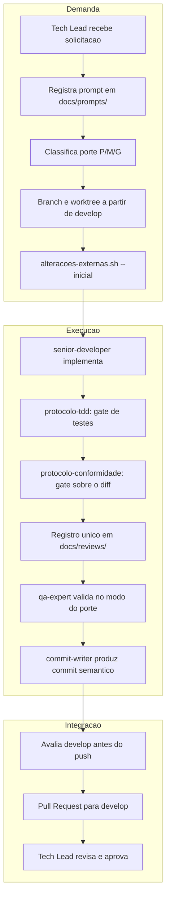

# Registro de Entrega — Atualizacao do Ambiente de IA e Protocolos de Governanca

> Registro unico da demanda de atualizacao do ambiente de IA conforme regra 41 do protocolo comum e a skill `review-documentation`.

## Identificacao da demanda

| Campo | Valor |
|---|---|
| Demanda | Atualizacao do projeto com protocolos e framework vigentes |
| Data / Hora | 2026-10-07 12:56 |
| Dominio | Governanca / Pacote de Agents e Protocolos |
| Porte | **G (estrutural)** — atualizacao transversal de protocolo, personas, memoria e scripts |
| Instancia | `myNote/Adriano Sales Santos` |
| Modelo upstream | `git@github.com:salesadriano/ai_team.git` no commit `ed927bb18678241c777346e7ad94ac0d0f2dd5c4` |
| Branch de trabalho | `feature/atualiza-ambiente-ia` |
| Branch principal | `develop` (confirmada pelo solicitante sob a regra 46) |
| Log de prompt | [2026-10-07_1256_atualiza-ambiente-ia.md](../prompts/2026-10-07_1256_atualiza-ambiente-ia.md) |

---

## Contexto e Motivacao

O projeto `dropbox_sync` vinha operando com uma versao legada do pacote de agentes localizada em `.claude/` (com formato anterior a setembro de 2026: regras 1 a 35, tabelas mutaveis de memoria sem entradas granulares e sem scripts de validacao automatizada).

A atualizacao alinha o projeto a versao estavel vigente do modelo de referencia `ai_team` (`ed927bb18678241c777346e7ad94ac0d0f2dd5c4`), incorporando:
1. **Regras 1 a 48 do protocolo comum** em `.github/agents/AGENTS.md`.
2. **Estrutura de memoria por entradas granulares** (`.github/agents/memoria/entradas/YYYY-MM-DD-HHMM-slug.md`) geridas por `scripts/memoria-index.sh`.
3. **Congelamento das tabelas historicas** em `MEMORIA-COMPARTILHADA.md` e `MEMORIA-PROJETO.md`, preservando integralmente todas as 81 decisoes ativas do projeto (`PRJ-DEC-01` a `PRJ-DEC-81`).
4. **8 Personas completas** em `.github/agents/*.agent.md`.
5. **Catalogo de templates operacionais** em `.github/agents/templates/`.
6. **Catalogo de skills tecnicas e transversais** em `.github/skills/`, incluindo `shellcheck-configuration` e `bats-testing-patterns`.
7. **Scripts utilitarios e guardas** em `scripts/` (`memoria-index.sh`, `ensure-docs.sh`, `alteracoes-externas.sh`, `validate-skill-links.sh` e testes em `scripts/tests/`).
8. **Guia operacional unico** em `CLAUDE.md` na raiz do repositorio, apontando para `.github/agents/AGENTS.md`.
9. **Limpeza da pasta legada** `.claude/`.

---

## Decisoes de Projeto e Governanca

### 1. Branch principal declarada: `develop`
- Conforme a Regra 46, a branch principal foi explicitamente confirmada pelo solicitante como `develop`.
- Registrada na entrada de memoria [2026-10-07-1256-branch-principal](../../.github/agents/memoria/entradas/2026-10-07-1256-branch-principal.md).

### 2. Preservacao e congelamento das decisoes do projeto
- As 81 decisoes ativas acumuladas ao longo das Etapas 1, 2, 3 e 4 (incluindo `PRJ-DEC-76` a `PRJ-DEC-81` do recente incremento de upload em partes do PR #14) foram preservadas na tabela congelada de `MEMORIA-PROJETO.md`.
- Novas decisoes passam a ser gravadas como entradas individuais em `.github/agents/memoria/entradas/`.

### 3. Stack do projeto e adaptacoes
- Shell script (`bash` 4.4+ e POSIX `sh`) com `cURL`.
- Registrada na entrada de memoria [2026-10-07-1256-stack](../../.github/agents/memoria/entradas/2026-10-07-1256-stack.md).
- Regras de frontend (Cypress, Storybook, Design System) e banco relacional persistente marcadas como nao aplicaveis no `AGENTS.md` sem quebrar a numeracao original.

### 4. Adocao do modelo upstream
- Registrada na entrada de memoria [2026-10-07-1256-adocao-modelo](../../.github/agents/memoria/entradas/2026-10-07-1256-adocao-modelo.md).

---

## Artefatos Gerados e Modificados

| Caminho | Acao | Finalidade |
|---|---|---|
| `.github/agents/AGENTS.md` | Criado / Adaptado | Protocolo comum obrigatorio com 48 regras |
| `.github/agents/*.agent.md` | Criado | 8 personas agnosticas com modelo e invocabilidade |
| `.github/agents/templates/*` | Criado | Templates operacionais oficiais (evidencias, pareceres, aprovacoes) |
| `.github/agents/memoria/MEMORIA-COMPARTILHADA.md` | Criado | Memoria compartilhada com tabela congelada |
| `.github/agents/memoria/MEMORIA-PROJETO.md` | Criado | Memoria de projeto congelada preservando PRJ-DEC-01 a 81 |
| `.github/agents/memoria/entradas/*` | Criado | Entradas de memoria iniciais (`branch-principal`, `stack`, `adocao-modelo`) |
| `.github/agents/memoria/historico/*` | Migrado | Historico documental do projeto |
| `.github/skills/*` | Criado | Skills transversais e de stack do modelo |
| `.github/prompts/execucao-enxuta.prompt.md` | Criado | Prompt reutilizavel para execucao com comunicacao enxuta |
| `scripts/memoria-index.sh` | Criado | Gerador e validador do indice de memoria |
| `scripts/ensure-docs.sh` | Criado | Guarda da estrutura documental (`prompts/`, `reviews/`, `sources/`) |
| `scripts/alteracoes-externas.sh` | Criado | Deteccao de intervencao humana (regra 48) |
| `scripts/validate-skill-links.sh` | Criado | Validador estatico de links internos das skills |
| `scripts/tests/*` | Criado | Testes BATS dos scripts de governanca |
| `CLAUDE.md` | Criado | Ponto de entrada operacional do Claude Code |
| `.gitignore` | Atualizado | Ignora `.github/agents/memoria/INDICE.md` |
| `.claude/` | Removido | Eliminacao da estrutura legada obsoleta |
| `docs/prompts/2026-10-07_1256_atualiza-ambiente-ia.md` | Criado | Trilha de auditoria do prompt |

---

## Evidencias de Validacao

| Verificacao | Comando | Resultado |
|---|---|---|
| Validacao de memoria | `sh scripts/memoria-index.sh --check` | **3 entradas validas**, exit code 0 |
| Links internos de skills | `sh scripts/validate-skill-links.sh` | **Valido** (All local skill references are valid) |
| Estrutura documental | `sh scripts/ensure-docs.sh` | **Valido** (diretorios e READMEs garantidos) |
| Caminhos locais do modelo | `grep -rnF "/home/sales/ai_team" .github scripts` | **Nenhum encontrado** (projeto autossuficiente) |
| Rebase com develop upstream | `git rebase origin/develop` | **Integrado** com PR #13 e PR #14 (`aeae808`), exit code 0 |
| Suite completa de testes | `bash tests/run.sh < /dev/null` | **555 aprovados, 0 reprovados, 2 pulados**, exit code 0 |
| Linter estatico | `shellcheck lib/*.sh commands/*.sh bin/* scripts/*.sh` | **Valido**, exit code 0 |
| Guarda de remocao de testes | `bash scripts/verificar-remocao-de-casos.sh develop` | **557 -> 557 casos preservados**, exit code 0 |
| Testes BATS de scripts | `npx --yes bats@1.13.0 scripts/tests/` | **50/50 aprovados**, exit code 0 |
| Deteccao de alteracoes externas | `sh scripts/alteracoes-externas.sh --detectar` | **Zero divergencias**, exit code 0 |
| Conformidade de auditoria | Ajuste em `tests/integracao/sync_test.sh` | Remocao de `$(printf)` atendendo `PRJ-DEC-32` / `json_test.sh` |

---

## Fluxo de Trabalho e Diagrama

---

## Riscos e Rollback

- **Risco:** Referencias a caminhos antigos `.claude/` em scripts locais de desenvolvedores.
- **Mitigacao:** `CLAUDE.md` e `.github/agents/AGENTS.md` centralizam as referencias; `lib/` e `commands/` nao dependem de nenhum caminho em `.claude/`.
- **Plano de Rollback:** `git revert` do commit da demanda em `develop` ou na branch de trabalho, restaurando a pasta `.claude/` do commit anterior se necessario.
