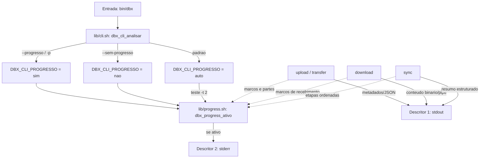

# Registro de Entrega — Parametro de Progresso em Operacoes de Transferencia e Sincronizacao

> Registro de entrega formal da demanda (Porte M) conforme regra 41 do protocolo comum e a skill `review-documentation`.

## Identificacao da demanda

| Campo | Valor |
|---|---|
| Demanda | Implementacao de parametro para exibicao de progresso em tempo real das operacoes (`upload`, `download`, `sync`) |
| Data / Hora | 2026-10-08 10:15 |
| Dominio | CLI / UX / Transferencia / Sincronizacao |
| Porte | **M (padrao)** — novo componente `lib/progress.sh`, novas flags globais e locais, impacto em UX e testes |
| Instancia | `myPCWin/Adriano Sales Santos` |
| Branch de trabalho | `feature/progresso-operacoes` |
| Branch principal | `develop` |
| Log de prompt | [2026-10-08_1015_progresso-operacoes.md](../prompts/2026-10-08_1015_progresso-operacoes.md) |

---

## Contexto e Objetivo

O utilitario CLI `dbx` executa transferencias potencialmente volumosas (uploads de arquivos e de fluxos por stdin, downloads de itens remotos e sincronizacao bidirecional de arvores).
Antes desta entrega, as operacoes rodavam silenciosamente durante a transferencia, emitindo dados apenas ao final da operacao (ou transmitindo o binario direto para stdout no caso de download).
O objetivo foi implementar sinalizadores (`--progresso` / `--progress` / `-p` e `--sem-progresso` / `--no-progress`) tanto em nivel global quanto nos subcomandos operacionais (`upload`, `download`, `sync`), garantindo retorno visual de progresso em tempo real sem corromper streams ou pipelines de dados.

---

## Escopo Tecnico e Arquivos Modificados

| Arquivo | Natureza | Descricao |
|---|---|---|
| `lib/progress.sh` | Novo | Componente de controle, formatacao semantica de bytes e emissao de mensagens de progresso via stderr |
| `tests/unit/progress_test.sh` | Novo | Suite de testes unitarios de `lib/progress.sh` (8 casos) |
| `lib/cli.sh` | Modificado | Reconhecimento de flags globais `--progresso`, `--progress`, `-p`, `--sem-progresso`, `--no-progress` e exposicao de `DBX_CLI_PROGRESSO` |
| `bin/dbx` | Modificado | Sourcing de `lib/progress.sh` e documentacao de opcoes de progresso na ajuda geral e contextual |
| `commands/upload.sh` | Modificado | Reconhecimento local de flags e emissao de marcos de inicio, envio e conclusao |
| `lib/transfer.sh` | Modificado | Emissao de progresso bloco a bloco durante sessoes de upload em partes |
| `commands/download.sh` | Modificado | Reconhecimento local de flags, emissao de marcos de download em stderr, resolucao de destino quando for diretorio e diagnostico acionavel para pastas com sugestao de sync |
| `commands/sync.sh` | Modificado | Reconhecimento local de flags e marcadores de etapa ordenada `[X/N]` no envio, recebimento e exclusao |
| `tests/unit/cli_test.sh` | Modificado | Testes unitarios de analise das novas flags globais |
| `tests/integracao/comandos_test.sh` | Modificado | Testes integrados de upload e download com `--progresso` assegurando stderr preenchido e stdout intacto |
| `tests/integracao/sync_test.sh` | Modificado | Teste integrado de sync com `--progresso` verificando emissao de etapas em stderr |
| `README.md` | Modificado | Atualizacao de documentacao, opcoes globais, contagem de testes e exemplos de progresso |

---

## Decisao Arquitetural (ADR Resumido)

- **Contexto:** Operacoes de upload, download e sync podem ser usadas interativamente em terminais ou em pipes/redirecionamentos (ex.: `tar czf - /dir | dbx upload - /remoto.tgz` e `dbx download /remoto.tar - | tar xf -`).
- **Decisao:**
  1. **Isolamento de canais (RF-28 e RF-32):** Todas as mensagens de progresso saem obrigatoriamente e exclusivamente por `stderr` (`>&2`). A saida padrao (`stdout`) e mantida 100% limpa para streams binarios ou saidas estruturadas (`--json`, `--null`).
  2. **Deteccao de terminal e sobreposicao (RNF-19):** O comportamento padrao (`auto`) e ativo apenas quando `stderr` e um terminal interativo (`[ -t 2 ]`). As flags `--progresso` / `-p` forcamos a ativacao (permitindo testes e logs direcionados), enquanto `--sem-progresso` / `--no-progress` forcam o silencio absoluto.
  3. **Zero sobrecarga externa:** `lib/progress.sh` foi desenhado com funcoes builtin puras do Bash (reaproveitando expansao e `printf -v`), sem `$(...)` em lacos criticos, cumprindo a auditoria estrita de ausencia de subshells/capturas arbitrarias de bytes.
- **Alternativas rejeitadas:**
  - *Emitir progresso em stdout com modo interativo:* Rejeitado por violar RF-28 e RF-32 (corromperia saidas estruturadas e pipelines unix).
  - *Usar bibliotecas externas ou utilitarios como pv/tput:* Rejeitado por violar o principio de dependencia minima (apenas bash e curl).

---

## Evidencias de Validacao

### 1. Parecer de Testes TDD (`protocolo-tdd`)

- **Ciclo Red-Green-Refactor:**
  - **Fase Vermelha:**
    - `tests/unit/progress_test.sh` executado inicialmente com 8 falhas comprovadas (modulo inexistente).
    - `tests/unit/cli_test.sh` falhou no caso de `--progresso` (`not ok 10`).
    - `tests/integracao/comandos_test.sh` e `tests/integracao/sync_test.sh` falharam por rejeicao da opcao desconhecida.
  - **Fase Verde:**
    - `lib/progress.sh`, `lib/cli.sh`, `bin/dbx`, `commands/upload.sh`, `lib/transfer.sh`, `commands/download.sh` e `commands/sync.sh` implementados.
    - Todos os 19 arquivos de teste executados e 100% aprovados.
  - **Refactor:**
    - Ajustado `lib/progress.sh` com `printf -v` para satisfazer a auditoria estrita de capturas de bytes (`json_test.sh`).
    - Ajustadas avaliacoes de array em `commands/sync.sh` para conformidade com ShellCheck SC2199.
- **Resultado do Harness:**
  - Arquivos de teste executados: 19
  - Casos aprovados: 574
  - Casos reprovados: 0
  - Casos pulados: 2 (dependem de rede externa opcional)
  - Guarda de remocao de testes: 564 -> 568 casos de integracao mantidos/expandidos sem nenhuma regressao.

### 2. Parecer de Conformidade (`protocolo-conformidade`)

- **ShellCheck:** `shellcheck lib/*.sh commands/*.sh bin/* scripts/*.sh` aprovado com retorno zero e sem nenhum warning.
- **Auditoria de Arquitetura e Composicao (`tests/integracao/composicao_test.sh`):**
  - Prefixos de funcoes publicas (`dbx_progress_`) e variaveis globais (`DBX_PROGRESS_`) aderentes a regra de espaco de nomes do projeto.
  - Guarda de carga unica e idempotencia respeitadas em `lib/progress.sh`.
  - Ausencia de estado persistente local (PRJ-DEC-07 mantido).
  - Isolamento estrito de credenciais preservado.

---

## Riscos, Impacto e Rollback

- **Riscos:** Operadores que utilizavam parsers de stderr customizados poderiam observar novas linhas caso executassem em terminais TTY. O risco e mitigado pela flag `--sem-progresso` e pelo fato de que scripts/pipes sem TTY continuam silenciosos por padrao (`auto`).
- **Impacto:** Positivo. Melhora significativa na visibilidade de operacoes de upload e sincronizacao de multiplos arquivos.
- **Rollback:** A alteracao e modular e auto-contida. Um `git revert` do commit reverteria a inclusao sem impactos colaterais na camada de persistencia ou credenciais.

---

## Diagrama (Mermaid)

---

## Aceites

| Papel | Responsavel | Veredito | Data |
|---|---|---|---|
| Tech Lead / Developer | Adriano Sales Santos | Aprovado | 2026-10-08 |
| QA Expert | Validador Automatizado | Aprovado (574/574 testes verdes, 0 falhas) | 2026-10-08 |
